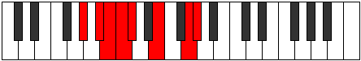
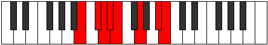

# Mode Sythian

## Links

- [Documentation](index.md)
- [Scales Index](Scales.md)
- [Modes Index](Modes.md)
- [Chords Index](Chords.md)

## Parent Scale

[Epagian](ScaleEpagian.md)

## Number

[2365](https://ianring.com/musictheory/scales/2365)

## Perfection

- 3 Perfect notes
- 4 Perfect notes

## Perfection Profile

[false false false true true true false]

## Permutations

| Tonic | Notes | Signature | Illustration | Audio |
|-------|-------|-----------|--------------|-------|
| [C](ModeCNaturalSythian.md) | **C**, **D**, **Eb**, Fb, Gbb, Ab, **B**, **C** | C |  | [midi](ModeCNaturalSythian.mid) [ogg](ModeCNaturalSythian.ogg) |
| [C#](ModeCSharpSythian.md) | **C#**, **D#**, **E**, F, Gb, A, **B#**, **C#** | C |  | [midi](ModeCSharpSythian.mid) [ogg](ModeCSharpSythian.ogg) |
| [Db](ModeDFlatSythian.md) | **Db**, **Eb**, **Fb**, Gbb, Abbb, Bbb, **C**, **Db** | C |  | [midi](ModeDFlatSythian.mid) [ogg](ModeDFlatSythian.ogg) |
| [D](ModeDNaturalSythian.md) | **D**, **E**, **F**, Gb, Abb, Bb, **C#**, **D** | C |  | [midi](ModeDNaturalSythian.mid) [ogg](ModeDNaturalSythian.ogg) |
| [D#](ModeDSharpSythian.md) | **D#**, **E#**, **F#**, G, Ab, B, **C##**, **D#** | C |  | [midi](ModeDSharpSythian.mid) [ogg](ModeDSharpSythian.ogg) |
| [Eb](ModeEFlatSythian.md) | **Eb**, **F**, **Gb**, Abb, Bbbb, Cb, **D**, **Eb** | C |  | [midi](ModeEFlatSythian.mid) [ogg](ModeEFlatSythian.ogg) |
| [E](ModeENaturalSythian.md) | **E**, **F#**, **G**, Ab, Bbb, C, **D#**, **E** | C |  | [midi](ModeENaturalSythian.mid) [ogg](ModeENaturalSythian.ogg) |
| [F](ModeFNaturalSythian.md) | **F**, **G**, **Ab**, Bbb, Cbb, Db, **E**, **F** | C |  | [midi](ModeFNaturalSythian.mid) [ogg](ModeFNaturalSythian.ogg) |
| [F#](ModeFSharpSythian.md) | **F#**, **G#**, **A**, Bb, Cb, D, **E#**, **F#** | C |  | [midi](ModeFSharpSythian.mid) [ogg](ModeFSharpSythian.ogg) |
| [Gb](ModeGFlatSythian.md) | **Gb**, **Ab**, **Bbb**, Cbb, Dbbb, Ebb, **F**, **Gb** | C |  | [midi](ModeGFlatSythian.mid) [ogg](ModeGFlatSythian.ogg) |
| [G](ModeGNaturalSythian.md) | **G**, **A**, **Bb**, Cb, Dbb, Eb, **F#**, **G** | C |  | [midi](ModeGNaturalSythian.mid) [ogg](ModeGNaturalSythian.ogg) |
| [G#](ModeGSharpSythian.md) | **G#**, **A#**, **B**, C, Db, E, **F##**, **G#** | C |  | [midi](ModeGSharpSythian.mid) [ogg](ModeGSharpSythian.ogg) |
| [Ab](ModeAFlatSythian.md) | **Ab**, **Bb**, **Cb**, Dbb, Ebbb, Fb, **G**, **Ab** | C |  | [midi](ModeAFlatSythian.mid) [ogg](ModeAFlatSythian.ogg) |
| [A](ModeANaturalSythian.md) | **A**, **B**, **C**, Db, Ebb, F, **G#**, **A** | C |  | [midi](ModeANaturalSythian.mid) [ogg](ModeANaturalSythian.ogg) |
| [A#](ModeASharpSythian.md) | **A#**, **B#**, **C#**, D, Eb, F#, **G##**, **A#** | C |  | [midi](ModeASharpSythian.mid) [ogg](ModeASharpSythian.ogg) |
| [Bb](ModeBFlatSythian.md) | **Bb**, **C**, **Db**, Ebb, Fbb, Gb, **A**, **Bb** | C |  | [midi](ModeBFlatSythian.mid) [ogg](ModeBFlatSythian.ogg) |
| [B](ModeBNaturalSythian.md) | **B**, **C#**, **D**, Eb, Fb, G, **A#**, **B** | C |  | [midi](ModeBNaturalSythian.mid) [ogg](ModeBNaturalSythian.ogg) |
