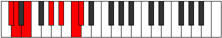
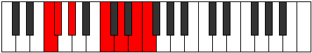

# Mode Sythimic

## Links

- [Documentation](index.md)
- [Scales Index](Scales.md)
- [Modes Index](Modes.md)
- [Chords Index](Chords.md)

## Parent Scale

[Dathimic](ScaleDathimic.md)

## Number

[2699](https://ianring.com/musictheory/scales/2699)

## Perfection

- 1 Perfect notes
- 5 Perfect notes

## Perfection Profile

[true false false false false false]

## Permutations

| Tonic | Notes | Signature | Illustration | Audio |
|-------|-------|-----------|--------------|-------|
| [C](ModeCNaturalSythimic.md) | C, **Db**, **Eb**, **F##**, **G##**, **A##**, C | C |  | [midi](https://github.com/edipermadi/music/blob/main/docs/ModeCNaturalSythimic.mid?raw=true) |
| [C#](ModeCSharpSythimic.md) | C#, **D**, **E**, **F###**, **G###**, **A###**, C# | C |  | [midi](https://github.com/edipermadi/music/blob/main/docs/ModeCSharpSythimic.mid?raw=true) |
| [Db](ModeDFlatSythimic.md) | Db, **Ebb**, **Fb**, **G#**, **A#**, **B#**, Db | C |  | [midi](https://github.com/edipermadi/music/blob/main/docs/ModeDFlatSythimic.mid?raw=true) |
| [D](ModeDNaturalSythimic.md) | D, **Eb**, **F**, **G##**, **A##**, **B##**, D | C |  | [midi](https://github.com/edipermadi/music/blob/main/docs/ModeDNaturalSythimic.mid?raw=true) |
| [D#](ModeDSharpSythimic.md) | D#, **E**, **F#**, **G###**, **A###**, **B###**, D# | C |  | [midi](https://github.com/edipermadi/music/blob/main/docs/ModeDSharpSythimic.mid?raw=true) |
| [Eb](ModeEFlatSythimic.md) | Eb, **Fb**, **Gb**, **A#**, **B#**, **C##**, Eb | C |  | [midi](https://github.com/edipermadi/music/blob/main/docs/ModeEFlatSythimic.mid?raw=true) |
| [E](ModeENaturalSythimic.md) | E, **F**, **G**, **A##**, **B##**, **C###**, E | C |  | [midi](https://github.com/edipermadi/music/blob/main/docs/ModeENaturalSythimic.mid?raw=true) |
| [F](ModeFNaturalSythimic.md) | F, **Gb**, **Ab**, **B#**, **C##**, **D##**, F | C |  | [midi](https://github.com/edipermadi/music/blob/main/docs/ModeFNaturalSythimic.mid?raw=true) |
| [F#](ModeFSharpSythimic.md) | F#, **G**, **A**, **B##**, **C###**, **D###**, F# | C |  | [midi](https://github.com/edipermadi/music/blob/main/docs/ModeFSharpSythimic.mid?raw=true) |
| [Gb](ModeGFlatSythimic.md) | Gb, **Abb**, **Bbb**, **C#**, **D#**, **E#**, Gb | C |  | [midi](https://github.com/edipermadi/music/blob/main/docs/ModeGFlatSythimic.mid?raw=true) |
| [G](ModeGNaturalSythimic.md) | G, **Ab**, **Bb**, **C##**, **D##**, **E##**, G | C |  | [midi](https://github.com/edipermadi/music/blob/main/docs/ModeGNaturalSythimic.mid?raw=true) |
| [G#](ModeGSharpSythimic.md) | G#, **A**, **B**, **C###**, **D###**, **E###**, G# | C |  | [midi](https://github.com/edipermadi/music/blob/main/docs/ModeGSharpSythimic.mid?raw=true) |
| [Ab](ModeAFlatSythimic.md) | Ab, **Bbb**, **Cb**, **D#**, **E#**, **F##**, Ab | C |  | [midi](https://github.com/edipermadi/music/blob/main/docs/ModeAFlatSythimic.mid?raw=true) |
| [A](ModeANaturalSythimic.md) | A, **Bb**, **C**, **D##**, **E##**, **F###**, A | C |  | [midi](https://github.com/edipermadi/music/blob/main/docs/ModeANaturalSythimic.mid?raw=true) |
| [A#](ModeASharpSythimic.md) | A#, **B**, **C#**, **D###**, **E###**, **Cbbb**, A# | C |  | [midi](https://github.com/edipermadi/music/blob/main/docs/ModeASharpSythimic.mid?raw=true) |
| [Bb](ModeBFlatSythimic.md) | Bb, **Cb**, **Db**, **E#**, **F##**, **G##**, Bb | C |  | [midi](https://github.com/edipermadi/music/blob/main/docs/ModeBFlatSythimic.mid?raw=true) |
| [B](ModeBNaturalSythimic.md) | B, **C**, **D**, **E##**, **F###**, **G###**, B | C |  | [midi](https://github.com/edipermadi/music/blob/main/docs/ModeBNaturalSythimic.mid?raw=true) |
