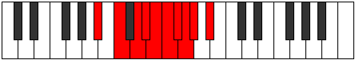

# Mode Sythygic

## Links

- [Documentation](README.md)
- [Scales Index](Scales.md)
- [Modes Index](Modes.md)
- [Chords Index](Chords.md)

## Parent Scale

[Kyrygic](ScaleKyrygic.md)

## Number

[2037](https://ianring.com/musictheory/scales/2037)

## Luminosity

7

## Transposition

2, 2, 1, 1, 1, 1, 1, 1, 2

## Chord Pattern

Ib5, vii⁰b3, viii, IX

## Perfection

- 6 Perfect notes
- 3 Perfect notes

## Perfection Profile

true, true, false, true, false, true, false, true, true

## Permutations

| Tonic | Notes | Signature | Illustration | Audio |
|-------|-------|-----------|--------------|-------|
| [C](ModeCNaturalSythygic.md) | C, D, **E**, F, **F#**, G, **G#**, A, A#, C | C |  | [midi](https://github.com/edipermadi/music/blob/main/docs/ModeCNaturalSythygic.mid?raw=true) |
| [C#](ModeCSharpSythygic.md) | C#, D#, **F**, F#, **G**, G#, **A**, A#, B, C# | C |  | [midi](https://github.com/edipermadi/music/blob/main/docs/ModeCSharpSythygic.mid?raw=true) |
| [Db](ModeDFlatSythygic.md) | Db, Eb, **F**, Gb, **G**, Ab, **A**, Bb, B, Db | C |  | [midi](https://github.com/edipermadi/music/blob/main/docs/ModeDFlatSythygic.mid?raw=true) |
| [D](ModeDNaturalSythygic.md) | D, E, **F#**, G, **G#**, A, **A#**, B, C, D | C |  | [midi](https://github.com/edipermadi/music/blob/main/docs/ModeDNaturalSythygic.mid?raw=true) |
| [D#](ModeDSharpSythygic.md) | D#, F, **G**, G#, **A**, A#, **B**, C, C#, D# | C |  | [midi](https://github.com/edipermadi/music/blob/main/docs/ModeDSharpSythygic.mid?raw=true) |
| [Eb](ModeEFlatSythygic.md) | Eb, F, **G**, Ab, **A**, Bb, **B**, C, Db, Eb | C |  | [midi](https://github.com/edipermadi/music/blob/main/docs/ModeEFlatSythygic.mid?raw=true) |
| [E](ModeENaturalSythygic.md) | E, F#, **G#**, A, **A#**, B, **C**, C#, D, E | C |  | [midi](https://github.com/edipermadi/music/blob/main/docs/ModeENaturalSythygic.mid?raw=true) |
| [F](ModeFNaturalSythygic.md) | F, G, **A**, A#, **B**, C, **C#**, D, D#, F | C |  | [midi](https://github.com/edipermadi/music/blob/main/docs/ModeFNaturalSythygic.mid?raw=true) |
| [F#](ModeFSharpSythygic.md) | F#, G#, **A#**, B, **C**, C#, **D**, D#, E, F# | C |  | [midi](https://github.com/edipermadi/music/blob/main/docs/ModeFSharpSythygic.mid?raw=true) |
| [Gb](ModeGFlatSythygic.md) | Gb, Ab, **Bb**, B, **C**, Db, **D**, Eb, E, Gb | C |  | [midi](https://github.com/edipermadi/music/blob/main/docs/ModeGFlatSythygic.mid?raw=true) |
| [G](ModeGNaturalSythygic.md) | G, A, **B**, C, **C#**, D, **D#**, E, F, G | C |  | [midi](https://github.com/edipermadi/music/blob/main/docs/ModeGNaturalSythygic.mid?raw=true) |
| [G#](ModeGSharpSythygic.md) | G#, A#, **C**, C#, **D**, D#, **E**, F, F#, G# | C |  | [midi](https://github.com/edipermadi/music/blob/main/docs/ModeGSharpSythygic.mid?raw=true) |
| [Ab](ModeAFlatSythygic.md) | Ab, Bb, **C**, Db, **D**, Eb, **E**, F, Gb, Ab | C |  | [midi](https://github.com/edipermadi/music/blob/main/docs/ModeAFlatSythygic.mid?raw=true) |
| [A](ModeANaturalSythygic.md) | A, B, **C#**, D, **D#**, E, **F**, F#, G, A | C |  | [midi](https://github.com/edipermadi/music/blob/main/docs/ModeANaturalSythygic.mid?raw=true) |
| [A#](ModeASharpSythygic.md) | A#, C, **D**, D#, **E**, F, **F#**, G, G#, A# | C |  | [midi](https://github.com/edipermadi/music/blob/main/docs/ModeASharpSythygic.mid?raw=true) |
| [Bb](ModeBFlatSythygic.md) | Bb, C, **D**, Eb, **E**, F, **Gb**, G, Ab, Bb | C |  | [midi](https://github.com/edipermadi/music/blob/main/docs/ModeBFlatSythygic.mid?raw=true) |
| [B](ModeBNaturalSythygic.md) | B, C#, **D#**, E, **F**, F#, **G**, G#, A, B | C |  | [midi](https://github.com/edipermadi/music/blob/main/docs/ModeBNaturalSythygic.mid?raw=true) |
