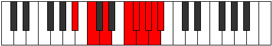

# Mode Sythyllic

## Links

- [Documentation](README.md)
- [Scales Index](Scales.md)
- [Modes Index](Modes.md)
- [Chords Index](Chords.md)

## Parent Scale

[Kataryllic](ScaleKataryllic.md)

## Number

[3989](https://ianring.com/musictheory/scales/3989)

## Transposition

2, 2, 3, 1, 1, 1, 1, 1

## Chord Pattern

I⁺, IIIb5, vii⁰b3

## Perfection

- 5 Perfect notes
- 3 Perfect notes

## Perfection Profile

true, true, true, true, false, true, false, false

## Permutations

| Tonic | Notes | Signature | Illustration | Audio |
|-------|-------|-----------|--------------|-------|
| [C](ModeCNaturalSythyllic.md) | C, D, E, G, **G#**, A, **A#**, **B**, C | C |  | [midi](https://github.com/edipermadi/music/blob/main/docs/ModeCNaturalSythyllic.mid?raw=true) |
| [C#](ModeCSharpSythyllic.md) | C#, D#, F, G#, **A**, A#, **B**, **C**, C# | C |  | [midi](https://github.com/edipermadi/music/blob/main/docs/ModeCSharpSythyllic.mid?raw=true) |
| [Db](ModeDFlatSythyllic.md) | Db, Eb, F, Ab, **A**, Bb, **B**, **C**, Db | C |  | [midi](https://github.com/edipermadi/music/blob/main/docs/ModeDFlatSythyllic.mid?raw=true) |
| [D](ModeDNaturalSythyllic.md) | D, E, F#, A, **A#**, B, **C**, **C#**, D | C |  | [midi](https://github.com/edipermadi/music/blob/main/docs/ModeDNaturalSythyllic.mid?raw=true) |
| [D#](ModeDSharpSythyllic.md) | D#, F, G, A#, **B**, C, **C#**, **D**, D# | C |  | [midi](https://github.com/edipermadi/music/blob/main/docs/ModeDSharpSythyllic.mid?raw=true) |
| [Eb](ModeEFlatSythyllic.md) | Eb, F, G, Bb, **B**, C, **Db**, **D**, Eb | C |  | [midi](https://github.com/edipermadi/music/blob/main/docs/ModeEFlatSythyllic.mid?raw=true) |
| [E](ModeENaturalSythyllic.md) | E, F#, G#, B, **C**, C#, **D**, **D#**, E | C |  | [midi](https://github.com/edipermadi/music/blob/main/docs/ModeENaturalSythyllic.mid?raw=true) |
| [F](ModeFNaturalSythyllic.md) | F, G, A, C, **C#**, D, **D#**, **E**, F | C |  | [midi](https://github.com/edipermadi/music/blob/main/docs/ModeFNaturalSythyllic.mid?raw=true) |
| [F#](ModeFSharpSythyllic.md) | F#, G#, A#, C#, **D**, D#, **E**, **F**, F# | C |  | [midi](https://github.com/edipermadi/music/blob/main/docs/ModeFSharpSythyllic.mid?raw=true) |
| [Gb](ModeGFlatSythyllic.md) | Gb, Ab, Bb, Db, **D**, Eb, **E**, **F**, Gb | C |  | [midi](https://github.com/edipermadi/music/blob/main/docs/ModeGFlatSythyllic.mid?raw=true) |
| [G](ModeGNaturalSythyllic.md) | G, A, B, D, **D#**, E, **F**, **F#**, G | C |  | [midi](https://github.com/edipermadi/music/blob/main/docs/ModeGNaturalSythyllic.mid?raw=true) |
| [G#](ModeGSharpSythyllic.md) | G#, A#, C, D#, **E**, F, **F#**, **G**, G# | C |  | [midi](https://github.com/edipermadi/music/blob/main/docs/ModeGSharpSythyllic.mid?raw=true) |
| [Ab](ModeAFlatSythyllic.md) | Ab, Bb, C, Eb, **E**, F, **Gb**, **G**, Ab | C |  | [midi](https://github.com/edipermadi/music/blob/main/docs/ModeAFlatSythyllic.mid?raw=true) |
| [A](ModeANaturalSythyllic.md) | A, B, C#, E, **F**, F#, **G**, **G#**, A | C |  | [midi](https://github.com/edipermadi/music/blob/main/docs/ModeANaturalSythyllic.mid?raw=true) |
| [A#](ModeASharpSythyllic.md) | A#, C, D, F, **F#**, G, **G#**, **A**, A# | C |  | [midi](https://github.com/edipermadi/music/blob/main/docs/ModeASharpSythyllic.mid?raw=true) |
| [Bb](ModeBFlatSythyllic.md) | Bb, C, D, F, **Gb**, G, **Ab**, **A**, Bb | C |  | [midi](https://github.com/edipermadi/music/blob/main/docs/ModeBFlatSythyllic.mid?raw=true) |
| [B](ModeBNaturalSythyllic.md) | B, C#, D#, F#, **G**, G#, **A**, **A#**, B | C |  | [midi](https://github.com/edipermadi/music/blob/main/docs/ModeBNaturalSythyllic.mid?raw=true) |
