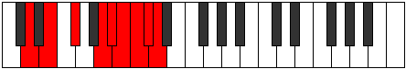
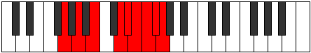

# Mode Sythyllic

## Links

- [Documentation](index.md)
- [Scales Index](Scales.md)
- [Modes Index](Modes.md)
- [Chords Index](Chords.md)

## Parent Scale

[Kataryllic](ScaleKataryllic.md)

## Number

[3989](https://ianring.com/musictheory/scales/3989)

## Perfection

- 5 Perfect notes
- 3 Perfect notes

## Perfection Profile

[true true true true false true false false]

## Permutations

| Tonic | Notes | Signature | Illustration | Audio |
|-------|-------|-----------|--------------|-------|
| [C](ModeCNaturalSythyllic.md) | C, D, E, G, **G#**, A, **A#**, **B**, C | C |  | [midi](ModeCNaturalSythyllic.mid) [ogg](ModeCNaturalSythyllic.ogg) |
| [C#](ModeCSharpSythyllic.md) | C#, D#, F, G#, **A**, A#, **B**, **C**, C# | C |  | [midi](ModeCSharpSythyllic.mid) [ogg](ModeCSharpSythyllic.ogg) |
| [Db](ModeDFlatSythyllic.md) | Db, Eb, F, Ab, **A**, Bb, **B**, **C**, Db | C |  | [midi](ModeDFlatSythyllic.mid) [ogg](ModeDFlatSythyllic.ogg) |
| [D](ModeDNaturalSythyllic.md) | D, E, F#, A, **A#**, B, **C**, **C#**, D | C |  | [midi](ModeDNaturalSythyllic.mid) [ogg](ModeDNaturalSythyllic.ogg) |
| [D#](ModeDSharpSythyllic.md) | D#, F, G, A#, **B**, C, **C#**, **D**, D# | C |  | [midi](ModeDSharpSythyllic.mid) [ogg](ModeDSharpSythyllic.ogg) |
| [Eb](ModeEFlatSythyllic.md) | Eb, F, G, Bb, **B**, C, **Db**, **D**, Eb | C |  | [midi](ModeEFlatSythyllic.mid) [ogg](ModeEFlatSythyllic.ogg) |
| [E](ModeENaturalSythyllic.md) | E, F#, G#, B, **C**, C#, **D**, **D#**, E | C |  | [midi](ModeENaturalSythyllic.mid) [ogg](ModeENaturalSythyllic.ogg) |
| [F](ModeFNaturalSythyllic.md) | F, G, A, C, **C#**, D, **D#**, **E**, F | C |  | [midi](ModeFNaturalSythyllic.mid) [ogg](ModeFNaturalSythyllic.ogg) |
| [F#](ModeFSharpSythyllic.md) | F#, G#, A#, C#, **D**, D#, **E**, **F**, F# | C |  | [midi](ModeFSharpSythyllic.mid) [ogg](ModeFSharpSythyllic.ogg) |
| [Gb](ModeGFlatSythyllic.md) | Gb, Ab, Bb, Db, **D**, Eb, **E**, **F**, Gb | C |  | [midi](ModeGFlatSythyllic.mid) [ogg](ModeGFlatSythyllic.ogg) |
| [G](ModeGNaturalSythyllic.md) | G, A, B, D, **D#**, E, **F**, **F#**, G | C |  | [midi](ModeGNaturalSythyllic.mid) [ogg](ModeGNaturalSythyllic.ogg) |
| [G#](ModeGSharpSythyllic.md) | G#, A#, C, D#, **E**, F, **F#**, **G**, G# | C |  | [midi](ModeGSharpSythyllic.mid) [ogg](ModeGSharpSythyllic.ogg) |
| [Ab](ModeAFlatSythyllic.md) | Ab, Bb, C, Eb, **E**, F, **Gb**, **G**, Ab | C |  | [midi](ModeAFlatSythyllic.mid) [ogg](ModeAFlatSythyllic.ogg) |
| [A](ModeANaturalSythyllic.md) | A, B, C#, E, **F**, F#, **G**, **G#**, A | C |  | [midi](ModeANaturalSythyllic.mid) [ogg](ModeANaturalSythyllic.ogg) |
| [A#](ModeASharpSythyllic.md) | A#, C, D, F, **F#**, G, **G#**, **A**, A# | C |  | [midi](ModeASharpSythyllic.mid) [ogg](ModeASharpSythyllic.ogg) |
| [Bb](ModeBFlatSythyllic.md) | Bb, C, D, F, **Gb**, G, **Ab**, **A**, Bb | C |  | [midi](ModeBFlatSythyllic.mid) [ogg](ModeBFlatSythyllic.ogg) |
| [B](ModeBNaturalSythyllic.md) | B, C#, D#, F#, **G**, G#, **A**, **A#**, B | C |  | [midi](ModeBNaturalSythyllic.mid) [ogg](ModeBNaturalSythyllic.ogg) |
