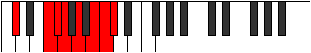

# Mode Thacrian

## Links

- [Documentation](README.md)
- [Scales Index](Scales.md)
- [Modes Index](Modes.md)
- [Chords Index](Chords.md)

## Parent Scale

[Thacrian](ScaleThacrian.md)

## Number

[3441](https://ianring.com/musictheory/scales/3441)

## Luminosity

-1

## Transposition

4, 1, 1, 2, 2, 1, 1

## Chord Pattern

ii⁰b3, iii⁰, IVb5

## Perfection

- 4 Perfect notes
- 3 Perfect notes

## Perfection Profile

false, true, true, false, false, true, true

## Permutations

| Tonic | Notes | Signature | Illustration | Audio |
|-------|-------|-----------|--------------|-------|
| [C](ModeCNaturalThacrian.md) | **C**, D##, E#, **F#**, **G#**, A#, B, **C** | C |  | [midi](https://github.com/edipermadi/music/blob/main/docs/ModeCNaturalThacrian.mid?raw=true) |
| [C#](ModeCSharpThacrian.md) | **C#**, D###, E##, **F##**, **G##**, A##, B#, **C#** | C |  | [midi](https://github.com/edipermadi/music/blob/main/docs/ModeCSharpThacrian.mid?raw=true) |
| [Db](ModeDFlatThacrian.md) | **Db**, E#, F#, **G**, **A**, B, C, **Db** | C |  | [midi](https://github.com/edipermadi/music/blob/main/docs/ModeDFlatThacrian.mid?raw=true) |
| [D](ModeDNaturalThacrian.md) | **D**, E##, F##, **G#**, **A#**, B#, C#, **D** | C |  | [midi](https://github.com/edipermadi/music/blob/main/docs/ModeDNaturalThacrian.mid?raw=true) |
| [D#](ModeDSharpThacrian.md) | **D#**, E###, F###, **G##**, **A##**, B##, C##, **D#** | C |  | [midi](https://github.com/edipermadi/music/blob/main/docs/ModeDSharpThacrian.mid?raw=true) |
| [Eb](ModeEFlatThacrian.md) | **Eb**, F##, G#, **A**, **B**, C#, D, **Eb** | C |  | [midi](https://github.com/edipermadi/music/blob/main/docs/ModeEFlatThacrian.mid?raw=true) |
| [E](ModeENaturalThacrian.md) | **E**, F###, G##, **A#**, **B#**, C##, D#, **E** | C |  | [midi](https://github.com/edipermadi/music/blob/main/docs/ModeENaturalThacrian.mid?raw=true) |
| [F](ModeFNaturalThacrian.md) | **F**, G##, A#, **B**, **C#**, D#, E, **F** | C |  | [midi](https://github.com/edipermadi/music/blob/main/docs/ModeFNaturalThacrian.mid?raw=true) |
| [F#](ModeFSharpThacrian.md) | **F#**, G###, A##, **B#**, **C##**, D##, E#, **F#** | C |  | [midi](https://github.com/edipermadi/music/blob/main/docs/ModeFSharpThacrian.mid?raw=true) |
| [Gb](ModeGFlatThacrian.md) | **Gb**, A#, B, **C**, **D**, E, F, **Gb** | C |  | [midi](https://github.com/edipermadi/music/blob/main/docs/ModeGFlatThacrian.mid?raw=true) |
| [G](ModeGNaturalThacrian.md) | **G**, A##, B#, **C#**, **D#**, E#, F#, **G** | C |  | [midi](https://github.com/edipermadi/music/blob/main/docs/ModeGNaturalThacrian.mid?raw=true) |
| [G#](ModeGSharpThacrian.md) | **G#**, A###, B##, **C##**, **D##**, E##, F##, **G#** | C |  | [midi](https://github.com/edipermadi/music/blob/main/docs/ModeGSharpThacrian.mid?raw=true) |
| [Ab](ModeAFlatThacrian.md) | **Ab**, B#, C#, **D**, **E**, F#, G, **Ab** | C |  | [midi](https://github.com/edipermadi/music/blob/main/docs/ModeAFlatThacrian.mid?raw=true) |
| [A](ModeANaturalThacrian.md) | **A**, B##, C##, **D#**, **E#**, F##, G#, **A** | C |  | [midi](https://github.com/edipermadi/music/blob/main/docs/ModeANaturalThacrian.mid?raw=true) |
| [A#](ModeASharpThacrian.md) | **A#**, B###, C###, **D##**, **E##**, F###, G##, **A#** | C |  | [midi](https://github.com/edipermadi/music/blob/main/docs/ModeASharpThacrian.mid?raw=true) |
| [Bb](ModeBFlatThacrian.md) | **Bb**, C##, D#, **E**, **F#**, G#, A, **Bb** | C |  | [midi](https://github.com/edipermadi/music/blob/main/docs/ModeBFlatThacrian.mid?raw=true) |
| [B](ModeBNaturalThacrian.md) | **B**, C###, D##, **E#**, **F##**, G##, A#, **B** | C |  | [midi](https://github.com/edipermadi/music/blob/main/docs/ModeBNaturalThacrian.mid?raw=true) |
