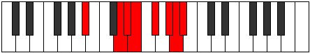
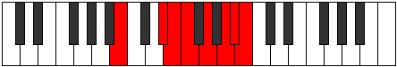

# Mode Thacrian

## Links

- [Documentation](index.md)
- [Scales Index](Scales.md)
- [Modes Index](Modes.md)
- [Chords Index](Chords.md)

## Parent Scale

[Thacrian](ScaleThacrian.md)

## Number

[3441](https://ianring.com/musictheory/scales/3441)

## Perfection

- 4 Perfect notes
- 3 Perfect notes

## Perfection Profile

[false true true false false true true]

## Permutations

| Tonic | Notes | Signature | Illustration | Audio |
|-------|-------|-----------|--------------|-------|
| [C](ModeCNaturalThacrian.md) | **C**, D##, E#, **F#**, **G#**, A#, B, **C** | C |  | [midi](ModeCNaturalThacrian.mid) [ogg](ModeCNaturalThacrian.ogg) |
| [C#](ModeCSharpThacrian.md) | **C#**, D###, E##, **F##**, **G##**, A##, B#, **C#** | C |  | [midi](ModeCSharpThacrian.mid) [ogg](ModeCSharpThacrian.ogg) |
| [Db](ModeDFlatThacrian.md) | **Db**, E#, F#, **G**, **A**, B, C, **Db** | C |  | [midi](ModeDFlatThacrian.mid) [ogg](ModeDFlatThacrian.ogg) |
| [D](ModeDNaturalThacrian.md) | **D**, E##, F##, **G#**, **A#**, B#, C#, **D** | C |  | [midi](ModeDNaturalThacrian.mid) [ogg](ModeDNaturalThacrian.ogg) |
| [D#](ModeDSharpThacrian.md) | **D#**, E###, F###, **G##**, **A##**, B##, C##, **D#** | C |  | [midi](ModeDSharpThacrian.mid) [ogg](ModeDSharpThacrian.ogg) |
| [Eb](ModeEFlatThacrian.md) | **Eb**, F##, G#, **A**, **B**, C#, D, **Eb** | C |  | [midi](ModeEFlatThacrian.mid) [ogg](ModeEFlatThacrian.ogg) |
| [E](ModeENaturalThacrian.md) | **E**, F###, G##, **A#**, **B#**, C##, D#, **E** | C |  | [midi](ModeENaturalThacrian.mid) [ogg](ModeENaturalThacrian.ogg) |
| [F](ModeFNaturalThacrian.md) | **F**, G##, A#, **B**, **C#**, D#, E, **F** | C |  | [midi](ModeFNaturalThacrian.mid) [ogg](ModeFNaturalThacrian.ogg) |
| [F#](ModeFSharpThacrian.md) | **F#**, G###, A##, **B#**, **C##**, D##, E#, **F#** | C |  | [midi](ModeFSharpThacrian.mid) [ogg](ModeFSharpThacrian.ogg) |
| [Gb](ModeGFlatThacrian.md) | **Gb**, A#, B, **C**, **D**, E, F, **Gb** | C |  | [midi](ModeGFlatThacrian.mid) [ogg](ModeGFlatThacrian.ogg) |
| [G](ModeGNaturalThacrian.md) | **G**, A##, B#, **C#**, **D#**, E#, F#, **G** | C |  | [midi](ModeGNaturalThacrian.mid) [ogg](ModeGNaturalThacrian.ogg) |
| [G#](ModeGSharpThacrian.md) | **G#**, A###, B##, **C##**, **D##**, E##, F##, **G#** | C |  | [midi](ModeGSharpThacrian.mid) [ogg](ModeGSharpThacrian.ogg) |
| [Ab](ModeAFlatThacrian.md) | **Ab**, B#, C#, **D**, **E**, F#, G, **Ab** | C |  | [midi](ModeAFlatThacrian.mid) [ogg](ModeAFlatThacrian.ogg) |
| [A](ModeANaturalThacrian.md) | **A**, B##, C##, **D#**, **E#**, F##, G#, **A** | C |  | [midi](ModeANaturalThacrian.mid) [ogg](ModeANaturalThacrian.ogg) |
| [A#](ModeASharpThacrian.md) | **A#**, B###, C###, **D##**, **E##**, F###, G##, **A#** | C |  | [midi](ModeASharpThacrian.mid) [ogg](ModeASharpThacrian.ogg) |
| [Bb](ModeBFlatThacrian.md) | **Bb**, C##, D#, **E**, **F#**, G#, A, **Bb** | C |  | [midi](ModeBFlatThacrian.mid) [ogg](ModeBFlatThacrian.ogg) |
| [B](ModeBNaturalThacrian.md) | **B**, C###, D##, **E#**, **F##**, G##, A#, **B** | C |  | [midi](ModeBNaturalThacrian.mid) [ogg](ModeBNaturalThacrian.ogg) |
