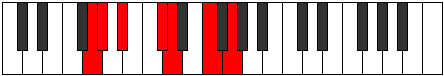
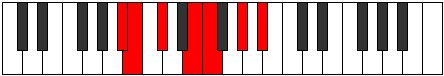

# Mode Thacrimic

## Links

- [Documentation](index.md)
- [Scales Index](Scales.md)
- [Modes Index](Modes.md)
- [Chords Index](Chords.md)

## Parent Scale

[Zacrimic](ScaleZacrimic.md)

## Number

[1227](https://ianring.com/musictheory/scales/1227)

## Perfection

- 3 Perfect notes
- 3 Perfect notes

## Perfection Profile

[true false true true false false]

## Permutations

| Tonic | Notes | Signature | Illustration | Audio |
|-------|-------|-----------|--------------|-------|
| [C](ModeCNaturalThacrimic.md) | C, **Db**, Eb, F#, **G**, **A#**, C | C |  | [midi](ModeCNaturalThacrimic.mid) [ogg](ModeCNaturalThacrimic.ogg) |
| [C#](ModeCSharpThacrimic.md) | C#, **D**, E, F##, **G#**, **A##**, C# | C |  | [midi](ModeCSharpThacrimic.mid) [ogg](ModeCSharpThacrimic.ogg) |
| [Db](ModeDFlatThacrimic.md) | Db, **Ebb**, Fb, G, **Ab**, **B**, Db | C |  | [midi](ModeDFlatThacrimic.mid) [ogg](ModeDFlatThacrimic.ogg) |
| [D](ModeDNaturalThacrimic.md) | D, **Eb**, F, G#, **A**, **B#**, D | C |  | [midi](ModeDNaturalThacrimic.mid) [ogg](ModeDNaturalThacrimic.ogg) |
| [D#](ModeDSharpThacrimic.md) | D#, **E**, F#, G##, **A#**, **B##**, D# | C |  | [midi](ModeDSharpThacrimic.mid) [ogg](ModeDSharpThacrimic.ogg) |
| [Eb](ModeEFlatThacrimic.md) | Eb, **Fb**, Gb, A, **Bb**, **C#**, Eb | C |  | [midi](ModeEFlatThacrimic.mid) [ogg](ModeEFlatThacrimic.ogg) |
| [E](ModeENaturalThacrimic.md) | E, **F**, G, A#, **B**, **C##**, E | C |  | [midi](ModeENaturalThacrimic.mid) [ogg](ModeENaturalThacrimic.ogg) |
| [F](ModeFNaturalThacrimic.md) | F, **Gb**, Ab, B, **C**, **D#**, F | C |  | [midi](ModeFNaturalThacrimic.mid) [ogg](ModeFNaturalThacrimic.ogg) |
| [F#](ModeFSharpThacrimic.md) | F#, **G**, A, B#, **C#**, **D##**, F# | C |  | [midi](ModeFSharpThacrimic.mid) [ogg](ModeFSharpThacrimic.ogg) |
| [Gb](ModeGFlatThacrimic.md) | Gb, **Abb**, Bbb, C, **Db**, **E**, Gb | C |  | [midi](ModeGFlatThacrimic.mid) [ogg](ModeGFlatThacrimic.ogg) |
| [G](ModeGNaturalThacrimic.md) | G, **Ab**, Bb, C#, **D**, **E#**, G | C |  | [midi](ModeGNaturalThacrimic.mid) [ogg](ModeGNaturalThacrimic.ogg) |
| [G#](ModeGSharpThacrimic.md) | G#, **A**, B, C##, **D#**, **E##**, G# | C |  | [midi](ModeGSharpThacrimic.mid) [ogg](ModeGSharpThacrimic.ogg) |
| [Ab](ModeAFlatThacrimic.md) | Ab, **Bbb**, Cb, D, **Eb**, **F#**, Ab | C |  | [midi](ModeAFlatThacrimic.mid) [ogg](ModeAFlatThacrimic.ogg) |
| [A](ModeANaturalThacrimic.md) | A, **Bb**, C, D#, **E**, **F##**, A | C |  | [midi](ModeANaturalThacrimic.mid) [ogg](ModeANaturalThacrimic.ogg) |
| [A#](ModeASharpThacrimic.md) | A#, **B**, C#, D##, **E#**, **F###**, A# | C |  | [midi](ModeASharpThacrimic.mid) [ogg](ModeASharpThacrimic.ogg) |
| [Bb](ModeBFlatThacrimic.md) | Bb, **Cb**, Db, E, **F**, **G#**, Bb | C |  | [midi](ModeBFlatThacrimic.mid) [ogg](ModeBFlatThacrimic.ogg) |
| [B](ModeBNaturalThacrimic.md) | B, **C**, D, E#, **F#**, **G##**, B | C |  | [midi](ModeBNaturalThacrimic.mid) [ogg](ModeBNaturalThacrimic.ogg) |
