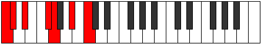
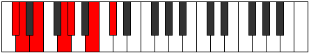
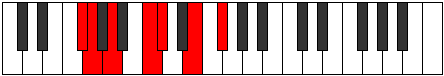

# Mode Thacrimic

## Links

- [Documentation](README.md)
- [Scales Index](Scales.md)
- [Modes Index](Modes.md)
- [Chords Index](Chords.md)

## Parent Scale

[Zacrimic](ScaleZacrimic.md)

## Number

[1227](https://ianring.com/musictheory/scales/1227)

## Luminosity

-1

## Transposition

1, 2, 3, 1, 3, 2

## Chord Pattern

i, IV

## Perfection

- 3 Perfect notes
- 3 Perfect notes

## Perfection Profile

true, false, true, true, false, false

## Permutations

| Tonic | Notes | Signature | Illustration | Audio |
|-------|-------|-----------|--------------|-------|
| [C](ModeCNaturalThacrimic.md) | C, **Db**, Eb, F#, **G**, **A#**, C | C |  | [midi](https://github.com/edipermadi/music/blob/main/docs/ModeCNaturalThacrimic.mid?raw=true) |
| [C#](ModeCSharpThacrimic.md) | C#, **D**, E, F##, **G#**, **A##**, C# | C |  | [midi](https://github.com/edipermadi/music/blob/main/docs/ModeCSharpThacrimic.mid?raw=true) |
| [Db](ModeDFlatThacrimic.md) | Db, **Ebb**, Fb, G, **Ab**, **B**, Db | C |  | [midi](https://github.com/edipermadi/music/blob/main/docs/ModeDFlatThacrimic.mid?raw=true) |
| [D](ModeDNaturalThacrimic.md) | D, **Eb**, F, G#, **A**, **B#**, D | C |  | [midi](https://github.com/edipermadi/music/blob/main/docs/ModeDNaturalThacrimic.mid?raw=true) |
| [D#](ModeDSharpThacrimic.md) | D#, **E**, F#, G##, **A#**, **B##**, D# | C |  | [midi](https://github.com/edipermadi/music/blob/main/docs/ModeDSharpThacrimic.mid?raw=true) |
| [Eb](ModeEFlatThacrimic.md) | Eb, **Fb**, Gb, A, **Bb**, **C#**, Eb | C |  | [midi](https://github.com/edipermadi/music/blob/main/docs/ModeEFlatThacrimic.mid?raw=true) |
| [E](ModeENaturalThacrimic.md) | E, **F**, G, A#, **B**, **C##**, E | C |  | [midi](https://github.com/edipermadi/music/blob/main/docs/ModeENaturalThacrimic.mid?raw=true) |
| [F](ModeFNaturalThacrimic.md) | F, **Gb**, Ab, B, **C**, **D#**, F | C |  | [midi](https://github.com/edipermadi/music/blob/main/docs/ModeFNaturalThacrimic.mid?raw=true) |
| [F#](ModeFSharpThacrimic.md) | F#, **G**, A, B#, **C#**, **D##**, F# | C |  | [midi](https://github.com/edipermadi/music/blob/main/docs/ModeFSharpThacrimic.mid?raw=true) |
| [Gb](ModeGFlatThacrimic.md) | Gb, **Abb**, Bbb, C, **Db**, **E**, Gb | C |  | [midi](https://github.com/edipermadi/music/blob/main/docs/ModeGFlatThacrimic.mid?raw=true) |
| [G](ModeGNaturalThacrimic.md) | G, **Ab**, Bb, C#, **D**, **E#**, G | C |  | [midi](https://github.com/edipermadi/music/blob/main/docs/ModeGNaturalThacrimic.mid?raw=true) |
| [G#](ModeGSharpThacrimic.md) | G#, **A**, B, C##, **D#**, **E##**, G# | C |  | [midi](https://github.com/edipermadi/music/blob/main/docs/ModeGSharpThacrimic.mid?raw=true) |
| [Ab](ModeAFlatThacrimic.md) | Ab, **Bbb**, Cb, D, **Eb**, **F#**, Ab | C |  | [midi](https://github.com/edipermadi/music/blob/main/docs/ModeAFlatThacrimic.mid?raw=true) |
| [A](ModeANaturalThacrimic.md) | A, **Bb**, C, D#, **E**, **F##**, A | C |  | [midi](https://github.com/edipermadi/music/blob/main/docs/ModeANaturalThacrimic.mid?raw=true) |
| [A#](ModeASharpThacrimic.md) | A#, **B**, C#, D##, **E#**, **F###**, A# | C |  | [midi](https://github.com/edipermadi/music/blob/main/docs/ModeASharpThacrimic.mid?raw=true) |
| [Bb](ModeBFlatThacrimic.md) | Bb, **Cb**, Db, E, **F**, **G#**, Bb | C |  | [midi](https://github.com/edipermadi/music/blob/main/docs/ModeBFlatThacrimic.mid?raw=true) |
| [B](ModeBNaturalThacrimic.md) | B, **C**, D, E#, **F#**, **G##**, B | C |  | [midi](https://github.com/edipermadi/music/blob/main/docs/ModeBNaturalThacrimic.mid?raw=true) |
