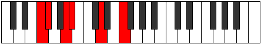
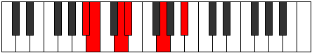

# Mode Thacritonic

## Links

- [Documentation](index.md)
- [Scales Index](Scales.md)
- [Modes Index](Modes.md)
- [Chords Index](Chords.md)

## Parent Scale

[Zacritonic](ScaleZacritonic.md)

## Number

[563](https://ianring.com/musictheory/scales/563)

## Perfection

- 2 Perfect notes
- 3 Perfect notes

## Perfection Profile

[false false false true true]

## Permutations

| Tonic | Notes | Signature | Illustration | Audio |
|-------|-------|-----------|--------------|-------|
| [C](ModeCNaturalThacritonic.md) | **C**, **C#**, **E**, F, A, **C** | C |  | [midi](ModeCNaturalThacritonic.mid) [ogg](ModeCNaturalThacritonic.ogg) |
| [C#](ModeCSharpThacritonic.md) | **C#**, **D**, **F**, F#, A#, **C#** | C |  | [midi](ModeCSharpThacritonic.mid) [ogg](ModeCSharpThacritonic.ogg) |
| [Db](ModeDFlatThacritonic.md) | **Db**, **D**, **F**, Gb, Bb, **Db** | C |  | [midi](ModeDFlatThacritonic.mid) [ogg](ModeDFlatThacritonic.ogg) |
| [D](ModeDNaturalThacritonic.md) | **D**, **D#**, **F#**, G, B, **D** | C |  | [midi](ModeDNaturalThacritonic.mid) [ogg](ModeDNaturalThacritonic.ogg) |
| [D#](ModeDSharpThacritonic.md) | **D#**, **E**, **G**, G#, C, **D#** | C |  | [midi](ModeDSharpThacritonic.mid) [ogg](ModeDSharpThacritonic.ogg) |
| [Eb](ModeEFlatThacritonic.md) | **Eb**, **E**, **G**, Ab, C, **Eb** | C |  | [midi](ModeEFlatThacritonic.mid) [ogg](ModeEFlatThacritonic.ogg) |
| [E](ModeENaturalThacritonic.md) | **E**, **F**, **G#**, A, C#, **E** | C |  | [midi](ModeENaturalThacritonic.mid) [ogg](ModeENaturalThacritonic.ogg) |
| [F](ModeFNaturalThacritonic.md) | **F**, **F#**, **A**, A#, D, **F** | C |  | [midi](ModeFNaturalThacritonic.mid) [ogg](ModeFNaturalThacritonic.ogg) |
| [F#](ModeFSharpThacritonic.md) | **F#**, **G**, **A#**, B, D#, **F#** | C |  | [midi](ModeFSharpThacritonic.mid) [ogg](ModeFSharpThacritonic.ogg) |
| [Gb](ModeGFlatThacritonic.md) | **Gb**, **G**, **Bb**, B, Eb, **Gb** | C |  | [midi](ModeGFlatThacritonic.mid) [ogg](ModeGFlatThacritonic.ogg) |
| [G](ModeGNaturalThacritonic.md) | **G**, **G#**, **B**, C, E, **G** | C |  | [midi](ModeGNaturalThacritonic.mid) [ogg](ModeGNaturalThacritonic.ogg) |
| [G#](ModeGSharpThacritonic.md) | **G#**, **A**, **C**, C#, F, **G#** | C |  | [midi](ModeGSharpThacritonic.mid) [ogg](ModeGSharpThacritonic.ogg) |
| [Ab](ModeAFlatThacritonic.md) | **Ab**, **A**, **C**, Db, F, **Ab** | C |  | [midi](ModeAFlatThacritonic.mid) [ogg](ModeAFlatThacritonic.ogg) |
| [A](ModeANaturalThacritonic.md) | **A**, **A#**, **C#**, D, F#, **A** | C |  | [midi](ModeANaturalThacritonic.mid) [ogg](ModeANaturalThacritonic.ogg) |
| [A#](ModeASharpThacritonic.md) | **A#**, **B**, **D**, D#, G, **A#** | C |  | [midi](ModeASharpThacritonic.mid) [ogg](ModeASharpThacritonic.ogg) |
| [Bb](ModeBFlatThacritonic.md) | **Bb**, **B**, **D**, Eb, G, **Bb** | C |  | [midi](ModeBFlatThacritonic.mid) [ogg](ModeBFlatThacritonic.ogg) |
| [B](ModeBNaturalThacritonic.md) | **B**, **C**, **D#**, E, G#, **B** | C |  | [midi](ModeBNaturalThacritonic.mid) [ogg](ModeBNaturalThacritonic.ogg) |
