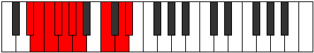

# Mode Thacrygic

## Links

- [Documentation](README.md)
- [Scales Index](Scales.md)
- [Modes Index](Modes.md)
- [Chords Index](Chords.md)

## Parent Scale

[Sathygic](ScaleSathygic.md)

## Number

[2687](https://ianring.com/musictheory/scales/2687)

## Transposition

1, 1, 1, 1, 1, 1, 3, 2, 1

## Chord Pattern

iv⁰b3, VI

## Perfection

- 6 Perfect notes
- 3 Perfect notes

## Perfection Profile

false, false, true, false, true, true, true, true, true

## Permutations

| Tonic | Notes | Signature | Illustration | Audio |
|-------|-------|-----------|--------------|-------|
| [C](ModeCNaturalThacrygic.md) | **C**, **C#**, D, **D#**, E, F, F#, A, B, **C** | C |  | [midi](https://github.com/edipermadi/music/blob/main/docs/ModeCNaturalThacrygic.mid?raw=true) |
| [C#](ModeCSharpThacrygic.md) | **C#**, **D**, D#, **E**, F, F#, G, A#, C, **C#** | C |  | [midi](https://github.com/edipermadi/music/blob/main/docs/ModeCSharpThacrygic.mid?raw=true) |
| [Db](ModeDFlatThacrygic.md) | **Db**, **D**, Eb, **E**, F, Gb, G, Bb, C, **Db** | C |  | [midi](https://github.com/edipermadi/music/blob/main/docs/ModeDFlatThacrygic.mid?raw=true) |
| [D](ModeDNaturalThacrygic.md) | **D**, **D#**, E, **F**, F#, G, G#, B, C#, **D** | C |  | [midi](https://github.com/edipermadi/music/blob/main/docs/ModeDNaturalThacrygic.mid?raw=true) |
| [D#](ModeDSharpThacrygic.md) | **D#**, **E**, F, **F#**, G, G#, A, C, D, **D#** | C |  | [midi](https://github.com/edipermadi/music/blob/main/docs/ModeDSharpThacrygic.mid?raw=true) |
| [Eb](ModeEFlatThacrygic.md) | **Eb**, **E**, F, **Gb**, G, Ab, A, C, D, **Eb** | C |  | [midi](https://github.com/edipermadi/music/blob/main/docs/ModeEFlatThacrygic.mid?raw=true) |
| [E](ModeENaturalThacrygic.md) | **E**, **F**, F#, **G**, G#, A, A#, C#, D#, **E** | C |  | [midi](https://github.com/edipermadi/music/blob/main/docs/ModeENaturalThacrygic.mid?raw=true) |
| [F](ModeFNaturalThacrygic.md) | **F**, **F#**, G, **G#**, A, A#, B, D, E, **F** | C |  | [midi](https://github.com/edipermadi/music/blob/main/docs/ModeFNaturalThacrygic.mid?raw=true) |
| [F#](ModeFSharpThacrygic.md) | **F#**, **G**, G#, **A**, A#, B, C, D#, F, **F#** | C |  | [midi](https://github.com/edipermadi/music/blob/main/docs/ModeFSharpThacrygic.mid?raw=true) |
| [Gb](ModeGFlatThacrygic.md) | **Gb**, **G**, Ab, **A**, Bb, B, C, Eb, F, **Gb** | C |  | [midi](https://github.com/edipermadi/music/blob/main/docs/ModeGFlatThacrygic.mid?raw=true) |
| [G](ModeGNaturalThacrygic.md) | **G**, **G#**, A, **A#**, B, C, C#, E, F#, **G** | C |  | [midi](https://github.com/edipermadi/music/blob/main/docs/ModeGNaturalThacrygic.mid?raw=true) |
| [G#](ModeGSharpThacrygic.md) | **G#**, **A**, A#, **B**, C, C#, D, F, G, **G#** | C |  | [midi](https://github.com/edipermadi/music/blob/main/docs/ModeGSharpThacrygic.mid?raw=true) |
| [Ab](ModeAFlatThacrygic.md) | **Ab**, **A**, Bb, **B**, C, Db, D, F, G, **Ab** | C |  | [midi](https://github.com/edipermadi/music/blob/main/docs/ModeAFlatThacrygic.mid?raw=true) |
| [A](ModeANaturalThacrygic.md) | **A**, **A#**, B, **C**, C#, D, D#, F#, G#, **A** | C |  | [midi](https://github.com/edipermadi/music/blob/main/docs/ModeANaturalThacrygic.mid?raw=true) |
| [A#](ModeASharpThacrygic.md) | **A#**, **B**, C, **C#**, D, D#, E, G, A, **A#** | C |  | [midi](https://github.com/edipermadi/music/blob/main/docs/ModeASharpThacrygic.mid?raw=true) |
| [Bb](ModeBFlatThacrygic.md) | **Bb**, **B**, C, **Db**, D, Eb, E, G, A, **Bb** | C |  | [midi](https://github.com/edipermadi/music/blob/main/docs/ModeBFlatThacrygic.mid?raw=true) |
| [B](ModeBNaturalThacrygic.md) | **B**, **C**, C#, **D**, D#, E, F, G#, A#, **B** | C |  | [midi](https://github.com/edipermadi/music/blob/main/docs/ModeBNaturalThacrygic.mid?raw=true) |
