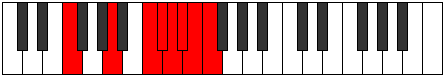

# Mode Thadian

## Links

- [Documentation](index.md)
- [Scales Index](Scales.md)
- [Modes Index](Modes.md)
- [Chords Index](Chords.md)

## Parent Scale

[Thadian](ScaleThadian.md)

## Number

[3985](https://ianring.com/musictheory/scales/3985)

## Interval Pattern

4, 3, 1, 1, 1, 1, 1

## Chord Pattern

## Perfection

- 3 Perfect notes
- 4 Perfect notes

## Perfection Profile

[true true false false true false false]

## Permutations

| Tonic | Notes | Signature | Illustration | Audio |
|-------|-------|-----------|--------------|-------|
| [C](ModeCNaturalThadian.md) | C, D##, **E###**, **F###**, G##, **A#**, **B**, C | C |  | [midi](https://github.com/edipermadi/music/blob/main/docs/ModeCNaturalThadian.mid?raw=true) |
| [C#](ModeCSharpThadian.md) | C#, D###, **F###**, **G##**, A#, **B**, **C**, C# | C |  | [midi](https://github.com/edipermadi/music/blob/main/docs/ModeCSharpThadian.mid?raw=true) |
| [Db](ModeDFlatThadian.md) | Db, E#, **F###**, **G##**, A#, **B**, **C**, Db | C |  | [midi](https://github.com/edipermadi/music/blob/main/docs/ModeDFlatThadian.mid?raw=true) |
| [D](ModeDNaturalThadian.md) | D, E##, **Cbbb**, **Cbb**, Dbbb, **Dbb**, **Ebbb**, D | C |  | [midi](https://github.com/edipermadi/music/blob/main/docs/ModeDNaturalThadian.mid?raw=true) |
| [D#](ModeDSharpThadian.md) | D#, E###, **Cbb**, **Dbbb**, Dbb, **Ebbb**, **Fbbb**, D# | C |  | [midi](https://github.com/edipermadi/music/blob/main/docs/ModeDSharpThadian.mid?raw=true) |
| [Eb](ModeEFlatThadian.md) | Eb, F##, **G###**, **A##**, B#, **C#**, **D**, Eb | C |  | [midi](https://github.com/edipermadi/music/blob/main/docs/ModeEFlatThadian.mid?raw=true) |
| [E](ModeENaturalThadian.md) | E, F###, **Cb**, **Dbb**, Ebbb, **Fbbb**, **C###**, E | C |  | [midi](https://github.com/edipermadi/music/blob/main/docs/ModeENaturalThadian.mid?raw=true) |
| [F](ModeFNaturalThadian.md) | F, G##, **A###**, **B##**, C##, **D#**, **E**, F | C |  | [midi](https://github.com/edipermadi/music/blob/main/docs/ModeFNaturalThadian.mid?raw=true) |
| [F#](ModeFSharpThadian.md) | F#, G###, **Db**, **Ebb**, Fbb, **Gbbb**, **D###**, F# | C |  | [midi](https://github.com/edipermadi/music/blob/main/docs/ModeFSharpThadian.mid?raw=true) |
| [Gb](ModeGFlatThadian.md) | Gb, A#, **B##**, **C##**, D#, **E**, **F**, Gb | C |  | [midi](https://github.com/edipermadi/music/blob/main/docs/ModeGFlatThadian.mid?raw=true) |
| [G](ModeGNaturalThadian.md) | G, A##, **B###**, **C###**, D##, **E#**, **F#**, G | C |  | [midi](https://github.com/edipermadi/music/blob/main/docs/ModeGNaturalThadian.mid?raw=true) |
| [G#](ModeGSharpThadian.md) | G#, A###, **C###**, **D##**, E#, **F#**, **G**, G# | C |  | [midi](https://github.com/edipermadi/music/blob/main/docs/ModeGSharpThadian.mid?raw=true) |
| [Ab](ModeAFlatThadian.md) | Ab, B#, **C###**, **D##**, E#, **F#**, **G**, Ab | C |  | [midi](https://github.com/edipermadi/music/blob/main/docs/ModeAFlatThadian.mid?raw=true) |
| [A](ModeANaturalThadian.md) | A, B##, **D##**, **E#**, F#, **G**, **Ab**, A | C |  | [midi](https://github.com/edipermadi/music/blob/main/docs/ModeANaturalThadian.mid?raw=true) |
| [A#](ModeASharpThadian.md) | A#, B###, **D###**, **E##**, F##, **G#**, **A**, A# | C |  | [midi](https://github.com/edipermadi/music/blob/main/docs/ModeASharpThadian.mid?raw=true) |
| [Bb](ModeBFlatThadian.md) | Bb, C##, **D###**, **E##**, F##, **G#**, **A**, Bb | C |  | [midi](https://github.com/edipermadi/music/blob/main/docs/ModeBFlatThadian.mid?raw=true) |
| [B](ModeBNaturalThadian.md) | B, C###, **E##**, **F##**, G#, **A**, **Bb**, B | C |  | [midi](https://github.com/edipermadi/music/blob/main/docs/ModeBNaturalThadian.mid?raw=true) |
