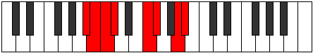

# Mode Thagian

## Links

- [Documentation](index.md)
- [Scales Index](Scales.md)
- [Modes Index](Modes.md)
- [Chords Index](Chords.md)

## Parent Scale

[Parian](ScaleParian.md)

## Number

[2447](https://ianring.com/musictheory/scales/2447)

## Perfection

- 4 Perfect notes
- 3 Perfect notes

## Perfection Profile

[true true false false true true false]

## Permutations

| Tonic | Notes | Signature | Illustration | Audio |
|-------|-------|-----------|--------------|-------|
| [C](ModeCNaturalThagian.md) | C, Db, **Ebb**, **Fbb**, G, Ab, **B**, C | C |  | [midi](ModeCNaturalThagian.mid) [ogg](ModeCNaturalThagian.ogg) |
| [C#](ModeCSharpThagian.md) | C#, D, **Eb**, **Fb**, G#, A, **B#**, C# | C |  | [midi](ModeCSharpThagian.mid) [ogg](ModeCSharpThagian.ogg) |
| [Db](ModeDFlatThagian.md) | Db, Ebb, **Fbb**, **Gbbb**, Ab, Bbb, **C**, Db | C |  | [midi](ModeDFlatThagian.mid) [ogg](ModeDFlatThagian.ogg) |
| [D](ModeDNaturalThagian.md) | D, Eb, **Fb**, **Gbb**, A, Bb, **C#**, D | C |  | [midi](ModeDNaturalThagian.mid) [ogg](ModeDNaturalThagian.ogg) |
| [D#](ModeDSharpThagian.md) | D#, E, **F**, **Gb**, A#, B, **C##**, D# | C |  | [midi](ModeDSharpThagian.mid) [ogg](ModeDSharpThagian.ogg) |
| [Eb](ModeEFlatThagian.md) | Eb, Fb, **Gbb**, **Abbb**, Bb, Cb, **D**, Eb | C |  | [midi](ModeEFlatThagian.mid) [ogg](ModeEFlatThagian.ogg) |
| [E](ModeENaturalThagian.md) | E, F, **Gb**, **Abb**, B, C, **D#**, E | C |  | [midi](ModeENaturalThagian.mid) [ogg](ModeENaturalThagian.ogg) |
| [F](ModeFNaturalThagian.md) | F, Gb, **Abb**, **Bbbb**, C, Db, **E**, F | C |  | [midi](ModeFNaturalThagian.mid) [ogg](ModeFNaturalThagian.ogg) |
| [F#](ModeFSharpThagian.md) | F#, G, **Ab**, **Bbb**, C#, D, **E#**, F# | C |  | [midi](ModeFSharpThagian.mid) [ogg](ModeFSharpThagian.ogg) |
| [Gb](ModeGFlatThagian.md) | Gb, Abb, **Bbbb**, **Cbbb**, Db, Ebb, **F**, Gb | C |  | [midi](ModeGFlatThagian.mid) [ogg](ModeGFlatThagian.ogg) |
| [G](ModeGNaturalThagian.md) | G, Ab, **Bbb**, **Cbb**, D, Eb, **F#**, G | C |  | [midi](ModeGNaturalThagian.mid) [ogg](ModeGNaturalThagian.ogg) |
| [G#](ModeGSharpThagian.md) | G#, A, **Bb**, **Cb**, D#, E, **F##**, G# | C |  | [midi](ModeGSharpThagian.mid) [ogg](ModeGSharpThagian.ogg) |
| [Ab](ModeAFlatThagian.md) | Ab, Bbb, **Cbb**, **Dbbb**, Eb, Fb, **G**, Ab | C |  | [midi](ModeAFlatThagian.mid) [ogg](ModeAFlatThagian.ogg) |
| [A](ModeANaturalThagian.md) | A, Bb, **Cb**, **Dbb**, E, F, **G#**, A | C |  | [midi](ModeANaturalThagian.mid) [ogg](ModeANaturalThagian.ogg) |
| [A#](ModeASharpThagian.md) | A#, B, **C**, **Db**, E#, F#, **G##**, A# | C |  | [midi](ModeASharpThagian.mid) [ogg](ModeASharpThagian.ogg) |
| [Bb](ModeBFlatThagian.md) | Bb, Cb, **Dbb**, **Ebbb**, F, Gb, **A**, Bb | C |  | [midi](ModeBFlatThagian.mid) [ogg](ModeBFlatThagian.ogg) |
| [B](ModeBNaturalThagian.md) | B, C, **Db**, **Ebb**, F#, G, **A#**, B | C |  | [midi](ModeBNaturalThagian.mid) [ogg](ModeBNaturalThagian.ogg) |
