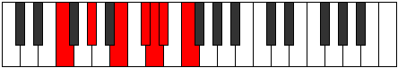
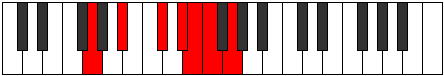

# Mode Thagimic

## Links

- [Documentation](index.md)
- [Scales Index](Scales.md)
- [Modes Index](Modes.md)
- [Chords Index](Chords.md)

## Parent Scale

[Thagimic](ScaleThagimic.md)

## Number

[1865](https://ianring.com/musictheory/scales/1865)

## Perfection

- 2 Perfect notes
- 4 Perfect notes

## Perfection Profile

[false true false true false false]

## Permutations

| Tonic | Notes | Signature | Illustration | Audio |
|-------|-------|-----------|--------------|-------|
| [C](ModeCNaturalThagimic.md) | **C**, D#, **E##**, F###, **G##**, **A#**, **C** | C |  | [midi](ModeCNaturalThagimic.mid) [ogg](ModeCNaturalThagimic.ogg) |
| [C#](ModeCSharpThagimic.md) | **C#**, D##, **E###**, Cbbb, **Cbb**, **Dbbb**, **C#** | C |  | [midi](ModeCSharpThagimic.mid) [ogg](ModeCSharpThagimic.ogg) |
| [Db](ModeDFlatThagimic.md) | **Db**, E, **F##**, G##, **A#**, **B**, **Db** | C |  | [midi](ModeDFlatThagimic.mid) [ogg](ModeDFlatThagimic.ogg) |
| [D](ModeDNaturalThagimic.md) | **D**, E#, **F###**, G###, **A##**, **B#**, **D** | C |  | [midi](ModeDNaturalThagimic.mid) [ogg](ModeDNaturalThagimic.ogg) |
| [D#](ModeDSharpThagimic.md) | **D#**, E##, **Cbbb**, Dbbb, **Dbb**, **Ebbb**, **D#** | C |  | [midi](ModeDSharpThagimic.mid) [ogg](ModeDSharpThagimic.ogg) |
| [Eb](ModeEFlatThagimic.md) | **Eb**, F#, **G##**, A##, **B#**, **C#**, **Eb** | C |  | [midi](ModeEFlatThagimic.mid) [ogg](ModeEFlatThagimic.ogg) |
| [E](ModeENaturalThagimic.md) | **E**, F##, **G###**, A###, **B##**, **C##**, **E** | C |  | [midi](ModeENaturalThagimic.mid) [ogg](ModeENaturalThagimic.ogg) |
| [F](ModeFNaturalThagimic.md) | **F**, G#, **A##**, B##, **C##**, **D#**, **F** | C |  | [midi](ModeFNaturalThagimic.mid) [ogg](ModeFNaturalThagimic.ogg) |
| [F#](ModeFSharpThagimic.md) | **F#**, G##, **A###**, B###, **C###**, **D##**, **F#** | C |  | [midi](ModeFSharpThagimic.mid) [ogg](ModeFSharpThagimic.ogg) |
| [Gb](ModeGFlatThagimic.md) | **Gb**, A, **B#**, C##, **D#**, **E**, **Gb** | C |  | [midi](ModeGFlatThagimic.mid) [ogg](ModeGFlatThagimic.ogg) |
| [G](ModeGNaturalThagimic.md) | **G**, A#, **B##**, C###, **D##**, **E#**, **G** | C |  | [midi](ModeGNaturalThagimic.mid) [ogg](ModeGNaturalThagimic.ogg) |
| [G#](ModeGSharpThagimic.md) | **G#**, A##, **B###**, D##, **E#**, **F#**, **G#** | C |  | [midi](ModeGSharpThagimic.mid) [ogg](ModeGSharpThagimic.ogg) |
| [Ab](ModeAFlatThagimic.md) | **Ab**, B, **C##**, D##, **E#**, **F#**, **Ab** | C |  | [midi](ModeAFlatThagimic.mid) [ogg](ModeAFlatThagimic.ogg) |
| [A](ModeANaturalThagimic.md) | **A**, B#, **C###**, D###, **E##**, **F##**, **A** | C |  | [midi](ModeANaturalThagimic.mid) [ogg](ModeANaturalThagimic.ogg) |
| [A#](ModeASharpThagimic.md) | **A#**, B##, **D##**, E##, **F##**, **G#**, **A#** | C |  | [midi](ModeASharpThagimic.mid) [ogg](ModeASharpThagimic.ogg) |
| [Bb](ModeBFlatThagimic.md) | **Bb**, C#, **D##**, E##, **F##**, **G#**, **Bb** | C |  | [midi](ModeBFlatThagimic.mid) [ogg](ModeBFlatThagimic.ogg) |
| [B](ModeBNaturalThagimic.md) | **B**, C##, **D###**, E###, **F###**, **G##**, **B** | C |  | [midi](ModeBNaturalThagimic.mid) [ogg](ModeBNaturalThagimic.ogg) |
