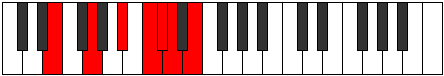
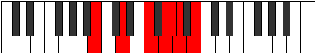

# Mode Thagimic

## Links

- [Documentation](README.md)
- [Scales Index](Scales.md)
- [Modes Index](Modes.md)
- [Chords Index](Chords.md)

## Parent Scale

[Thagimic](ScaleThagimic.md)

## Number

[1865](https://ianring.com/musictheory/scales/1865)

## Transposition

3, 3, 2, 1, 1, 2

## Chord Pattern

iii⁰

## Perfection

- 2 Perfect notes
- 4 Perfect notes

## Perfection Profile

[false true false true false false]

## Permutations

| Tonic | Notes | Signature | Illustration | Audio |
|-------|-------|-----------|--------------|-------|
| [C](ModeCNaturalThagimic.md) | **C**, D#, **E##**, F###, **G##**, **A#**, **C** | C |  | [midi](https://github.com/edipermadi/music/blob/main/docs/ModeCNaturalThagimic.mid?raw=true) |
| [C#](ModeCSharpThagimic.md) | **C#**, D##, **E###**, Cbbb, **Cbb**, **Dbbb**, **C#** | C |  | [midi](https://github.com/edipermadi/music/blob/main/docs/ModeCSharpThagimic.mid?raw=true) |
| [Db](ModeDFlatThagimic.md) | **Db**, E, **F##**, G##, **A#**, **B**, **Db** | C |  | [midi](https://github.com/edipermadi/music/blob/main/docs/ModeDFlatThagimic.mid?raw=true) |
| [D](ModeDNaturalThagimic.md) | **D**, E#, **F###**, G###, **A##**, **B#**, **D** | C |  | [midi](https://github.com/edipermadi/music/blob/main/docs/ModeDNaturalThagimic.mid?raw=true) |
| [D#](ModeDSharpThagimic.md) | **D#**, E##, **Cbbb**, Dbbb, **Dbb**, **Ebbb**, **D#** | C |  | [midi](https://github.com/edipermadi/music/blob/main/docs/ModeDSharpThagimic.mid?raw=true) |
| [Eb](ModeEFlatThagimic.md) | **Eb**, F#, **G##**, A##, **B#**, **C#**, **Eb** | C |  | [midi](https://github.com/edipermadi/music/blob/main/docs/ModeEFlatThagimic.mid?raw=true) |
| [E](ModeENaturalThagimic.md) | **E**, F##, **G###**, A###, **B##**, **C##**, **E** | C |  | [midi](https://github.com/edipermadi/music/blob/main/docs/ModeENaturalThagimic.mid?raw=true) |
| [F](ModeFNaturalThagimic.md) | **F**, G#, **A##**, B##, **C##**, **D#**, **F** | C |  | [midi](https://github.com/edipermadi/music/blob/main/docs/ModeFNaturalThagimic.mid?raw=true) |
| [F#](ModeFSharpThagimic.md) | **F#**, G##, **A###**, B###, **C###**, **D##**, **F#** | C |  | [midi](https://github.com/edipermadi/music/blob/main/docs/ModeFSharpThagimic.mid?raw=true) |
| [Gb](ModeGFlatThagimic.md) | **Gb**, A, **B#**, C##, **D#**, **E**, **Gb** | C |  | [midi](https://github.com/edipermadi/music/blob/main/docs/ModeGFlatThagimic.mid?raw=true) |
| [G](ModeGNaturalThagimic.md) | **G**, A#, **B##**, C###, **D##**, **E#**, **G** | C |  | [midi](https://github.com/edipermadi/music/blob/main/docs/ModeGNaturalThagimic.mid?raw=true) |
| [G#](ModeGSharpThagimic.md) | **G#**, A##, **B###**, D##, **E#**, **F#**, **G#** | C |  | [midi](https://github.com/edipermadi/music/blob/main/docs/ModeGSharpThagimic.mid?raw=true) |
| [Ab](ModeAFlatThagimic.md) | **Ab**, B, **C##**, D##, **E#**, **F#**, **Ab** | C |  | [midi](https://github.com/edipermadi/music/blob/main/docs/ModeAFlatThagimic.mid?raw=true) |
| [A](ModeANaturalThagimic.md) | **A**, B#, **C###**, D###, **E##**, **F##**, **A** | C |  | [midi](https://github.com/edipermadi/music/blob/main/docs/ModeANaturalThagimic.mid?raw=true) |
| [A#](ModeASharpThagimic.md) | **A#**, B##, **D##**, E##, **F##**, **G#**, **A#** | C |  | [midi](https://github.com/edipermadi/music/blob/main/docs/ModeASharpThagimic.mid?raw=true) |
| [Bb](ModeBFlatThagimic.md) | **Bb**, C#, **D##**, E##, **F##**, **G#**, **Bb** | C |  | [midi](https://github.com/edipermadi/music/blob/main/docs/ModeBFlatThagimic.mid?raw=true) |
| [B](ModeBNaturalThagimic.md) | **B**, C##, **D###**, E###, **F###**, **G##**, **B** | C |  | [midi](https://github.com/edipermadi/music/blob/main/docs/ModeBNaturalThagimic.mid?raw=true) |
