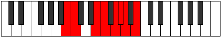

# Mode Thalian

## Links

- [Documentation](README.md)
- [Scales Index](Scales.md)
- [Modes Index](Modes.md)
- [Chords Index](Chords.md)

## Parent Scale

[Stythian](ScaleStythian.md)

## Number

[1891](https://ianring.com/musictheory/scales/1891)

## Transposition

1, 4, 1, 2, 1, 1, 2

## Chord Pattern

iv⁰

## Perfection

- 4 Perfect notes
- 3 Perfect notes

## Perfection Profile

[false true true true false false true]

## Permutations

| Tonic | Notes | Signature | Illustration | Audio |
|-------|-------|-----------|--------------|-------|
| [C](ModeCNaturalThalian.md) | **C**, Db, E#, F#, **G#**, **A**, Bb, **C** | C |  | [midi](https://github.com/edipermadi/music/blob/main/docs/ModeCNaturalThalian.mid?raw=true) |
| [C#](ModeCSharpThalian.md) | **C#**, D, E##, F##, **G##**, **A#**, B, **C#** | C |  | [midi](https://github.com/edipermadi/music/blob/main/docs/ModeCSharpThalian.mid?raw=true) |
| [Db](ModeDFlatThalian.md) | **Db**, Ebb, F#, G, **A**, **Bb**, Cb, **Db** | C |  | [midi](https://github.com/edipermadi/music/blob/main/docs/ModeDFlatThalian.mid?raw=true) |
| [D](ModeDNaturalThalian.md) | **D**, Eb, F##, G#, **A#**, **B**, C, **D** | C |  | [midi](https://github.com/edipermadi/music/blob/main/docs/ModeDNaturalThalian.mid?raw=true) |
| [D#](ModeDSharpThalian.md) | **D#**, E, F###, G##, **A##**, **B#**, C#, **D#** | C |  | [midi](https://github.com/edipermadi/music/blob/main/docs/ModeDSharpThalian.mid?raw=true) |
| [Eb](ModeEFlatThalian.md) | **Eb**, Fb, G#, A, **B**, **C**, Db, **Eb** | C |  | [midi](https://github.com/edipermadi/music/blob/main/docs/ModeEFlatThalian.mid?raw=true) |
| [E](ModeENaturalThalian.md) | **E**, F, G##, A#, **B#**, **C#**, D, **E** | C |  | [midi](https://github.com/edipermadi/music/blob/main/docs/ModeENaturalThalian.mid?raw=true) |
| [F](ModeFNaturalThalian.md) | **F**, Gb, A#, B, **C#**, **D**, Eb, **F** | C |  | [midi](https://github.com/edipermadi/music/blob/main/docs/ModeFNaturalThalian.mid?raw=true) |
| [F#](ModeFSharpThalian.md) | **F#**, G, A##, B#, **C##**, **D#**, E, **F#** | C |  | [midi](https://github.com/edipermadi/music/blob/main/docs/ModeFSharpThalian.mid?raw=true) |
| [Gb](ModeGFlatThalian.md) | **Gb**, Abb, B, C, **D**, **Eb**, Fb, **Gb** | C |  | [midi](https://github.com/edipermadi/music/blob/main/docs/ModeGFlatThalian.mid?raw=true) |
| [G](ModeGNaturalThalian.md) | **G**, Ab, B#, C#, **D#**, **E**, F, **G** | C |  | [midi](https://github.com/edipermadi/music/blob/main/docs/ModeGNaturalThalian.mid?raw=true) |
| [G#](ModeGSharpThalian.md) | **G#**, A, B##, C##, **D##**, **E#**, F#, **G#** | C |  | [midi](https://github.com/edipermadi/music/blob/main/docs/ModeGSharpThalian.mid?raw=true) |
| [Ab](ModeAFlatThalian.md) | **Ab**, Bbb, C#, D, **E**, **F**, Gb, **Ab** | C |  | [midi](https://github.com/edipermadi/music/blob/main/docs/ModeAFlatThalian.mid?raw=true) |
| [A](ModeANaturalThalian.md) | **A**, Bb, C##, D#, **E#**, **F#**, G, **A** | C |  | [midi](https://github.com/edipermadi/music/blob/main/docs/ModeANaturalThalian.mid?raw=true) |
| [A#](ModeASharpThalian.md) | **A#**, B, C###, D##, **E##**, **F##**, G#, **A#** | C |  | [midi](https://github.com/edipermadi/music/blob/main/docs/ModeASharpThalian.mid?raw=true) |
| [Bb](ModeBFlatThalian.md) | **Bb**, Cb, D#, E, **F#**, **G**, Ab, **Bb** | C |  | [midi](https://github.com/edipermadi/music/blob/main/docs/ModeBFlatThalian.mid?raw=true) |
| [B](ModeBNaturalThalian.md) | **B**, C, D##, E#, **F##**, **G#**, A, **B** | C |  | [midi](https://github.com/edipermadi/music/blob/main/docs/ModeBNaturalThalian.mid?raw=true) |
