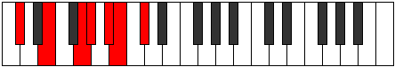
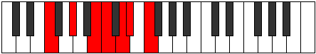
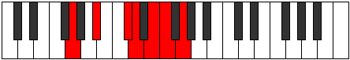

# Mode Thalimic

## Links

- [Documentation](README.md)
- [Scales Index](Scales.md)
- [Modes Index](Modes.md)
- [Chords Index](Chords.md)

## Parent Scale

[Thalimic](ScaleThalimic.md)

## Number

[1737](https://ianring.com/musictheory/scales/1737)

## Transposition

3, 3, 1, 2, 1, 2

## Chord Pattern

II, iii⁰

## Perfection

- 2 Perfect notes
- 4 Perfect notes

## Perfection Profile

[true true false false false false]

## Permutations

| Tonic | Notes | Signature | Illustration | Audio |
|-------|-------|-----------|--------------|-------|
| [C](ModeCNaturalThalimic.md) | C, D#, **E##**, **F##**, **G##**, **A#**, C | C |  | [midi](https://github.com/edipermadi/music/blob/main/docs/ModeCNaturalThalimic.mid?raw=true) |
| [C#](ModeCSharpThalimic.md) | C#, D##, **E###**, **F###**, **G###**, **A##**, C# | C |  | [midi](https://github.com/edipermadi/music/blob/main/docs/ModeCSharpThalimic.mid?raw=true) |
| [Db](ModeDFlatThalimic.md) | Db, E, **F##**, **G#**, **A#**, **B**, Db | C |  | [midi](https://github.com/edipermadi/music/blob/main/docs/ModeDFlatThalimic.mid?raw=true) |
| [D](ModeDNaturalThalimic.md) | D, E#, **F###**, **G##**, **A##**, **B#**, D | C |  | [midi](https://github.com/edipermadi/music/blob/main/docs/ModeDNaturalThalimic.mid?raw=true) |
| [D#](ModeDSharpThalimic.md) | D#, E##, **Cbbb**, **Cbb**, **Dbb**, **Ebbb**, D# | C |  | [midi](https://github.com/edipermadi/music/blob/main/docs/ModeDSharpThalimic.mid?raw=true) |
| [Eb](ModeEFlatThalimic.md) | Eb, F#, **G##**, **A#**, **B#**, **C#**, Eb | C |  | [midi](https://github.com/edipermadi/music/blob/main/docs/ModeEFlatThalimic.mid?raw=true) |
| [E](ModeENaturalThalimic.md) | E, F##, **G###**, **A##**, **B##**, **C##**, E | C |  | [midi](https://github.com/edipermadi/music/blob/main/docs/ModeENaturalThalimic.mid?raw=true) |
| [F](ModeFNaturalThalimic.md) | F, G#, **A##**, **B#**, **C##**, **D#**, F | C |  | [midi](https://github.com/edipermadi/music/blob/main/docs/ModeFNaturalThalimic.mid?raw=true) |
| [F#](ModeFSharpThalimic.md) | F#, G##, **A###**, **B##**, **C###**, **D##**, F# | C |  | [midi](https://github.com/edipermadi/music/blob/main/docs/ModeFSharpThalimic.mid?raw=true) |
| [Gb](ModeGFlatThalimic.md) | Gb, A, **B#**, **C#**, **D#**, **E**, Gb | C |  | [midi](https://github.com/edipermadi/music/blob/main/docs/ModeGFlatThalimic.mid?raw=true) |
| [G](ModeGNaturalThalimic.md) | G, A#, **B##**, **C##**, **D##**, **E#**, G | C |  | [midi](https://github.com/edipermadi/music/blob/main/docs/ModeGNaturalThalimic.mid?raw=true) |
| [G#](ModeGSharpThalimic.md) | G#, A##, **B###**, **C###**, **D###**, **E##**, G# | C |  | [midi](https://github.com/edipermadi/music/blob/main/docs/ModeGSharpThalimic.mid?raw=true) |
| [Ab](ModeAFlatThalimic.md) | Ab, B, **C##**, **D#**, **E#**, **F#**, Ab | C |  | [midi](https://github.com/edipermadi/music/blob/main/docs/ModeAFlatThalimic.mid?raw=true) |
| [A](ModeANaturalThalimic.md) | A, B#, **C###**, **D##**, **E##**, **F##**, A | C |  | [midi](https://github.com/edipermadi/music/blob/main/docs/ModeANaturalThalimic.mid?raw=true) |
| [A#](ModeASharpThalimic.md) | A#, B##, **D##**, **E#**, **F##**, **G#**, A# | C |  | [midi](https://github.com/edipermadi/music/blob/main/docs/ModeASharpThalimic.mid?raw=true) |
| [Bb](ModeBFlatThalimic.md) | Bb, C#, **D##**, **E#**, **F##**, **G#**, Bb | C |  | [midi](https://github.com/edipermadi/music/blob/main/docs/ModeBFlatThalimic.mid?raw=true) |
| [B](ModeBNaturalThalimic.md) | B, C##, **D###**, **E##**, **F###**, **G##**, B | C |  | [midi](https://github.com/edipermadi/music/blob/main/docs/ModeBNaturalThalimic.mid?raw=true) |
