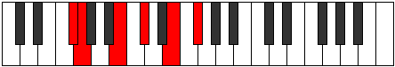
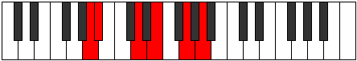

# Mode Thalitonic

## Links

- [Documentation](README.md)
- [Scales Index](Scales.md)
- [Modes Index](Modes.md)
- [Chords Index](Chords.md)

## Parent Scale

[Gathitonic](ScaleGathitonic.md)

## Number

[1187](https://ianring.com/musictheory/scales/1187)

## Transposition

1, 4, 2, 3, 2

## Chord Pattern

## Perfection

- 3 Perfect notes
- 2 Perfect notes

## Perfection Profile

[true false true false true]

## Permutations

| Tonic | Notes | Signature | Illustration | Audio |
|-------|-------|-----------|--------------|-------|
| [C](ModeCNaturalThalitonic.md) | C, **C#**, F, **G**, A#, C | C |  | [midi](https://github.com/edipermadi/music/blob/main/docs/ModeCNaturalThalitonic.mid?raw=true) |
| [C#](ModeCSharpThalitonic.md) | C#, **D**, F#, **G#**, B, C# | C |  | [midi](https://github.com/edipermadi/music/blob/main/docs/ModeCSharpThalitonic.mid?raw=true) |
| [Db](ModeDFlatThalitonic.md) | Db, **D**, Gb, **Ab**, B, Db | C |  | [midi](https://github.com/edipermadi/music/blob/main/docs/ModeDFlatThalitonic.mid?raw=true) |
| [D](ModeDNaturalThalitonic.md) | D, **D#**, G, **A**, C, D | C |  | [midi](https://github.com/edipermadi/music/blob/main/docs/ModeDNaturalThalitonic.mid?raw=true) |
| [D#](ModeDSharpThalitonic.md) | D#, **E**, G#, **A#**, C#, D# | C |  | [midi](https://github.com/edipermadi/music/blob/main/docs/ModeDSharpThalitonic.mid?raw=true) |
| [Eb](ModeEFlatThalitonic.md) | Eb, **E**, Ab, **Bb**, Db, Eb | C |  | [midi](https://github.com/edipermadi/music/blob/main/docs/ModeEFlatThalitonic.mid?raw=true) |
| [E](ModeENaturalThalitonic.md) | E, **F**, A, **B**, D, E | C |  | [midi](https://github.com/edipermadi/music/blob/main/docs/ModeENaturalThalitonic.mid?raw=true) |
| [F](ModeFNaturalThalitonic.md) | F, **F#**, A#, **C**, D#, F | C |  | [midi](https://github.com/edipermadi/music/blob/main/docs/ModeFNaturalThalitonic.mid?raw=true) |
| [F#](ModeFSharpThalitonic.md) | F#, **G**, B, **C#**, E, F# | C |  | [midi](https://github.com/edipermadi/music/blob/main/docs/ModeFSharpThalitonic.mid?raw=true) |
| [Gb](ModeGFlatThalitonic.md) | Gb, **G**, B, **Db**, E, Gb | C |  | [midi](https://github.com/edipermadi/music/blob/main/docs/ModeGFlatThalitonic.mid?raw=true) |
| [G](ModeGNaturalThalitonic.md) | G, **G#**, C, **D**, F, G | C |  | [midi](https://github.com/edipermadi/music/blob/main/docs/ModeGNaturalThalitonic.mid?raw=true) |
| [G#](ModeGSharpThalitonic.md) | G#, **A**, C#, **D#**, F#, G# | C |  | [midi](https://github.com/edipermadi/music/blob/main/docs/ModeGSharpThalitonic.mid?raw=true) |
| [Ab](ModeAFlatThalitonic.md) | Ab, **A**, Db, **Eb**, Gb, Ab | C |  | [midi](https://github.com/edipermadi/music/blob/main/docs/ModeAFlatThalitonic.mid?raw=true) |
| [A](ModeANaturalThalitonic.md) | A, **A#**, D, **E**, G, A | C |  | [midi](https://github.com/edipermadi/music/blob/main/docs/ModeANaturalThalitonic.mid?raw=true) |
| [A#](ModeASharpThalitonic.md) | A#, **B**, D#, **F**, G#, A# | C |  | [midi](https://github.com/edipermadi/music/blob/main/docs/ModeASharpThalitonic.mid?raw=true) |
| [Bb](ModeBFlatThalitonic.md) | Bb, **B**, Eb, **F**, Ab, Bb | C |  | [midi](https://github.com/edipermadi/music/blob/main/docs/ModeBFlatThalitonic.mid?raw=true) |
| [B](ModeBNaturalThalitonic.md) | B, **C**, E, **F#**, A, B | C |  | [midi](https://github.com/edipermadi/music/blob/main/docs/ModeBNaturalThalitonic.mid?raw=true) |
