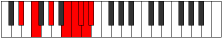

# Mode Thanian

## Links

- [Documentation](index.md)
- [Scales Index](Scales.md)
- [Modes Index](Modes.md)
- [Chords Index](Chords.md)

## Parent Scale

[Katoptian](ScaleKatoptian.md)

## Number

[3877](https://ianring.com/musictheory/scales/3877)

## Interval Pattern

2, 3, 3, 1, 1, 1, 1

## Chord Pattern

## Perfection

- 3 Perfect notes
- 4 Perfect notes

## Perfection Profile

[false true true false false true false]

## Permutations

| Tonic | Notes | Signature | Illustration | Audio |
|-------|-------|-----------|--------------|-------|
| [C](ModeCNaturalThanian.md) | **C**, D, E#, **F###**, **G##**, A#, **B**, **C** | C |  | [midi](https://github.com/edipermadi/music/blob/main/docs/ModeCNaturalThanian.mid?raw=true) |
| [C#](ModeCSharpThanian.md) | **C#**, D#, E##, **Cbbb**, **Cbb**, Dbbb, **Dbb**, **C#** | C |  | [midi](https://github.com/edipermadi/music/blob/main/docs/ModeCSharpThanian.mid?raw=true) |
| [Db](ModeDFlatThanian.md) | **Db**, Eb, F#, **G##**, **A#**, B, **C**, **Db** | C |  | [midi](https://github.com/edipermadi/music/blob/main/docs/ModeDFlatThanian.mid?raw=true) |
| [D](ModeDNaturalThanian.md) | **D**, E, F##, **G###**, **A##**, B#, **C#**, **D** | C |  | [midi](https://github.com/edipermadi/music/blob/main/docs/ModeDNaturalThanian.mid?raw=true) |
| [D#](ModeDSharpThanian.md) | **D#**, E#, F###, **Cb**, **Dbb**, Ebbb, **Fbbb**, **D#** | C |  | [midi](https://github.com/edipermadi/music/blob/main/docs/ModeDSharpThanian.mid?raw=true) |
| [Eb](ModeEFlatThanian.md) | **Eb**, F, G#, **A##**, **B#**, C#, **D**, **Eb** | C |  | [midi](https://github.com/edipermadi/music/blob/main/docs/ModeEFlatThanian.mid?raw=true) |
| [E](ModeENaturalThanian.md) | **E**, F#, G##, **A###**, **B##**, C##, **D#**, **E** | C |  | [midi](https://github.com/edipermadi/music/blob/main/docs/ModeENaturalThanian.mid?raw=true) |
| [F](ModeFNaturalThanian.md) | **F**, G, A#, **B##**, **C##**, D#, **E**, **F** | C |  | [midi](https://github.com/edipermadi/music/blob/main/docs/ModeFNaturalThanian.mid?raw=true) |
| [F#](ModeFSharpThanian.md) | **F#**, G#, A##, **B###**, **C###**, D##, **E#**, **F#** | C |  | [midi](https://github.com/edipermadi/music/blob/main/docs/ModeFSharpThanian.mid?raw=true) |
| [Gb](ModeGFlatThanian.md) | **Gb**, Ab, B, **C##**, **D#**, E, **F**, **Gb** | C |  | [midi](https://github.com/edipermadi/music/blob/main/docs/ModeGFlatThanian.mid?raw=true) |
| [G](ModeGNaturalThanian.md) | **G**, A, B#, **C###**, **D##**, E#, **F#**, **G** | C |  | [midi](https://github.com/edipermadi/music/blob/main/docs/ModeGNaturalThanian.mid?raw=true) |
| [G#](ModeGSharpThanian.md) | **G#**, A#, B##, **D##**, **E#**, F#, **G**, **G#** | C |  | [midi](https://github.com/edipermadi/music/blob/main/docs/ModeGSharpThanian.mid?raw=true) |
| [Ab](ModeAFlatThanian.md) | **Ab**, Bb, C#, **D##**, **E#**, F#, **G**, **Ab** | C |  | [midi](https://github.com/edipermadi/music/blob/main/docs/ModeAFlatThanian.mid?raw=true) |
| [A](ModeANaturalThanian.md) | **A**, B, C##, **D###**, **E##**, F##, **G#**, **A** | C |  | [midi](https://github.com/edipermadi/music/blob/main/docs/ModeANaturalThanian.mid?raw=true) |
| [A#](ModeASharpThanian.md) | **A#**, B#, C###, **E##**, **F##**, G#, **A**, **A#** | C |  | [midi](https://github.com/edipermadi/music/blob/main/docs/ModeASharpThanian.mid?raw=true) |
| [Bb](ModeBFlatThanian.md) | **Bb**, C, D#, **E##**, **F##**, G#, **A**, **Bb** | C |  | [midi](https://github.com/edipermadi/music/blob/main/docs/ModeBFlatThanian.mid?raw=true) |
| [B](ModeBNaturalThanian.md) | **B**, C#, D##, **E###**, **F###**, G##, **A#**, **B** | C |  | [midi](https://github.com/edipermadi/music/blob/main/docs/ModeBNaturalThanian.mid?raw=true) |
