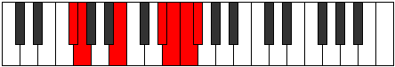

# Mode Thanimic

## Links

- [Documentation](README.md)
- [Scales Index](Scales.md)
- [Modes Index](Modes.md)
- [Chords Index](Chords.md)

## Parent Scale

[Ponimic](ScalePonimic.md)

## Number

[3619](https://ianring.com/musictheory/scales/3619)

## Luminosity

4

## Transposition

1, 4, 4, 1, 1, 1

## Chord Pattern

## Perfection

- 2 Perfect notes
- 4 Perfect notes

## Perfection Profile

false, false, true, false, true, false

## Permutations

| Tonic | Notes | Signature | Illustration | Audio |
|-------|-------|-----------|--------------|-------|
| [C](ModeCNaturalThanimic.md) | **C**, **Db**, E#, **Cbbb**, Cbb, **Dbbb**, **C** | C |  | [midi](https://github.com/edipermadi/music/blob/main/docs/ModeCNaturalThanimic.mid?raw=true) |
| [C#](ModeCSharpThanimic.md) | **C#**, **D**, E##, **Cbb**, Dbbb, **Dbb**, **C#** | C |  | [midi](https://github.com/edipermadi/music/blob/main/docs/ModeCSharpThanimic.mid?raw=true) |
| [Db](ModeDFlatThanimic.md) | **Db**, **Ebb**, F#, **G###**, A##, **B#**, **Db** | C |  | [midi](https://github.com/edipermadi/music/blob/main/docs/ModeDFlatThanimic.mid?raw=true) |
| [D](ModeDNaturalThanimic.md) | **D**, **Eb**, F##, **Cb**, Dbb, **Ebbb**, **D** | C |  | [midi](https://github.com/edipermadi/music/blob/main/docs/ModeDNaturalThanimic.mid?raw=true) |
| [D#](ModeDSharpThanimic.md) | **D#**, **E**, F###, **Dbb**, Ebbb, **Fbbb**, **D#** | C |  | [midi](https://github.com/edipermadi/music/blob/main/docs/ModeDSharpThanimic.mid?raw=true) |
| [Eb](ModeEFlatThanimic.md) | **Eb**, **Fb**, G#, **A###**, B##, **C##**, **Eb** | C |  | [midi](https://github.com/edipermadi/music/blob/main/docs/ModeEFlatThanimic.mid?raw=true) |
| [E](ModeENaturalThanimic.md) | **E**, **F**, G##, **Db**, Ebb, **Fbb**, **E** | C |  | [midi](https://github.com/edipermadi/music/blob/main/docs/ModeENaturalThanimic.mid?raw=true) |
| [F](ModeFNaturalThanimic.md) | **F**, **Gb**, A#, **B###**, C###, **D##**, **F** | C |  | [midi](https://github.com/edipermadi/music/blob/main/docs/ModeFNaturalThanimic.mid?raw=true) |
| [F#](ModeFSharpThanimic.md) | **F#**, **G**, A##, **C###**, D##, **E#**, **F#** | C |  | [midi](https://github.com/edipermadi/music/blob/main/docs/ModeFSharpThanimic.mid?raw=true) |
| [Gb](ModeGFlatThanimic.md) | **Gb**, **Abb**, B, **C###**, D##, **E#**, **Gb** | C |  | [midi](https://github.com/edipermadi/music/blob/main/docs/ModeGFlatThanimic.mid?raw=true) |
| [G](ModeGNaturalThanimic.md) | **G**, **Ab**, B#, **D##**, E#, **F#**, **G** | C |  | [midi](https://github.com/edipermadi/music/blob/main/docs/ModeGNaturalThanimic.mid?raw=true) |
| [G#](ModeGSharpThanimic.md) | **G#**, **A**, B##, **D###**, E##, **F##**, **G#** | C |  | [midi](https://github.com/edipermadi/music/blob/main/docs/ModeGSharpThanimic.mid?raw=true) |
| [Ab](ModeAFlatThanimic.md) | **Ab**, **Bbb**, C#, **D###**, E##, **F##**, **Ab** | C |  | [midi](https://github.com/edipermadi/music/blob/main/docs/ModeAFlatThanimic.mid?raw=true) |
| [A](ModeANaturalThanimic.md) | **A**, **Bb**, C##, **E##**, F##, **G#**, **A** | C |  | [midi](https://github.com/edipermadi/music/blob/main/docs/ModeANaturalThanimic.mid?raw=true) |
| [A#](ModeASharpThanimic.md) | **A#**, **B**, C###, **E###**, F###, **G##**, **A#** | C |  | [midi](https://github.com/edipermadi/music/blob/main/docs/ModeASharpThanimic.mid?raw=true) |
| [Bb](ModeBFlatThanimic.md) | **Bb**, **Cb**, D#, **E###**, F###, **G##**, **Bb** | C |  | [midi](https://github.com/edipermadi/music/blob/main/docs/ModeBFlatThanimic.mid?raw=true) |
| [B](ModeBNaturalThanimic.md) | **B**, **C**, D##, **F###**, G##, **A#**, **B** | C |  | [midi](https://github.com/edipermadi/music/blob/main/docs/ModeBNaturalThanimic.mid?raw=true) |
