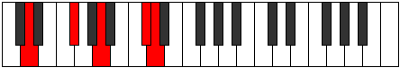
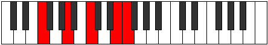

# Mode Thaptic

## Links

- [Documentation](index.md)
- [Scales Index](Scales.md)
- [Modes Index](Modes.md)
- [Chords Index](Chords.md)

## Parent Scale

[Thaptic](ScaleThaptic.md)

## Number

[2193](https://ianring.com/musictheory/scales/2193)

## Perfection

- 2 Perfect notes
- 2 Perfect notes

## Perfection Profile

[true true false false]

## Permutations

| Tonic | Notes | Signature | Illustration | Audio |
|-------|-------|-----------|--------------|-------|
| [C](ModeCNaturalThaptic.md) | C, E, **G**, **B**, C | C |  | [midi](ModeCNaturalThaptic.mid) [ogg](ModeCNaturalThaptic.ogg) |
| [C#](ModeCSharpThaptic.md) | C#, F, **G#**, **C**, C# | C |  | [midi](ModeCSharpThaptic.mid) [ogg](ModeCSharpThaptic.ogg) |
| [Db](ModeDFlatThaptic.md) | Db, F, **Ab**, **C**, Db | C |  | [midi](ModeDFlatThaptic.mid) [ogg](ModeDFlatThaptic.ogg) |
| [D](ModeDNaturalThaptic.md) | D, F#, **A**, **C#**, D | C |  | [midi](ModeDNaturalThaptic.mid) [ogg](ModeDNaturalThaptic.ogg) |
| [D#](ModeDSharpThaptic.md) | D#, G, **A#**, **D**, D# | C |  | [midi](ModeDSharpThaptic.mid) [ogg](ModeDSharpThaptic.ogg) |
| [Eb](ModeEFlatThaptic.md) | Eb, G, **Bb**, **D**, Eb | C |  | [midi](ModeEFlatThaptic.mid) [ogg](ModeEFlatThaptic.ogg) |
| [E](ModeENaturalThaptic.md) | E, G#, **B**, **D#**, E | C |  | [midi](ModeENaturalThaptic.mid) [ogg](ModeENaturalThaptic.ogg) |
| [F](ModeFNaturalThaptic.md) | F, A, **C**, **E**, F | C |  | [midi](ModeFNaturalThaptic.mid) [ogg](ModeFNaturalThaptic.ogg) |
| [F#](ModeFSharpThaptic.md) | F#, A#, **C#**, **F**, F# | C |  | [midi](ModeFSharpThaptic.mid) [ogg](ModeFSharpThaptic.ogg) |
| [Gb](ModeGFlatThaptic.md) | Gb, Bb, **Db**, **F**, Gb | C |  | [midi](ModeGFlatThaptic.mid) [ogg](ModeGFlatThaptic.ogg) |
| [G](ModeGNaturalThaptic.md) | G, B, **D**, **F#**, G | C |  | [midi](ModeGNaturalThaptic.mid) [ogg](ModeGNaturalThaptic.ogg) |
| [G#](ModeGSharpThaptic.md) | G#, C, **D#**, **G**, G# | C |  | [midi](ModeGSharpThaptic.mid) [ogg](ModeGSharpThaptic.ogg) |
| [Ab](ModeAFlatThaptic.md) | Ab, C, **Eb**, **G**, Ab | C |  | [midi](ModeAFlatThaptic.mid) [ogg](ModeAFlatThaptic.ogg) |
| [A](ModeANaturalThaptic.md) | A, C#, **E**, **G#**, A | C |  | [midi](ModeANaturalThaptic.mid) [ogg](ModeANaturalThaptic.ogg) |
| [A#](ModeASharpThaptic.md) | A#, D, **F**, **A**, A# | C |  | [midi](ModeASharpThaptic.mid) [ogg](ModeASharpThaptic.ogg) |
| [Bb](ModeBFlatThaptic.md) | Bb, D, **F**, **A**, Bb | C |  | [midi](ModeBFlatThaptic.mid) [ogg](ModeBFlatThaptic.ogg) |
| [B](ModeBNaturalThaptic.md) | B, D#, **F#**, **A#**, B | C |  | [midi](ModeBNaturalThaptic.mid) [ogg](ModeBNaturalThaptic.ogg) |
