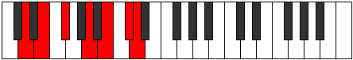

# Mode Thaptimic

## Links

- [Documentation](index.md)
- [Scales Index](Scales.md)
- [Modes Index](Modes.md)
- [Chords Index](Chords.md)

## Parent Scale

[Epathimic](ScaleEpathimic.md)

## Number

[2709](https://ianring.com/musictheory/scales/2709)

## Perfection

- 5 Perfect notes
- 1 Perfect notes

## Perfection Profile

[true true true true true false]

## Permutations

| Tonic | Notes | Signature | Illustration | Audio |
|-------|-------|-----------|--------------|-------|
| [C](ModeCNaturalThaptimic.md) | C, D, E, F##, G##, **A##**, C | C |  | [midi](ModeCNaturalThaptimic.mid) [ogg](ModeCNaturalThaptimic.ogg) |
| [C#](ModeCSharpThaptimic.md) | C#, D#, E#, F###, G###, **A###**, C# | C |  | [midi](ModeCSharpThaptimic.mid) [ogg](ModeCSharpThaptimic.ogg) |
| [Db](ModeDFlatThaptimic.md) | Db, Eb, F, G#, A#, **B#**, Db | C |  | [midi](ModeDFlatThaptimic.mid) [ogg](ModeDFlatThaptimic.ogg) |
| [D](ModeDNaturalThaptimic.md) | D, E, F#, G##, A##, **B##**, D | C |  | [midi](ModeDNaturalThaptimic.mid) [ogg](ModeDNaturalThaptimic.ogg) |
| [D#](ModeDSharpThaptimic.md) | D#, E#, F##, G###, A###, **B###**, D# | C |  | [midi](ModeDSharpThaptimic.mid) [ogg](ModeDSharpThaptimic.ogg) |
| [Eb](ModeEFlatThaptimic.md) | Eb, F, G, A#, B#, **C##**, Eb | C |  | [midi](ModeEFlatThaptimic.mid) [ogg](ModeEFlatThaptimic.ogg) |
| [E](ModeENaturalThaptimic.md) | E, F#, G#, A##, B##, **C###**, E | C |  | [midi](ModeENaturalThaptimic.mid) [ogg](ModeENaturalThaptimic.ogg) |
| [F](ModeFNaturalThaptimic.md) | F, G, A, B#, C##, **D##**, F | C |  | [midi](ModeFNaturalThaptimic.mid) [ogg](ModeFNaturalThaptimic.ogg) |
| [F#](ModeFSharpThaptimic.md) | F#, G#, A#, B##, C###, **D###**, F# | C |  | [midi](ModeFSharpThaptimic.mid) [ogg](ModeFSharpThaptimic.ogg) |
| [Gb](ModeGFlatThaptimic.md) | Gb, Ab, Bb, C#, D#, **E#**, Gb | C |  | [midi](ModeGFlatThaptimic.mid) [ogg](ModeGFlatThaptimic.ogg) |
| [G](ModeGNaturalThaptimic.md) | G, A, B, C##, D##, **E##**, G | C |  | [midi](ModeGNaturalThaptimic.mid) [ogg](ModeGNaturalThaptimic.ogg) |
| [G#](ModeGSharpThaptimic.md) | G#, A#, B#, C###, D###, **E###**, G# | C |  | [midi](ModeGSharpThaptimic.mid) [ogg](ModeGSharpThaptimic.ogg) |
| [Ab](ModeAFlatThaptimic.md) | Ab, Bb, C, D#, E#, **F##**, Ab | C |  | [midi](ModeAFlatThaptimic.mid) [ogg](ModeAFlatThaptimic.ogg) |
| [A](ModeANaturalThaptimic.md) | A, B, C#, D##, E##, **F###**, A | C |  | [midi](ModeANaturalThaptimic.mid) [ogg](ModeANaturalThaptimic.ogg) |
| [A#](ModeASharpThaptimic.md) | A#, B#, C##, D###, E###, **Cbbb**, A# | C |  | [midi](ModeASharpThaptimic.mid) [ogg](ModeASharpThaptimic.ogg) |
| [Bb](ModeBFlatThaptimic.md) | Bb, C, D, E#, F##, **G##**, Bb | C |  | [midi](ModeBFlatThaptimic.mid) [ogg](ModeBFlatThaptimic.ogg) |
| [B](ModeBNaturalThaptimic.md) | B, C#, D#, E##, F###, **G###**, B | C |  | [midi](ModeBNaturalThaptimic.mid) [ogg](ModeBNaturalThaptimic.ogg) |
