# Mode Tharimic

## Links

- [Documentation](README.md)
- [Scales Index](Scales.md)
- [Modes Index](Modes.md)
- [Chords Index](Chords.md)

## Parent Scale

[Epynimic](ScaleEpynimic.md)

## Number

[2343](https://ianring.com/musictheory/scales/2343)

## Interval Pattern

1, 1, 3, 3, 3, 1

## Chord Pattern

## Perfection

- 2 Perfect notes
- 4 Perfect notes

## Perfection Profile

[false true false true false false]

## Permutations

| Tonic | Notes | Signature | Illustration | Audio |
|-------|-------|-----------|--------------|-------|
| [C](ModeCNaturalTharimic.md) | **C**, Db, **Ebb**, F, **G#**, **A##**, **C** | C |  | [midi](https://github.com/edipermadi/music/blob/main/docs/ModeCNaturalTharimic.mid?raw=true) |
| [C#](ModeCSharpTharimic.md) | **C#**, D, **Eb**, F#, **G##**, **A###**, **C#** | C | 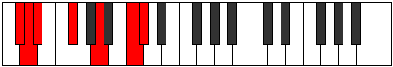 | [midi](https://github.com/edipermadi/music/blob/main/docs/ModeCSharpTharimic.mid?raw=true) |
| [Db](ModeDFlatTharimic.md) | **Db**, Ebb, **Fbb**, Gb, **A**, **B#**, **Db** | C |  | [midi](https://github.com/edipermadi/music/blob/main/docs/ModeDFlatTharimic.mid?raw=true) |
| [D](ModeDNaturalTharimic.md) | **D**, Eb, **Fb**, G, **A#**, **B##**, **D** | C | 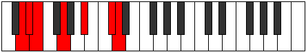 | [midi](https://github.com/edipermadi/music/blob/main/docs/ModeDNaturalTharimic.mid?raw=true) |
| [D#](ModeDSharpTharimic.md) | **D#**, E, **F**, G#, **A##**, **B###**, **D#** | C | 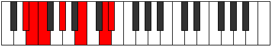 | [midi](https://github.com/edipermadi/music/blob/main/docs/ModeDSharpTharimic.mid?raw=true) |
| [Eb](ModeEFlatTharimic.md) | **Eb**, Fb, **Gbb**, Ab, **B**, **C##**, **Eb** | C |  | [midi](https://github.com/edipermadi/music/blob/main/docs/ModeEFlatTharimic.mid?raw=true) |
| [E](ModeENaturalTharimic.md) | **E**, F, **Gb**, A, **B#**, **C###**, **E** | C | 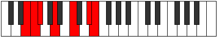 | [midi](https://github.com/edipermadi/music/blob/main/docs/ModeENaturalTharimic.mid?raw=true) |
| [F](ModeFNaturalTharimic.md) | **F**, Gb, **Abb**, Bb, **C#**, **D##**, **F** | C | 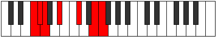 | [midi](https://github.com/edipermadi/music/blob/main/docs/ModeFNaturalTharimic.mid?raw=true) |
| [F#](ModeFSharpTharimic.md) | **F#**, G, **Ab**, B, **C##**, **D###**, **F#** | C | 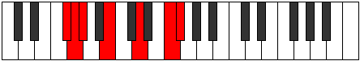 | [midi](https://github.com/edipermadi/music/blob/main/docs/ModeFSharpTharimic.mid?raw=true) |
| [Gb](ModeGFlatTharimic.md) | **Gb**, Abb, **Bbbb**, Cb, **D**, **E#**, **Gb** | C |  | [midi](https://github.com/edipermadi/music/blob/main/docs/ModeGFlatTharimic.mid?raw=true) |
| [G](ModeGNaturalTharimic.md) | **G**, Ab, **Bbb**, C, **D#**, **E##**, **G** | C | 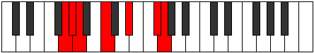 | [midi](https://github.com/edipermadi/music/blob/main/docs/ModeGNaturalTharimic.mid?raw=true) |
| [G#](ModeGSharpTharimic.md) | **G#**, A, **Bb**, C#, **D##**, **E###**, **G#** | C |  | [midi](https://github.com/edipermadi/music/blob/main/docs/ModeGSharpTharimic.mid?raw=true) |
| [Ab](ModeAFlatTharimic.md) | **Ab**, Bbb, **Cbb**, Db, **E**, **F##**, **Ab** | C |  | [midi](https://github.com/edipermadi/music/blob/main/docs/ModeAFlatTharimic.mid?raw=true) |
| [A](ModeANaturalTharimic.md) | **A**, Bb, **Cb**, D, **E#**, **F###**, **A** | C | 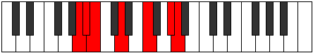 | [midi](https://github.com/edipermadi/music/blob/main/docs/ModeANaturalTharimic.mid?raw=true) |
| [A#](ModeASharpTharimic.md) | **A#**, B, **C**, D#, **E##**, **Cbbb**, **A#** | C | 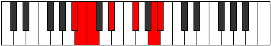 | [midi](https://github.com/edipermadi/music/blob/main/docs/ModeASharpTharimic.mid?raw=true) |
| [Bb](ModeBFlatTharimic.md) | **Bb**, Cb, **Dbb**, Eb, **F#**, **G##**, **Bb** | C | 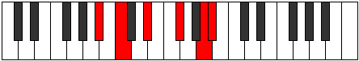 | [midi](https://github.com/edipermadi/music/blob/main/docs/ModeBFlatTharimic.mid?raw=true) |
| [B](ModeBNaturalTharimic.md) | **B**, C, **Db**, E, **F##**, **G###**, **B** | C | 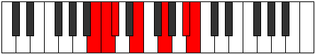 | [midi](https://github.com/edipermadi/music/blob/main/docs/ModeBNaturalTharimic.mid?raw=true) |
