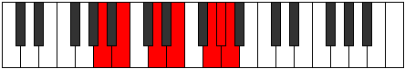

# Mode Thatimic

## Links

- [Documentation](index.md)
- [Scales Index](Scales.md)
- [Modes Index](Modes.md)
- [Chords Index](Chords.md)

## Parent Scale

[Ionacrimic](ScaleIonacrimic.md)

## Number

[3237](https://ianring.com/musictheory/scales/3237)

## Perfection

- 4 Perfect notes
- 2 Perfect notes

## Perfection Profile

[true false true true true false]

## Permutations

| Tonic | Notes | Signature | Illustration | Audio |
|-------|-------|-----------|--------------|-------|
| [C](ModeCNaturalThatimic.md) | C, **D**, E#, F##, G###, **A##**, C | C |  | [midi](ModeCNaturalThatimic.mid) [ogg](ModeCNaturalThatimic.ogg) |
| [C#](ModeCSharpThatimic.md) | C#, **D#**, E##, F###, Cb, **Dbb**, C# | C |  | [midi](ModeCSharpThatimic.mid) [ogg](ModeCSharpThatimic.ogg) |
| [Db](ModeDFlatThatimic.md) | Db, **Eb**, F#, G#, A##, **B#**, Db | C |  | [midi](ModeDFlatThatimic.mid) [ogg](ModeDFlatThatimic.ogg) |
| [D](ModeDNaturalThatimic.md) | D, **E**, F##, G##, A###, **B##**, D | C |  | [midi](ModeDNaturalThatimic.mid) [ogg](ModeDNaturalThatimic.ogg) |
| [D#](ModeDSharpThatimic.md) | D#, **E#**, F###, G###, Db, **Ebb**, D# | C |  | [midi](ModeDSharpThatimic.mid) [ogg](ModeDSharpThatimic.ogg) |
| [Eb](ModeEFlatThatimic.md) | Eb, **F**, G#, A#, B##, **C##**, Eb | C |  | [midi](ModeEFlatThatimic.mid) [ogg](ModeEFlatThatimic.ogg) |
| [E](ModeENaturalThatimic.md) | E, **F#**, G##, A##, B###, **C###**, E | C |  | [midi](ModeENaturalThatimic.mid) [ogg](ModeENaturalThatimic.ogg) |
| [F](ModeFNaturalThatimic.md) | F, **G**, A#, B#, C###, **D##**, F | C |  | [midi](ModeFNaturalThatimic.mid) [ogg](ModeFNaturalThatimic.ogg) |
| [F#](ModeFSharpThatimic.md) | F#, **G#**, A##, B##, D##, **E#**, F# | C |  | [midi](ModeFSharpThatimic.mid) [ogg](ModeFSharpThatimic.ogg) |
| [Gb](ModeGFlatThatimic.md) | Gb, **Ab**, B, C#, D##, **E#**, Gb | C |  | [midi](ModeGFlatThatimic.mid) [ogg](ModeGFlatThatimic.ogg) |
| [G](ModeGNaturalThatimic.md) | G, **A**, B#, C##, D###, **E##**, G | C |  | [midi](ModeGNaturalThatimic.mid) [ogg](ModeGNaturalThatimic.ogg) |
| [G#](ModeGSharpThatimic.md) | G#, **A#**, B##, C###, E##, **F##**, G# | C |  | [midi](ModeGSharpThatimic.mid) [ogg](ModeGSharpThatimic.ogg) |
| [Ab](ModeAFlatThatimic.md) | Ab, **Bb**, C#, D#, E##, **F##**, Ab | C |  | [midi](ModeAFlatThatimic.mid) [ogg](ModeAFlatThatimic.ogg) |
| [A](ModeANaturalThatimic.md) | A, **B**, C##, D##, E###, **F###**, A | C |  | [midi](ModeANaturalThatimic.mid) [ogg](ModeANaturalThatimic.ogg) |
| [A#](ModeASharpThatimic.md) | A#, **B#**, C###, D###, F###, **G##**, A# | C |  | [midi](ModeASharpThatimic.mid) [ogg](ModeASharpThatimic.ogg) |
| [Bb](ModeBFlatThatimic.md) | Bb, **C**, D#, E#, F###, **G##**, Bb | C |  | [midi](ModeBFlatThatimic.mid) [ogg](ModeBFlatThatimic.ogg) |
| [B](ModeBNaturalThatimic.md) | B, **C#**, D##, E##, Cbbb, **Cbb**, B | C |  | [midi](ModeBNaturalThatimic.mid) [ogg](ModeBNaturalThatimic.ogg) |
