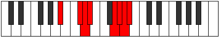

# Mode Thocrian

## Links

- [Documentation](index.md)
- [Scales Index](Scales.md)
- [Modes Index](Modes.md)
- [Chords Index](Chords.md)

## Parent Scale

[Aeolacrian](ScaleAeolacrian.md)

## Number

[3641](https://ianring.com/musictheory/scales/3641)

## Perfection

- 5 Perfect notes
- 2 Perfect notes

## Perfection Profile

[false true true true true true false]

## Permutations

| Tonic | Notes | Signature | Illustration | Audio |
|-------|-------|-----------|--------------|-------|
| [C](ModeCNaturalThocrian.md) | **C**, D#, E, F, G##, A#, **B**, **C** | C |  | [midi](ModeCNaturalThocrian.mid) [ogg](ModeCNaturalThocrian.ogg) |
| [C#](ModeCSharpThocrian.md) | **C#**, D##, E#, F#, G###, A##, **B#**, **C#** | C |  | [midi](ModeCSharpThocrian.mid) [ogg](ModeCSharpThocrian.ogg) |
| [Db](ModeDFlatThocrian.md) | **Db**, E, F, Gb, A#, B, **C**, **Db** | C |  | [midi](ModeDFlatThocrian.mid) [ogg](ModeDFlatThocrian.ogg) |
| [D](ModeDNaturalThocrian.md) | **D**, E#, F#, G, A##, B#, **C#**, **D** | C |  | [midi](ModeDNaturalThocrian.mid) [ogg](ModeDNaturalThocrian.ogg) |
| [D#](ModeDSharpThocrian.md) | **D#**, E##, F##, G#, A###, B##, **C##**, **D#** | C |  | [midi](ModeDSharpThocrian.mid) [ogg](ModeDSharpThocrian.ogg) |
| [Eb](ModeEFlatThocrian.md) | **Eb**, F#, G, Ab, B#, C#, **D**, **Eb** | C |  | [midi](ModeEFlatThocrian.mid) [ogg](ModeEFlatThocrian.ogg) |
| [E](ModeENaturalThocrian.md) | **E**, F##, G#, A, B##, C##, **D#**, **E** | C |  | [midi](ModeENaturalThocrian.mid) [ogg](ModeENaturalThocrian.ogg) |
| [F](ModeFNaturalThocrian.md) | **F**, G#, A, Bb, C##, D#, **E**, **F** | C |  | [midi](ModeFNaturalThocrian.mid) [ogg](ModeFNaturalThocrian.ogg) |
| [F#](ModeFSharpThocrian.md) | **F#**, G##, A#, B, C###, D##, **E#**, **F#** | C |  | [midi](ModeFSharpThocrian.mid) [ogg](ModeFSharpThocrian.ogg) |
| [Gb](ModeGFlatThocrian.md) | **Gb**, A, Bb, Cb, D#, E, **F**, **Gb** | C |  | [midi](ModeGFlatThocrian.mid) [ogg](ModeGFlatThocrian.ogg) |
| [G](ModeGNaturalThocrian.md) | **G**, A#, B, C, D##, E#, **F#**, **G** | C |  | [midi](ModeGNaturalThocrian.mid) [ogg](ModeGNaturalThocrian.ogg) |
| [G#](ModeGSharpThocrian.md) | **G#**, A##, B#, C#, D###, E##, **F##**, **G#** | C |  | [midi](ModeGSharpThocrian.mid) [ogg](ModeGSharpThocrian.ogg) |
| [Ab](ModeAFlatThocrian.md) | **Ab**, B, C, Db, E#, F#, **G**, **Ab** | C |  | [midi](ModeAFlatThocrian.mid) [ogg](ModeAFlatThocrian.ogg) |
| [A](ModeANaturalThocrian.md) | **A**, B#, C#, D, E##, F##, **G#**, **A** | C |  | [midi](ModeANaturalThocrian.mid) [ogg](ModeANaturalThocrian.ogg) |
| [A#](ModeASharpThocrian.md) | **A#**, B##, C##, D#, E###, F###, **G##**, **A#** | C |  | [midi](ModeASharpThocrian.mid) [ogg](ModeASharpThocrian.ogg) |
| [Bb](ModeBFlatThocrian.md) | **Bb**, C#, D, Eb, F##, G#, **A**, **Bb** | C |  | [midi](ModeBFlatThocrian.mid) [ogg](ModeBFlatThocrian.ogg) |
| [B](ModeBNaturalThocrian.md) | **B**, C##, D#, E, F###, G##, **A#**, **B** | C |  | [midi](ModeBNaturalThocrian.mid) [ogg](ModeBNaturalThocrian.ogg) |
