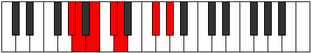
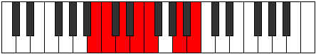

# Mode Thocrimic

## Links

- [Documentation](index.md)
- [Scales Index](Scales.md)
- [Modes Index](Modes.md)
- [Chords Index](Chords.md)

## Parent Scale

[Dyrimic](ScaleDyrimic.md)

## Number

[1131](https://ianring.com/musictheory/scales/1131)

## Perfection

- 4 Perfect notes
- 2 Perfect notes

## Perfection Profile

[false false true true true true]

## Permutations

| Tonic | Notes | Signature | Illustration | Audio |
|-------|-------|-----------|--------------|-------|
| [C](ModeCNaturalThocrimic.md) | **C**, **Db**, Eb, F, Gb, A#, **C** | C |  | [midi](ModeCNaturalThocrimic.mid) [ogg](ModeCNaturalThocrimic.ogg) |
| [C#](ModeCSharpThocrimic.md) | **C#**, **D**, E, F#, G, A##, **C#** | C |  | [midi](ModeCSharpThocrimic.mid) [ogg](ModeCSharpThocrimic.ogg) |
| [Db](ModeDFlatThocrimic.md) | **Db**, **Ebb**, Fb, Gb, Abb, B, **Db** | C |  | [midi](ModeDFlatThocrimic.mid) [ogg](ModeDFlatThocrimic.ogg) |
| [D](ModeDNaturalThocrimic.md) | **D**, **Eb**, F, G, Ab, B#, **D** | C |  | [midi](ModeDNaturalThocrimic.mid) [ogg](ModeDNaturalThocrimic.ogg) |
| [D#](ModeDSharpThocrimic.md) | **D#**, **E**, F#, G#, A, B##, **D#** | C |  | [midi](ModeDSharpThocrimic.mid) [ogg](ModeDSharpThocrimic.ogg) |
| [Eb](ModeEFlatThocrimic.md) | **Eb**, **Fb**, Gb, Ab, Bbb, C#, **Eb** | C |  | [midi](ModeEFlatThocrimic.mid) [ogg](ModeEFlatThocrimic.ogg) |
| [E](ModeENaturalThocrimic.md) | **E**, **F**, G, A, Bb, C##, **E** | C |  | [midi](ModeENaturalThocrimic.mid) [ogg](ModeENaturalThocrimic.ogg) |
| [F](ModeFNaturalThocrimic.md) | **F**, **Gb**, Ab, Bb, Cb, D#, **F** | C |  | [midi](ModeFNaturalThocrimic.mid) [ogg](ModeFNaturalThocrimic.ogg) |
| [F#](ModeFSharpThocrimic.md) | **F#**, **G**, A, B, C, D##, **F#** | C |  | [midi](ModeFSharpThocrimic.mid) [ogg](ModeFSharpThocrimic.ogg) |
| [Gb](ModeGFlatThocrimic.md) | **Gb**, **Abb**, Bbb, Cb, Dbb, E, **Gb** | C |  | [midi](ModeGFlatThocrimic.mid) [ogg](ModeGFlatThocrimic.ogg) |
| [G](ModeGNaturalThocrimic.md) | **G**, **Ab**, Bb, C, Db, E#, **G** | C |  | [midi](ModeGNaturalThocrimic.mid) [ogg](ModeGNaturalThocrimic.ogg) |
| [G#](ModeGSharpThocrimic.md) | **G#**, **A**, B, C#, D, E##, **G#** | C |  | [midi](ModeGSharpThocrimic.mid) [ogg](ModeGSharpThocrimic.ogg) |
| [Ab](ModeAFlatThocrimic.md) | **Ab**, **Bbb**, Cb, Db, Ebb, F#, **Ab** | C |  | [midi](ModeAFlatThocrimic.mid) [ogg](ModeAFlatThocrimic.ogg) |
| [A](ModeANaturalThocrimic.md) | **A**, **Bb**, C, D, Eb, F##, **A** | C |  | [midi](ModeANaturalThocrimic.mid) [ogg](ModeANaturalThocrimic.ogg) |
| [A#](ModeASharpThocrimic.md) | **A#**, **B**, C#, D#, E, F###, **A#** | C |  | [midi](ModeASharpThocrimic.mid) [ogg](ModeASharpThocrimic.ogg) |
| [Bb](ModeBFlatThocrimic.md) | **Bb**, **Cb**, Db, Eb, Fb, G#, **Bb** | C |  | [midi](ModeBFlatThocrimic.mid) [ogg](ModeBFlatThocrimic.ogg) |
| [B](ModeBNaturalThocrimic.md) | **B**, **C**, D, E, F, G##, **B** | C |  | [midi](ModeBNaturalThocrimic.mid) [ogg](ModeBNaturalThocrimic.ogg) |
