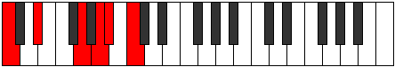
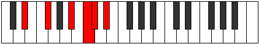
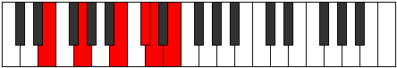
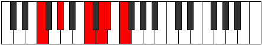

# Mode Thocritonic

## Links

- [Documentation](index.md)
- [Scales Index](Scales.md)
- [Modes Index](Modes.md)
- [Chords Index](Chords.md)

## Parent Scale

[Aeolacritonic](ScaleAeolacritonic.md)

## Number

[1673](https://ianring.com/musictheory/scales/1673)

## Perfection

- 2 Perfect notes
- 3 Perfect notes

## Perfection Profile

[true true false false false]

## Permutations

| Tonic | Notes | Signature | Illustration | Audio |
|-------|-------|-----------|--------------|-------|
| [C](ModeCNaturalThocritonic.md) | C, D#, **G**, **A**, **A#**, C | C |  | [midi](ModeCNaturalThocritonic.mid) [ogg](ModeCNaturalThocritonic.ogg) |
| [C#](ModeCSharpThocritonic.md) | C#, E, **G#**, **A#**, **B**, C# | C |  | [midi](ModeCSharpThocritonic.mid) [ogg](ModeCSharpThocritonic.ogg) |
| [Db](ModeDFlatThocritonic.md) | Db, E, **Ab**, **Bb**, **B**, Db | C |  | [midi](ModeDFlatThocritonic.mid) [ogg](ModeDFlatThocritonic.ogg) |
| [D](ModeDNaturalThocritonic.md) | D, F, **A**, **B**, **C**, D | C |  | [midi](ModeDNaturalThocritonic.mid) [ogg](ModeDNaturalThocritonic.ogg) |
| [D#](ModeDSharpThocritonic.md) | D#, F#, **A#**, **C**, **C#**, D# | C |  | [midi](ModeDSharpThocritonic.mid) [ogg](ModeDSharpThocritonic.ogg) |
| [Eb](ModeEFlatThocritonic.md) | Eb, Gb, **Bb**, **C**, **Db**, Eb | C |  | [midi](ModeEFlatThocritonic.mid) [ogg](ModeEFlatThocritonic.ogg) |
| [E](ModeENaturalThocritonic.md) | E, G, **B**, **C#**, **D**, E | C |  | [midi](ModeENaturalThocritonic.mid) [ogg](ModeENaturalThocritonic.ogg) |
| [F](ModeFNaturalThocritonic.md) | F, G#, **C**, **D**, **D#**, F | C |  | [midi](ModeFNaturalThocritonic.mid) [ogg](ModeFNaturalThocritonic.ogg) |
| [F#](ModeFSharpThocritonic.md) | F#, A, **C#**, **D#**, **E**, F# | C |  | [midi](ModeFSharpThocritonic.mid) [ogg](ModeFSharpThocritonic.ogg) |
| [Gb](ModeGFlatThocritonic.md) | Gb, A, **Db**, **Eb**, **E**, Gb | C |  | [midi](ModeGFlatThocritonic.mid) [ogg](ModeGFlatThocritonic.ogg) |
| [G](ModeGNaturalThocritonic.md) | G, A#, **D**, **E**, **F**, G | C |  | [midi](ModeGNaturalThocritonic.mid) [ogg](ModeGNaturalThocritonic.ogg) |
| [G#](ModeGSharpThocritonic.md) | G#, B, **D#**, **F**, **F#**, G# | C |  | [midi](ModeGSharpThocritonic.mid) [ogg](ModeGSharpThocritonic.ogg) |
| [Ab](ModeAFlatThocritonic.md) | Ab, B, **Eb**, **F**, **Gb**, Ab | C |  | [midi](ModeAFlatThocritonic.mid) [ogg](ModeAFlatThocritonic.ogg) |
| [A](ModeANaturalThocritonic.md) | A, C, **E**, **F#**, **G**, A | C |  | [midi](ModeANaturalThocritonic.mid) [ogg](ModeANaturalThocritonic.ogg) |
| [A#](ModeASharpThocritonic.md) | A#, C#, **F**, **G**, **G#**, A# | C |  | [midi](ModeASharpThocritonic.mid) [ogg](ModeASharpThocritonic.ogg) |
| [Bb](ModeBFlatThocritonic.md) | Bb, Db, **F**, **G**, **Ab**, Bb | C |  | [midi](ModeBFlatThocritonic.mid) [ogg](ModeBFlatThocritonic.ogg) |
| [B](ModeBNaturalThocritonic.md) | B, D, **F#**, **G#**, **A**, B | C |  | [midi](ModeBNaturalThocritonic.mid) [ogg](ModeBNaturalThocritonic.ogg) |
