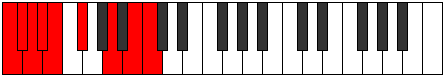

# Mode Thocryllic

## Links

- [Documentation](README.md)
- [Scales Index](Scales.md)
- [Modes Index](Modes.md)
- [Chords Index](Chords.md)

## Parent Scale

[Mixolydyllic](ScaleMixolydyllic.md)

## Number

[2655](https://ianring.com/musictheory/scales/2655)

## Luminosity

-1

## Transposition

1, 1, 1, 1, 2, 3, 2, 1

## Chord Pattern

## Perfection

- 5 Perfect notes
- 3 Perfect notes

## Perfection Profile

false, false, true, false, true, true, true, true

## Permutations

| Tonic | Notes | Signature | Illustration | Audio |
|-------|-------|-----------|--------------|-------|
| [C](ModeCNaturalThocryllic.md) | **C**, **C#**, D, **D#**, E, F#, A, B, **C** | C |  | [midi](https://github.com/edipermadi/music/blob/main/docs/ModeCNaturalThocryllic.mid?raw=true) |
| [C#](ModeCSharpThocryllic.md) | **C#**, **D**, D#, **E**, F, G, A#, C, **C#** | C |  | [midi](https://github.com/edipermadi/music/blob/main/docs/ModeCSharpThocryllic.mid?raw=true) |
| [Db](ModeDFlatThocryllic.md) | **Db**, **D**, Eb, **E**, F, G, Bb, C, **Db** | C |  | [midi](https://github.com/edipermadi/music/blob/main/docs/ModeDFlatThocryllic.mid?raw=true) |
| [D](ModeDNaturalThocryllic.md) | **D**, **D#**, E, **F**, F#, G#, B, C#, **D** | C |  | [midi](https://github.com/edipermadi/music/blob/main/docs/ModeDNaturalThocryllic.mid?raw=true) |
| [D#](ModeDSharpThocryllic.md) | **D#**, **E**, F, **F#**, G, A, C, D, **D#** | C |  | [midi](https://github.com/edipermadi/music/blob/main/docs/ModeDSharpThocryllic.mid?raw=true) |
| [Eb](ModeEFlatThocryllic.md) | **Eb**, **E**, F, **Gb**, G, A, C, D, **Eb** | C |  | [midi](https://github.com/edipermadi/music/blob/main/docs/ModeEFlatThocryllic.mid?raw=true) |
| [E](ModeENaturalThocryllic.md) | **E**, **F**, F#, **G**, G#, A#, C#, D#, **E** | C |  | [midi](https://github.com/edipermadi/music/blob/main/docs/ModeENaturalThocryllic.mid?raw=true) |
| [F](ModeFNaturalThocryllic.md) | **F**, **F#**, G, **G#**, A, B, D, E, **F** | C |  | [midi](https://github.com/edipermadi/music/blob/main/docs/ModeFNaturalThocryllic.mid?raw=true) |
| [F#](ModeFSharpThocryllic.md) | **F#**, **G**, G#, **A**, A#, C, D#, F, **F#** | C |  | [midi](https://github.com/edipermadi/music/blob/main/docs/ModeFSharpThocryllic.mid?raw=true) |
| [Gb](ModeGFlatThocryllic.md) | **Gb**, **G**, Ab, **A**, Bb, C, Eb, F, **Gb** | C |  | [midi](https://github.com/edipermadi/music/blob/main/docs/ModeGFlatThocryllic.mid?raw=true) |
| [G](ModeGNaturalThocryllic.md) | **G**, **G#**, A, **A#**, B, C#, E, F#, **G** | C |  | [midi](https://github.com/edipermadi/music/blob/main/docs/ModeGNaturalThocryllic.mid?raw=true) |
| [G#](ModeGSharpThocryllic.md) | **G#**, **A**, A#, **B**, C, D, F, G, **G#** | C |  | [midi](https://github.com/edipermadi/music/blob/main/docs/ModeGSharpThocryllic.mid?raw=true) |
| [Ab](ModeAFlatThocryllic.md) | **Ab**, **A**, Bb, **B**, C, D, F, G, **Ab** | C |  | [midi](https://github.com/edipermadi/music/blob/main/docs/ModeAFlatThocryllic.mid?raw=true) |
| [A](ModeANaturalThocryllic.md) | **A**, **A#**, B, **C**, C#, D#, F#, G#, **A** | C |  | [midi](https://github.com/edipermadi/music/blob/main/docs/ModeANaturalThocryllic.mid?raw=true) |
| [A#](ModeASharpThocryllic.md) | **A#**, **B**, C, **C#**, D, E, G, A, **A#** | C |  | [midi](https://github.com/edipermadi/music/blob/main/docs/ModeASharpThocryllic.mid?raw=true) |
| [Bb](ModeBFlatThocryllic.md) | **Bb**, **B**, C, **Db**, D, E, G, A, **Bb** | C |  | [midi](https://github.com/edipermadi/music/blob/main/docs/ModeBFlatThocryllic.mid?raw=true) |
| [B](ModeBNaturalThocryllic.md) | **B**, **C**, C#, **D**, D#, F, G#, A#, **B** | C |  | [midi](https://github.com/edipermadi/music/blob/main/docs/ModeBNaturalThocryllic.mid?raw=true) |
