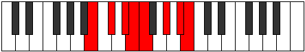

# Mode Thodian

## Links

- [Documentation](index.md)
- [Scales Index](Scales.md)
- [Modes Index](Modes.md)
- [Chords Index](Chords.md)

## Parent Scale

[Thonian](ScaleThonian.md)

## Number

[2677](https://ianring.com/musictheory/scales/2677)

## Perfection

- 5 Perfect notes
- 2 Perfect notes

## Perfection Profile

[false true true true false true true]

## Permutations

| Tonic | Notes | Signature | Illustration | Audio |
|-------|-------|-----------|--------------|-------|
| [C](ModeCNaturalThodian.md) | **C**, D, E, F, **Gb**, A, B, **C** | C |  | [midi](https://github.com/edipermadi/music/blob/main/docs/ModeCNaturalThodian.mid?raw=true) |
| [C#](ModeCSharpThodian.md) | **C#**, D#, E#, F#, **G**, A#, B#, **C#** | C |  | [midi](https://github.com/edipermadi/music/blob/main/docs/ModeCSharpThodian.mid?raw=true) |
| [Db](ModeDFlatThodian.md) | **Db**, Eb, F, Gb, **Abb**, Bb, C, **Db** | C |  | [midi](https://github.com/edipermadi/music/blob/main/docs/ModeDFlatThodian.mid?raw=true) |
| [D](ModeDNaturalThodian.md) | **D**, E, F#, G, **Ab**, B, C#, **D** | C |  | [midi](https://github.com/edipermadi/music/blob/main/docs/ModeDNaturalThodian.mid?raw=true) |
| [D#](ModeDSharpThodian.md) | **D#**, E#, F##, G#, **A**, B#, C##, **D#** | C |  | [midi](https://github.com/edipermadi/music/blob/main/docs/ModeDSharpThodian.mid?raw=true) |
| [Eb](ModeEFlatThodian.md) | **Eb**, F, G, Ab, **Bbb**, C, D, **Eb** | C |  | [midi](https://github.com/edipermadi/music/blob/main/docs/ModeEFlatThodian.mid?raw=true) |
| [E](ModeENaturalThodian.md) | **E**, F#, G#, A, **Bb**, C#, D#, **E** | C |  | [midi](https://github.com/edipermadi/music/blob/main/docs/ModeENaturalThodian.mid?raw=true) |
| [F](ModeFNaturalThodian.md) | **F**, G, A, Bb, **Cb**, D, E, **F** | C |  | [midi](https://github.com/edipermadi/music/blob/main/docs/ModeFNaturalThodian.mid?raw=true) |
| [F#](ModeFSharpThodian.md) | **F#**, G#, A#, B, **C**, D#, E#, **F#** | C |  | [midi](https://github.com/edipermadi/music/blob/main/docs/ModeFSharpThodian.mid?raw=true) |
| [Gb](ModeGFlatThodian.md) | **Gb**, Ab, Bb, Cb, **Dbb**, Eb, F, **Gb** | C |  | [midi](https://github.com/edipermadi/music/blob/main/docs/ModeGFlatThodian.mid?raw=true) |
| [G](ModeGNaturalThodian.md) | **G**, A, B, C, **Db**, E, F#, **G** | C |  | [midi](https://github.com/edipermadi/music/blob/main/docs/ModeGNaturalThodian.mid?raw=true) |
| [G#](ModeGSharpThodian.md) | **G#**, A#, B#, C#, **D**, E#, F##, **G#** | C |  | [midi](https://github.com/edipermadi/music/blob/main/docs/ModeGSharpThodian.mid?raw=true) |
| [Ab](ModeAFlatThodian.md) | **Ab**, Bb, C, Db, **Ebb**, F, G, **Ab** | C |  | [midi](https://github.com/edipermadi/music/blob/main/docs/ModeAFlatThodian.mid?raw=true) |
| [A](ModeANaturalThodian.md) | **A**, B, C#, D, **Eb**, F#, G#, **A** | C |  | [midi](https://github.com/edipermadi/music/blob/main/docs/ModeANaturalThodian.mid?raw=true) |
| [A#](ModeASharpThodian.md) | **A#**, B#, C##, D#, **E**, F##, G##, **A#** | C |  | [midi](https://github.com/edipermadi/music/blob/main/docs/ModeASharpThodian.mid?raw=true) |
| [Bb](ModeBFlatThodian.md) | **Bb**, C, D, Eb, **Fb**, G, A, **Bb** | C |  | [midi](https://github.com/edipermadi/music/blob/main/docs/ModeBFlatThodian.mid?raw=true) |
| [B](ModeBNaturalThodian.md) | **B**, C#, D#, E, **F**, G#, A#, **B** | C |  | [midi](https://github.com/edipermadi/music/blob/main/docs/ModeBNaturalThodian.mid?raw=true) |
