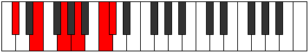

# Mode Thoditonic

## Links

- [Documentation](README.md)
- [Scales Index](Scales.md)
- [Modes Index](Modes.md)
- [Chords Index](Chords.md)

## Parent Scale

[Thoditonic](ScaleThoditonic.md)

## Number

[2377](https://ianring.com/musictheory/scales/2377)

## Transposition

3, 3, 2, 3, 1

## Chord Pattern

## Perfection

- 2 Perfect notes
- 3 Perfect notes

## Perfection Profile

[false false false true true]

## Permutations

| Tonic | Notes | Signature | Illustration | Audio |
|-------|-------|-----------|--------------|-------|
| [C](ModeCNaturalThoditonic.md) | **C**, **D#**, **F#**, G#, B, **C** | C |  | [midi](https://github.com/edipermadi/music/blob/main/docs/ModeCNaturalThoditonic.mid?raw=true) |
| [C#](ModeCSharpThoditonic.md) | **C#**, **E**, **G**, A, C, **C#** | C |  | [midi](https://github.com/edipermadi/music/blob/main/docs/ModeCSharpThoditonic.mid?raw=true) |
| [Db](ModeDFlatThoditonic.md) | **Db**, **E**, **G**, A, C, **Db** | C |  | [midi](https://github.com/edipermadi/music/blob/main/docs/ModeDFlatThoditonic.mid?raw=true) |
| [D](ModeDNaturalThoditonic.md) | **D**, **F**, **G#**, A#, C#, **D** | C |  | [midi](https://github.com/edipermadi/music/blob/main/docs/ModeDNaturalThoditonic.mid?raw=true) |
| [D#](ModeDSharpThoditonic.md) | **D#**, **F#**, **A**, B, D, **D#** | C |  | [midi](https://github.com/edipermadi/music/blob/main/docs/ModeDSharpThoditonic.mid?raw=true) |
| [Eb](ModeEFlatThoditonic.md) | **Eb**, **Gb**, **A**, B, D, **Eb** | C |  | [midi](https://github.com/edipermadi/music/blob/main/docs/ModeEFlatThoditonic.mid?raw=true) |
| [E](ModeENaturalThoditonic.md) | **E**, **G**, **A#**, C, D#, **E** | C |  | [midi](https://github.com/edipermadi/music/blob/main/docs/ModeENaturalThoditonic.mid?raw=true) |
| [F](ModeFNaturalThoditonic.md) | **F**, **G#**, **B**, C#, E, **F** | C |  | [midi](https://github.com/edipermadi/music/blob/main/docs/ModeFNaturalThoditonic.mid?raw=true) |
| [F#](ModeFSharpThoditonic.md) | **F#**, **A**, **C**, D, F, **F#** | C |  | [midi](https://github.com/edipermadi/music/blob/main/docs/ModeFSharpThoditonic.mid?raw=true) |
| [Gb](ModeGFlatThoditonic.md) | **Gb**, **A**, **C**, D, F, **Gb** | C |  | [midi](https://github.com/edipermadi/music/blob/main/docs/ModeGFlatThoditonic.mid?raw=true) |
| [G](ModeGNaturalThoditonic.md) | **G**, **A#**, **C#**, D#, F#, **G** | C |  | [midi](https://github.com/edipermadi/music/blob/main/docs/ModeGNaturalThoditonic.mid?raw=true) |
| [G#](ModeGSharpThoditonic.md) | **G#**, **B**, **D**, E, G, **G#** | C |  | [midi](https://github.com/edipermadi/music/blob/main/docs/ModeGSharpThoditonic.mid?raw=true) |
| [Ab](ModeAFlatThoditonic.md) | **Ab**, **B**, **D**, E, G, **Ab** | C |  | [midi](https://github.com/edipermadi/music/blob/main/docs/ModeAFlatThoditonic.mid?raw=true) |
| [A](ModeANaturalThoditonic.md) | **A**, **C**, **D#**, F, G#, **A** | C |  | [midi](https://github.com/edipermadi/music/blob/main/docs/ModeANaturalThoditonic.mid?raw=true) |
| [A#](ModeASharpThoditonic.md) | **A#**, **C#**, **E**, F#, A, **A#** | C |  | [midi](https://github.com/edipermadi/music/blob/main/docs/ModeASharpThoditonic.mid?raw=true) |
| [Bb](ModeBFlatThoditonic.md) | **Bb**, **Db**, **E**, Gb, A, **Bb** | C |  | [midi](https://github.com/edipermadi/music/blob/main/docs/ModeBFlatThoditonic.mid?raw=true) |
| [B](ModeBNaturalThoditonic.md) | **B**, **D**, **F**, G, A#, **B** | C |  | [midi](https://github.com/edipermadi/music/blob/main/docs/ModeBNaturalThoditonic.mid?raw=true) |
