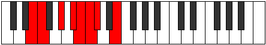
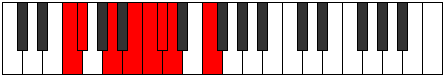

# Mode Thogian

## Links

- [Documentation](README.md)
- [Scales Index](Scales.md)
- [Modes Index](Modes.md)
- [Chords Index](Chords.md)

## Parent Scale

[Laptian](ScaleLaptian.md)

## Number

[979](https://ianring.com/musictheory/scales/979)

## Transposition

1, 3, 2, 1, 1, 1, 3

## Chord Pattern

I, iv⁰b3, iv⁰b3, v⁰b3, VI⁺, VI⁺

## Perfection

- 4 Perfect notes
- 3 Perfect notes

## Perfection Profile

[true true false true false false true]

## Permutations

| Tonic | Notes | Signature | Illustration | Audio |
|-------|-------|-----------|--------------|-------|
| [C](ModeCNaturalThogian.md) | C, Db, **E**, F#, **G**, **Ab**, Bbb, C | C |  | [midi](https://github.com/edipermadi/music/blob/main/docs/ModeCNaturalThogian.mid?raw=true) |
| [C#](ModeCSharpThogian.md) | C#, D, **E#**, F##, **G#**, **A**, Bb, C# | C |  | [midi](https://github.com/edipermadi/music/blob/main/docs/ModeCSharpThogian.mid?raw=true) |
| [Db](ModeDFlatThogian.md) | Db, Ebb, **F**, G, **Ab**, **Bbb**, Cbb, Db | C |  | [midi](https://github.com/edipermadi/music/blob/main/docs/ModeDFlatThogian.mid?raw=true) |
| [D](ModeDNaturalThogian.md) | D, Eb, **F#**, G#, **A**, **Bb**, Cb, D | C |  | [midi](https://github.com/edipermadi/music/blob/main/docs/ModeDNaturalThogian.mid?raw=true) |
| [D#](ModeDSharpThogian.md) | D#, E, **F##**, G##, **A#**, **B**, C, D# | C |  | [midi](https://github.com/edipermadi/music/blob/main/docs/ModeDSharpThogian.mid?raw=true) |
| [Eb](ModeEFlatThogian.md) | Eb, Fb, **G**, A, **Bb**, **Cb**, Dbb, Eb | C |  | [midi](https://github.com/edipermadi/music/blob/main/docs/ModeEFlatThogian.mid?raw=true) |
| [E](ModeENaturalThogian.md) | E, F, **G#**, A#, **B**, **C**, Db, E | C |  | [midi](https://github.com/edipermadi/music/blob/main/docs/ModeENaturalThogian.mid?raw=true) |
| [F](ModeFNaturalThogian.md) | F, Gb, **A**, B, **C**, **Db**, Ebb, F | C |  | [midi](https://github.com/edipermadi/music/blob/main/docs/ModeFNaturalThogian.mid?raw=true) |
| [F#](ModeFSharpThogian.md) | F#, G, **A#**, B#, **C#**, **D**, Eb, F# | C |  | [midi](https://github.com/edipermadi/music/blob/main/docs/ModeFSharpThogian.mid?raw=true) |
| [Gb](ModeGFlatThogian.md) | Gb, Abb, **Bb**, C, **Db**, **Ebb**, Fbb, Gb | C |  | [midi](https://github.com/edipermadi/music/blob/main/docs/ModeGFlatThogian.mid?raw=true) |
| [G](ModeGNaturalThogian.md) | G, Ab, **B**, C#, **D**, **Eb**, Fb, G | C |  | [midi](https://github.com/edipermadi/music/blob/main/docs/ModeGNaturalThogian.mid?raw=true) |
| [G#](ModeGSharpThogian.md) | G#, A, **B#**, C##, **D#**, **E**, F, G# | C |  | [midi](https://github.com/edipermadi/music/blob/main/docs/ModeGSharpThogian.mid?raw=true) |
| [Ab](ModeAFlatThogian.md) | Ab, Bbb, **C**, D, **Eb**, **Fb**, Gbb, Ab | C |  | [midi](https://github.com/edipermadi/music/blob/main/docs/ModeAFlatThogian.mid?raw=true) |
| [A](ModeANaturalThogian.md) | A, Bb, **C#**, D#, **E**, **F**, Gb, A | C |  | [midi](https://github.com/edipermadi/music/blob/main/docs/ModeANaturalThogian.mid?raw=true) |
| [A#](ModeASharpThogian.md) | A#, B, **C##**, D##, **E#**, **F#**, G, A# | C |  | [midi](https://github.com/edipermadi/music/blob/main/docs/ModeASharpThogian.mid?raw=true) |
| [Bb](ModeBFlatThogian.md) | Bb, Cb, **D**, E, **F**, **Gb**, Abb, Bb | C |  | [midi](https://github.com/edipermadi/music/blob/main/docs/ModeBFlatThogian.mid?raw=true) |
| [B](ModeBNaturalThogian.md) | B, C, **D#**, E#, **F#**, **G**, Ab, B | C |  | [midi](https://github.com/edipermadi/music/blob/main/docs/ModeBNaturalThogian.mid?raw=true) |
