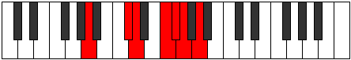

# Mode Thogimic

## Links

- [Documentation](index.md)
- [Scales Index](Scales.md)
- [Modes Index](Modes.md)
- [Chords Index](Chords.md)

## Parent Scale

[Thogimic](ScaleThogimic.md)

## Number

[1841](https://ianring.com/musictheory/scales/1841)

## Perfection

- 3 Perfect notes
- 3 Perfect notes

## Perfection Profile

[false false true false true true]

## Permutations

| Tonic | Notes | Signature | Illustration | Audio |
|-------|-------|-----------|--------------|-------|
| [C](ModeCNaturalThogimic.md) | **C**, **D##**, E#, **F###**, G##, A#, **C** | C |  | [midi](ModeCNaturalThogimic.mid) [ogg](ModeCNaturalThogimic.ogg) |
| [C#](ModeCSharpThogimic.md) | **C#**, **D###**, E##, **Cbbb**, Cbb, Dbbb, **C#** | C |  | [midi](ModeCSharpThogimic.mid) [ogg](ModeCSharpThogimic.ogg) |
| [Db](ModeDFlatThogimic.md) | **Db**, **E#**, F#, **G##**, A#, B, **Db** | C |  | [midi](ModeDFlatThogimic.mid) [ogg](ModeDFlatThogimic.ogg) |
| [D](ModeDNaturalThogimic.md) | **D**, **E##**, F##, **G###**, A##, B#, **D** | C |  | [midi](ModeDNaturalThogimic.mid) [ogg](ModeDNaturalThogimic.ogg) |
| [D#](ModeDSharpThogimic.md) | **D#**, **E###**, F###, **Cb**, Dbb, Ebbb, **D#** | C |  | [midi](ModeDSharpThogimic.mid) [ogg](ModeDSharpThogimic.ogg) |
| [Eb](ModeEFlatThogimic.md) | **Eb**, **F##**, G#, **A##**, B#, C#, **Eb** | C |  | [midi](ModeEFlatThogimic.mid) [ogg](ModeEFlatThogimic.ogg) |
| [E](ModeENaturalThogimic.md) | **E**, **F###**, G##, **A###**, B##, C##, **E** | C |  | [midi](ModeENaturalThogimic.mid) [ogg](ModeENaturalThogimic.ogg) |
| [F](ModeFNaturalThogimic.md) | **F**, **G##**, A#, **B##**, C##, D#, **F** | C |  | [midi](ModeFNaturalThogimic.mid) [ogg](ModeFNaturalThogimic.ogg) |
| [F#](ModeFSharpThogimic.md) | **F#**, **G###**, A##, **B###**, C###, D##, **F#** | C |  | [midi](ModeFSharpThogimic.mid) [ogg](ModeFSharpThogimic.ogg) |
| [Gb](ModeGFlatThogimic.md) | **Gb**, **A#**, B, **C##**, D#, E, **Gb** | C |  | [midi](ModeGFlatThogimic.mid) [ogg](ModeGFlatThogimic.ogg) |
| [G](ModeGNaturalThogimic.md) | **G**, **A##**, B#, **C###**, D##, E#, **G** | C |  | [midi](ModeGNaturalThogimic.mid) [ogg](ModeGNaturalThogimic.ogg) |
| [G#](ModeGSharpThogimic.md) | **G#**, **A###**, B##, **D##**, E#, F#, **G#** | C |  | [midi](ModeGSharpThogimic.mid) [ogg](ModeGSharpThogimic.ogg) |
| [Ab](ModeAFlatThogimic.md) | **Ab**, **B#**, C#, **D##**, E#, F#, **Ab** | C |  | [midi](ModeAFlatThogimic.mid) [ogg](ModeAFlatThogimic.ogg) |
| [A](ModeANaturalThogimic.md) | **A**, **B##**, C##, **D###**, E##, F##, **A** | C |  | [midi](ModeANaturalThogimic.mid) [ogg](ModeANaturalThogimic.ogg) |
| [A#](ModeASharpThogimic.md) | **A#**, **B###**, C###, **E##**, F##, G#, **A#** | C |  | [midi](ModeASharpThogimic.mid) [ogg](ModeASharpThogimic.ogg) |
| [Bb](ModeBFlatThogimic.md) | **Bb**, **C##**, D#, **E##**, F##, G#, **Bb** | C |  | [midi](ModeBFlatThogimic.mid) [ogg](ModeBFlatThogimic.ogg) |
| [B](ModeBNaturalThogimic.md) | **B**, **C###**, D##, **E###**, F###, G##, **B** | C |  | [midi](ModeBNaturalThogimic.mid) [ogg](ModeBNaturalThogimic.ogg) |
