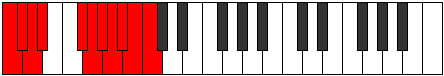

# Mode Thogyllian

## Links

- [Documentation](index.md)
- [Scales Index](Scales.md)
- [Modes Index](Modes.md)
- [Chords Index](Chords.md)

## Parent Scale

[Katoryllian](ScaleKatoryllian.md)

## Number

[4047](https://ianring.com/musictheory/scales/4047)

## Perfection

- 8 Perfect notes
- 2 Perfect notes

## Perfection Profile

[true true true true true true true false false true]

## Permutations

| Tonic | Notes | Signature | Illustration | Audio |
|-------|-------|-----------|--------------|-------|
| [C](ModeCNaturalThogyllian.md) | C, C#, D, D#, F#, G, G#, **A**, **A#**, B, C | C |  | [midi](ModeCNaturalThogyllian.mid) [ogg](ModeCNaturalThogyllian.ogg) |
| [C#](ModeCSharpThogyllian.md) | C#, D, D#, E, G, G#, A, **A#**, **B**, C, C# | C |  | [midi](ModeCSharpThogyllian.mid) [ogg](ModeCSharpThogyllian.ogg) |
| [Db](ModeDFlatThogyllian.md) | Db, D, Eb, E, G, Ab, A, **Bb**, **B**, C, Db | C |  | [midi](ModeDFlatThogyllian.mid) [ogg](ModeDFlatThogyllian.ogg) |
| [D](ModeDNaturalThogyllian.md) | D, D#, E, F, G#, A, A#, **B**, **C**, C#, D | C |  | [midi](ModeDNaturalThogyllian.mid) [ogg](ModeDNaturalThogyllian.ogg) |
| [D#](ModeDSharpThogyllian.md) | D#, E, F, F#, A, A#, B, **C**, **C#**, D, D# | C |  | [midi](ModeDSharpThogyllian.mid) [ogg](ModeDSharpThogyllian.ogg) |
| [Eb](ModeEFlatThogyllian.md) | Eb, E, F, Gb, A, Bb, B, **C**, **Db**, D, Eb | C |  | [midi](ModeEFlatThogyllian.mid) [ogg](ModeEFlatThogyllian.ogg) |
| [E](ModeENaturalThogyllian.md) | E, F, F#, G, A#, B, C, **C#**, **D**, D#, E | C |  | [midi](ModeENaturalThogyllian.mid) [ogg](ModeENaturalThogyllian.ogg) |
| [F](ModeFNaturalThogyllian.md) | F, F#, G, G#, B, C, C#, **D**, **D#**, E, F | C |  | [midi](ModeFNaturalThogyllian.mid) [ogg](ModeFNaturalThogyllian.ogg) |
| [F#](ModeFSharpThogyllian.md) | F#, G, G#, A, C, C#, D, **D#**, **E**, F, F# | C |  | [midi](ModeFSharpThogyllian.mid) [ogg](ModeFSharpThogyllian.ogg) |
| [Gb](ModeGFlatThogyllian.md) | Gb, G, Ab, A, C, Db, D, **Eb**, **E**, F, Gb | C |  | [midi](ModeGFlatThogyllian.mid) [ogg](ModeGFlatThogyllian.ogg) |
| [G](ModeGNaturalThogyllian.md) | G, G#, A, A#, C#, D, D#, **E**, **F**, F#, G | C |  | [midi](ModeGNaturalThogyllian.mid) [ogg](ModeGNaturalThogyllian.ogg) |
| [G#](ModeGSharpThogyllian.md) | G#, A, A#, B, D, D#, E, **F**, **F#**, G, G# | C |  | [midi](ModeGSharpThogyllian.mid) [ogg](ModeGSharpThogyllian.ogg) |
| [Ab](ModeAFlatThogyllian.md) | Ab, A, Bb, B, D, Eb, E, **F**, **Gb**, G, Ab | C |  | [midi](ModeAFlatThogyllian.mid) [ogg](ModeAFlatThogyllian.ogg) |
| [A](ModeANaturalThogyllian.md) | A, A#, B, C, D#, E, F, **F#**, **G**, G#, A | C |  | [midi](ModeANaturalThogyllian.mid) [ogg](ModeANaturalThogyllian.ogg) |
| [A#](ModeASharpThogyllian.md) | A#, B, C, C#, E, F, F#, **G**, **G#**, A, A# | C |  | [midi](ModeASharpThogyllian.mid) [ogg](ModeASharpThogyllian.ogg) |
| [Bb](ModeBFlatThogyllian.md) | Bb, B, C, Db, E, F, Gb, **G**, **Ab**, A, Bb | C |  | [midi](ModeBFlatThogyllian.mid) [ogg](ModeBFlatThogyllian.ogg) |
| [B](ModeBNaturalThogyllian.md) | B, C, C#, D, F, F#, G, **G#**, **A**, A#, B | C |  | [midi](ModeBNaturalThogyllian.mid) [ogg](ModeBNaturalThogyllian.ogg) |
