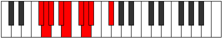

# Mode Thogyllic

## Links

- [Documentation](index.md)
- [Scales Index](Scales.md)
- [Modes Index](Modes.md)
- [Chords Index](Chords.md)

## Parent Scale

[Dydyllic](ScaleDydyllic.md)

## Number

[951](https://ianring.com/musictheory/scales/951)

## Perfection

- 6 Perfect notes
- 2 Perfect notes

## Perfection Profile

[true true true false true true false true]

## Permutations

| Tonic | Notes | Signature | Illustration | Audio |
|-------|-------|-----------|--------------|-------|
| [C](ModeCNaturalThogyllic.md) | C, C#, D, **E**, F, G, **G#**, A, C | C |  | [midi](ModeCNaturalThogyllic.mid) [ogg](ModeCNaturalThogyllic.ogg) |
| [C#](ModeCSharpThogyllic.md) | C#, D, D#, **F**, F#, G#, **A**, A#, C# | C |  | [midi](ModeCSharpThogyllic.mid) [ogg](ModeCSharpThogyllic.ogg) |
| [Db](ModeDFlatThogyllic.md) | Db, D, Eb, **F**, Gb, Ab, **A**, Bb, Db | C |  | [midi](ModeDFlatThogyllic.mid) [ogg](ModeDFlatThogyllic.ogg) |
| [D](ModeDNaturalThogyllic.md) | D, D#, E, **F#**, G, A, **A#**, B, D | C |  | [midi](ModeDNaturalThogyllic.mid) [ogg](ModeDNaturalThogyllic.ogg) |
| [D#](ModeDSharpThogyllic.md) | D#, E, F, **G**, G#, A#, **B**, C, D# | C |  | [midi](ModeDSharpThogyllic.mid) [ogg](ModeDSharpThogyllic.ogg) |
| [Eb](ModeEFlatThogyllic.md) | Eb, E, F, **G**, Ab, Bb, **B**, C, Eb | C |  | [midi](ModeEFlatThogyllic.mid) [ogg](ModeEFlatThogyllic.ogg) |
| [E](ModeENaturalThogyllic.md) | E, F, F#, **G#**, A, B, **C**, C#, E | C |  | [midi](ModeENaturalThogyllic.mid) [ogg](ModeENaturalThogyllic.ogg) |
| [F](ModeFNaturalThogyllic.md) | F, F#, G, **A**, A#, C, **C#**, D, F | C |  | [midi](ModeFNaturalThogyllic.mid) [ogg](ModeFNaturalThogyllic.ogg) |
| [F#](ModeFSharpThogyllic.md) | F#, G, G#, **A#**, B, C#, **D**, D#, F# | C |  | [midi](ModeFSharpThogyllic.mid) [ogg](ModeFSharpThogyllic.ogg) |
| [Gb](ModeGFlatThogyllic.md) | Gb, G, Ab, **Bb**, B, Db, **D**, Eb, Gb | C |  | [midi](ModeGFlatThogyllic.mid) [ogg](ModeGFlatThogyllic.ogg) |
| [G](ModeGNaturalThogyllic.md) | G, G#, A, **B**, C, D, **D#**, E, G | C |  | [midi](ModeGNaturalThogyllic.mid) [ogg](ModeGNaturalThogyllic.ogg) |
| [G#](ModeGSharpThogyllic.md) | G#, A, A#, **C**, C#, D#, **E**, F, G# | C |  | [midi](ModeGSharpThogyllic.mid) [ogg](ModeGSharpThogyllic.ogg) |
| [Ab](ModeAFlatThogyllic.md) | Ab, A, Bb, **C**, Db, Eb, **E**, F, Ab | C |  | [midi](ModeAFlatThogyllic.mid) [ogg](ModeAFlatThogyllic.ogg) |
| [A](ModeANaturalThogyllic.md) | A, A#, B, **C#**, D, E, **F**, F#, A | C |  | [midi](ModeANaturalThogyllic.mid) [ogg](ModeANaturalThogyllic.ogg) |
| [A#](ModeASharpThogyllic.md) | A#, B, C, **D**, D#, F, **F#**, G, A# | C |  | [midi](ModeASharpThogyllic.mid) [ogg](ModeASharpThogyllic.ogg) |
| [Bb](ModeBFlatThogyllic.md) | Bb, B, C, **D**, Eb, F, **Gb**, G, Bb | C |  | [midi](ModeBFlatThogyllic.mid) [ogg](ModeBFlatThogyllic.ogg) |
| [B](ModeBNaturalThogyllic.md) | B, C, C#, **D#**, E, F#, **G**, G#, B | C |  | [midi](ModeBNaturalThogyllic.mid) [ogg](ModeBNaturalThogyllic.ogg) |
