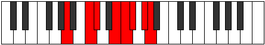

# Mode Tholian

## Links

- [Documentation](index.md)
- [Scales Index](Scales.md)
- [Modes Index](Modes.md)
- [Chords Index](Chords.md)

## Parent Scale

[Tholian](ScaleTholian.md)

## Number

[2969](https://ianring.com/musictheory/scales/2969)

## Interval Pattern

3, 1, 3, 1, 1, 2, 1

## Chord Pattern

I⁺, III, v, vi, VII⁺

## Perfection

- 4 Perfect notes
- 3 Perfect notes

## Perfection Profile

[true false true false true true false]

## Permutations

| Tonic | Notes | Signature | Illustration | Audio |
|-------|-------|-----------|--------------|-------|
| [C](ModeCNaturalTholian.md) | C, **D#**, E, **F##**, G#, A, **B**, C | C |  | [midi](https://github.com/edipermadi/music/blob/main/docs/ModeCNaturalTholian.mid?raw=true) |
| [C#](ModeCSharpTholian.md) | C#, **D##**, E#, **F###**, G##, A#, **B#**, C# | C |  | [midi](https://github.com/edipermadi/music/blob/main/docs/ModeCSharpTholian.mid?raw=true) |
| [Db](ModeDFlatTholian.md) | Db, **E**, F, **G#**, A, Bb, **C**, Db | C |  | [midi](https://github.com/edipermadi/music/blob/main/docs/ModeDFlatTholian.mid?raw=true) |
| [D](ModeDNaturalTholian.md) | D, **E#**, F#, **G##**, A#, B, **C#**, D | C |  | [midi](https://github.com/edipermadi/music/blob/main/docs/ModeDNaturalTholian.mid?raw=true) |
| [D#](ModeDSharpTholian.md) | D#, **E##**, F##, **G###**, A##, B#, **C##**, D# | C |  | [midi](https://github.com/edipermadi/music/blob/main/docs/ModeDSharpTholian.mid?raw=true) |
| [Eb](ModeEFlatTholian.md) | Eb, **F#**, G, **A#**, B, C, **D**, Eb | C |  | [midi](https://github.com/edipermadi/music/blob/main/docs/ModeEFlatTholian.mid?raw=true) |
| [E](ModeENaturalTholian.md) | E, **F##**, G#, **A##**, B#, C#, **D#**, E | C |  | [midi](https://github.com/edipermadi/music/blob/main/docs/ModeENaturalTholian.mid?raw=true) |
| [F](ModeFNaturalTholian.md) | F, **G#**, A, **B#**, C#, D, **E**, F | C |  | [midi](https://github.com/edipermadi/music/blob/main/docs/ModeFNaturalTholian.mid?raw=true) |
| [F#](ModeFSharpTholian.md) | F#, **G##**, A#, **B##**, C##, D#, **E#**, F# | C |  | [midi](https://github.com/edipermadi/music/blob/main/docs/ModeFSharpTholian.mid?raw=true) |
| [Gb](ModeGFlatTholian.md) | Gb, **A**, Bb, **C#**, D, Eb, **F**, Gb | C |  | [midi](https://github.com/edipermadi/music/blob/main/docs/ModeGFlatTholian.mid?raw=true) |
| [G](ModeGNaturalTholian.md) | G, **A#**, B, **C##**, D#, E, **F#**, G | C |  | [midi](https://github.com/edipermadi/music/blob/main/docs/ModeGNaturalTholian.mid?raw=true) |
| [G#](ModeGSharpTholian.md) | G#, **A##**, B#, **C###**, D##, E#, **F##**, G# | C |  | [midi](https://github.com/edipermadi/music/blob/main/docs/ModeGSharpTholian.mid?raw=true) |
| [Ab](ModeAFlatTholian.md) | Ab, **B**, C, **D#**, E, F, **G**, Ab | C |  | [midi](https://github.com/edipermadi/music/blob/main/docs/ModeAFlatTholian.mid?raw=true) |
| [A](ModeANaturalTholian.md) | A, **B#**, C#, **D##**, E#, F#, **G#**, A | C |  | [midi](https://github.com/edipermadi/music/blob/main/docs/ModeANaturalTholian.mid?raw=true) |
| [A#](ModeASharpTholian.md) | A#, **B##**, C##, **D###**, E##, F##, **G##**, A# | C |  | [midi](https://github.com/edipermadi/music/blob/main/docs/ModeASharpTholian.mid?raw=true) |
| [Bb](ModeBFlatTholian.md) | Bb, **C#**, D, **E#**, F#, G, **A**, Bb | C |  | [midi](https://github.com/edipermadi/music/blob/main/docs/ModeBFlatTholian.mid?raw=true) |
| [B](ModeBNaturalTholian.md) | B, **C##**, D#, **E##**, F##, G#, **A#**, B | C |  | [midi](https://github.com/edipermadi/music/blob/main/docs/ModeBNaturalTholian.mid?raw=true) |
