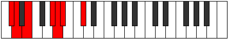

# Mode Tholimic

## Links

- [Documentation](README.md)
- [Scales Index](Scales.md)
- [Modes Index](Modes.md)
- [Chords Index](Chords.md)

## Parent Scale

[Bolimic](ScaleBolimic.md)

## Number

[907](https://ianring.com/musictheory/scales/907)

## Luminosity

-1

## Transposition

1, 2, 4, 1, 1, 3

## Chord Pattern

iv⁰b3, V

## Perfection

- 3 Perfect notes
- 3 Perfect notes

## Perfection Profile

true, true, false, false, true, false

## Permutations

| Tonic | Notes | Signature | Illustration | Audio |
|-------|-------|-----------|--------------|-------|
| [C](ModeCNaturalTholimic.md) | C, Db, **Eb**, **F##**, G#, **A**, C | C |  | [midi](https://github.com/edipermadi/music/blob/main/docs/ModeCNaturalTholimic.mid?raw=true) |
| [C#](ModeCSharpTholimic.md) | C#, D, **E**, **F###**, G##, **A#**, C# | C |  | [midi](https://github.com/edipermadi/music/blob/main/docs/ModeCSharpTholimic.mid?raw=true) |
| [Db](ModeDFlatTholimic.md) | Db, Ebb, **Fb**, **G#**, A, **Bb**, Db | C |  | [midi](https://github.com/edipermadi/music/blob/main/docs/ModeDFlatTholimic.mid?raw=true) |
| [D](ModeDNaturalTholimic.md) | D, Eb, **F**, **G##**, A#, **B**, D | C |  | [midi](https://github.com/edipermadi/music/blob/main/docs/ModeDNaturalTholimic.mid?raw=true) |
| [D#](ModeDSharpTholimic.md) | D#, E, **F#**, **G###**, A##, **B#**, D# | C |  | [midi](https://github.com/edipermadi/music/blob/main/docs/ModeDSharpTholimic.mid?raw=true) |
| [Eb](ModeEFlatTholimic.md) | Eb, Fb, **Gb**, **A#**, B, **C**, Eb | C |  | [midi](https://github.com/edipermadi/music/blob/main/docs/ModeEFlatTholimic.mid?raw=true) |
| [E](ModeENaturalTholimic.md) | E, F, **G**, **A##**, B#, **C#**, E | C |  | [midi](https://github.com/edipermadi/music/blob/main/docs/ModeENaturalTholimic.mid?raw=true) |
| [F](ModeFNaturalTholimic.md) | F, Gb, **Ab**, **B#**, C#, **D**, F | C |  | [midi](https://github.com/edipermadi/music/blob/main/docs/ModeFNaturalTholimic.mid?raw=true) |
| [F#](ModeFSharpTholimic.md) | F#, G, **A**, **B##**, C##, **D#**, F# | C |  | [midi](https://github.com/edipermadi/music/blob/main/docs/ModeFSharpTholimic.mid?raw=true) |
| [Gb](ModeGFlatTholimic.md) | Gb, Abb, **Bbb**, **C#**, D, **Eb**, Gb | C |  | [midi](https://github.com/edipermadi/music/blob/main/docs/ModeGFlatTholimic.mid?raw=true) |
| [G](ModeGNaturalTholimic.md) | G, Ab, **Bb**, **C##**, D#, **E**, G | C |  | [midi](https://github.com/edipermadi/music/blob/main/docs/ModeGNaturalTholimic.mid?raw=true) |
| [G#](ModeGSharpTholimic.md) | G#, A, **B**, **C###**, D##, **E#**, G# | C |  | [midi](https://github.com/edipermadi/music/blob/main/docs/ModeGSharpTholimic.mid?raw=true) |
| [Ab](ModeAFlatTholimic.md) | Ab, Bbb, **Cb**, **D#**, E, **F**, Ab | C |  | [midi](https://github.com/edipermadi/music/blob/main/docs/ModeAFlatTholimic.mid?raw=true) |
| [A](ModeANaturalTholimic.md) | A, Bb, **C**, **D##**, E#, **F#**, A | C |  | [midi](https://github.com/edipermadi/music/blob/main/docs/ModeANaturalTholimic.mid?raw=true) |
| [A#](ModeASharpTholimic.md) | A#, B, **C#**, **D###**, E##, **F##**, A# | C |  | [midi](https://github.com/edipermadi/music/blob/main/docs/ModeASharpTholimic.mid?raw=true) |
| [Bb](ModeBFlatTholimic.md) | Bb, Cb, **Db**, **E#**, F#, **G**, Bb | C |  | [midi](https://github.com/edipermadi/music/blob/main/docs/ModeBFlatTholimic.mid?raw=true) |
| [B](ModeBNaturalTholimic.md) | B, C, **D**, **E##**, F##, **G#**, B | C |  | [midi](https://github.com/edipermadi/music/blob/main/docs/ModeBNaturalTholimic.mid?raw=true) |
