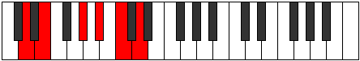
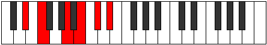
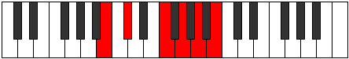

# Mode Tholitonic

## Links

- [Documentation](index.md)
- [Scales Index](Scales.md)
- [Modes Index](Modes.md)
- [Chords Index](Chords.md)

## Parent Scale

[Bolitonic](ScaleBolitonic.md)

## Number

[1349](https://ianring.com/musictheory/scales/1349)

## Interval Pattern

2, 4, 2, 2, 2

## Chord Pattern

III⁺

## Perfection

- 0 Perfect notes
- 5 Perfect notes

## Perfection Profile

[false false false false false]

## Permutations

| Tonic | Notes | Signature | Illustration | Audio |
|-------|-------|-----------|--------------|-------|
| [C](ModeCNaturalTholitonic.md) | **C**, **D**, **F#**, **G#**, **A#**, **C** | C |  | [midi](https://github.com/edipermadi/music/blob/main/docs/ModeCNaturalTholitonic.mid?raw=true) |
| [C#](ModeCSharpTholitonic.md) | **C#**, **D#**, **G**, **A**, **B**, **C#** | C |  | [midi](https://github.com/edipermadi/music/blob/main/docs/ModeCSharpTholitonic.mid?raw=true) |
| [Db](ModeDFlatTholitonic.md) | **Db**, **Eb**, **G**, **A**, **B**, **Db** | C |  | [midi](https://github.com/edipermadi/music/blob/main/docs/ModeDFlatTholitonic.mid?raw=true) |
| [D](ModeDNaturalTholitonic.md) | **D**, **E**, **G#**, **A#**, **C**, **D** | C |  | [midi](https://github.com/edipermadi/music/blob/main/docs/ModeDNaturalTholitonic.mid?raw=true) |
| [D#](ModeDSharpTholitonic.md) | **D#**, **F**, **A**, **B**, **C#**, **D#** | C |  | [midi](https://github.com/edipermadi/music/blob/main/docs/ModeDSharpTholitonic.mid?raw=true) |
| [Eb](ModeEFlatTholitonic.md) | **Eb**, **F**, **A**, **B**, **Db**, **Eb** | C |  | [midi](https://github.com/edipermadi/music/blob/main/docs/ModeEFlatTholitonic.mid?raw=true) |
| [E](ModeENaturalTholitonic.md) | **E**, **F#**, **A#**, **C**, **D**, **E** | C |  | [midi](https://github.com/edipermadi/music/blob/main/docs/ModeENaturalTholitonic.mid?raw=true) |
| [F](ModeFNaturalTholitonic.md) | **F**, **G**, **B**, **C#**, **D#**, **F** | C |  | [midi](https://github.com/edipermadi/music/blob/main/docs/ModeFNaturalTholitonic.mid?raw=true) |
| [F#](ModeFSharpTholitonic.md) | **F#**, **G#**, **C**, **D**, **E**, **F#** | C |  | [midi](https://github.com/edipermadi/music/blob/main/docs/ModeFSharpTholitonic.mid?raw=true) |
| [Gb](ModeGFlatTholitonic.md) | **Gb**, **Ab**, **C**, **D**, **E**, **Gb** | C |  | [midi](https://github.com/edipermadi/music/blob/main/docs/ModeGFlatTholitonic.mid?raw=true) |
| [G](ModeGNaturalTholitonic.md) | **G**, **A**, **C#**, **D#**, **F**, **G** | C |  | [midi](https://github.com/edipermadi/music/blob/main/docs/ModeGNaturalTholitonic.mid?raw=true) |
| [G#](ModeGSharpTholitonic.md) | **G#**, **A#**, **D**, **E**, **F#**, **G#** | C |  | [midi](https://github.com/edipermadi/music/blob/main/docs/ModeGSharpTholitonic.mid?raw=true) |
| [Ab](ModeAFlatTholitonic.md) | **Ab**, **Bb**, **D**, **E**, **Gb**, **Ab** | C |  | [midi](https://github.com/edipermadi/music/blob/main/docs/ModeAFlatTholitonic.mid?raw=true) |
| [A](ModeANaturalTholitonic.md) | **A**, **B**, **D#**, **F**, **G**, **A** | C |  | [midi](https://github.com/edipermadi/music/blob/main/docs/ModeANaturalTholitonic.mid?raw=true) |
| [A#](ModeASharpTholitonic.md) | **A#**, **C**, **E**, **F#**, **G#**, **A#** | C |  | [midi](https://github.com/edipermadi/music/blob/main/docs/ModeASharpTholitonic.mid?raw=true) |
| [Bb](ModeBFlatTholitonic.md) | **Bb**, **C**, **E**, **Gb**, **Ab**, **Bb** | C |  | [midi](https://github.com/edipermadi/music/blob/main/docs/ModeBFlatTholitonic.mid?raw=true) |
| [B](ModeBNaturalTholitonic.md) | **B**, **C#**, **F**, **G**, **A**, **B** | C |  | [midi](https://github.com/edipermadi/music/blob/main/docs/ModeBNaturalTholitonic.mid?raw=true) |
