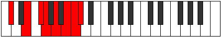
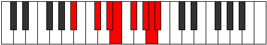

# Mode Thonian

## Links

- [Documentation](README.md)
- [Scales Index](Scales.md)
- [Modes Index](Modes.md)
- [Chords Index](Chords.md)

## Parent Scale

[Thonian](ScaleThonian.md)

## Number

[3433](https://ianring.com/musictheory/scales/3433)

## Luminosity

3

## Transposition

3, 2, 1, 2, 2, 1, 1

## Chord Pattern

ii, iii⁰, IVb5, v, VII

## Perfection

- 5 Perfect notes
- 2 Perfect notes

## Perfection Profile

false, true, true, false, true, true, true

## Permutations

| Tonic | Notes | Signature | Illustration | Audio |
|-------|-------|-----------|--------------|-------|
| [C](ModeCNaturalThonian.md) | **C**, D#, E#, **F#**, G#, A#, B, **C** | C |  | [midi](https://github.com/edipermadi/music/blob/main/docs/ModeCNaturalThonian.mid?raw=true) |
| [C#](ModeCSharpThonian.md) | **C#**, D##, E##, **F##**, G##, A##, B#, **C#** | C |  | [midi](https://github.com/edipermadi/music/blob/main/docs/ModeCSharpThonian.mid?raw=true) |
| [Db](ModeDFlatThonian.md) | **Db**, E, F#, **G**, A, B, C, **Db** | C |  | [midi](https://github.com/edipermadi/music/blob/main/docs/ModeDFlatThonian.mid?raw=true) |
| [D](ModeDNaturalThonian.md) | **D**, E#, F##, **G#**, A#, B#, C#, **D** | C |  | [midi](https://github.com/edipermadi/music/blob/main/docs/ModeDNaturalThonian.mid?raw=true) |
| [D#](ModeDSharpThonian.md) | **D#**, E##, F###, **G##**, A##, B##, C##, **D#** | C |  | [midi](https://github.com/edipermadi/music/blob/main/docs/ModeDSharpThonian.mid?raw=true) |
| [Eb](ModeEFlatThonian.md) | **Eb**, F#, G#, **A**, B, C#, D, **Eb** | C |  | [midi](https://github.com/edipermadi/music/blob/main/docs/ModeEFlatThonian.mid?raw=true) |
| [E](ModeENaturalThonian.md) | **E**, F##, G##, **A#**, B#, C##, D#, **E** | C |  | [midi](https://github.com/edipermadi/music/blob/main/docs/ModeENaturalThonian.mid?raw=true) |
| [F](ModeFNaturalThonian.md) | **F**, G#, A#, **B**, C#, D#, E, **F** | C |  | [midi](https://github.com/edipermadi/music/blob/main/docs/ModeFNaturalThonian.mid?raw=true) |
| [F#](ModeFSharpThonian.md) | **F#**, G##, A##, **B#**, C##, D##, E#, **F#** | C |  | [midi](https://github.com/edipermadi/music/blob/main/docs/ModeFSharpThonian.mid?raw=true) |
| [Gb](ModeGFlatThonian.md) | **Gb**, A, B, **C**, D, E, F, **Gb** | C |  | [midi](https://github.com/edipermadi/music/blob/main/docs/ModeGFlatThonian.mid?raw=true) |
| [G](ModeGNaturalThonian.md) | **G**, A#, B#, **C#**, D#, E#, F#, **G** | C |  | [midi](https://github.com/edipermadi/music/blob/main/docs/ModeGNaturalThonian.mid?raw=true) |
| [G#](ModeGSharpThonian.md) | **G#**, A##, B##, **C##**, D##, E##, F##, **G#** | C |  | [midi](https://github.com/edipermadi/music/blob/main/docs/ModeGSharpThonian.mid?raw=true) |
| [Ab](ModeAFlatThonian.md) | **Ab**, B, C#, **D**, E, F#, G, **Ab** | C |  | [midi](https://github.com/edipermadi/music/blob/main/docs/ModeAFlatThonian.mid?raw=true) |
| [A](ModeANaturalThonian.md) | **A**, B#, C##, **D#**, E#, F##, G#, **A** | C |  | [midi](https://github.com/edipermadi/music/blob/main/docs/ModeANaturalThonian.mid?raw=true) |
| [A#](ModeASharpThonian.md) | **A#**, B##, C###, **D##**, E##, F###, G##, **A#** | C |  | [midi](https://github.com/edipermadi/music/blob/main/docs/ModeASharpThonian.mid?raw=true) |
| [Bb](ModeBFlatThonian.md) | **Bb**, C#, D#, **E**, F#, G#, A, **Bb** | C |  | [midi](https://github.com/edipermadi/music/blob/main/docs/ModeBFlatThonian.mid?raw=true) |
| [B](ModeBNaturalThonian.md) | **B**, C##, D##, **E#**, F##, G##, A#, **B** | C |  | [midi](https://github.com/edipermadi/music/blob/main/docs/ModeBNaturalThonian.mid?raw=true) |
