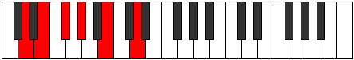

# Mode Thonitonic

## Links

- [Documentation](index.md)
- [Scales Index](Scales.md)
- [Modes Index](Modes.md)
- [Chords Index](Chords.md)

## Parent Scale

[Kataritonic](ScaleKataritonic.md)

## Number

[597](https://ianring.com/musictheory/scales/597)

## Perfection

- 2 Perfect notes
- 3 Perfect notes

## Perfection Profile

[false true false false true]

## Permutations

| Tonic | Notes | Signature | Illustration | Audio |
|-------|-------|-----------|--------------|-------|
| [C](ModeCNaturalThonitonic.md) | **C**, D, **E**, **F#**, A, **C** | C |  | [midi](ModeCNaturalThonitonic.mid) [ogg](ModeCNaturalThonitonic.ogg) |
| [C#](ModeCSharpThonitonic.md) | **C#**, D#, **F**, **G**, A#, **C#** | C |  | [midi](ModeCSharpThonitonic.mid) [ogg](ModeCSharpThonitonic.ogg) |
| [Db](ModeDFlatThonitonic.md) | **Db**, Eb, **F**, **G**, Bb, **Db** | C |  | [midi](ModeDFlatThonitonic.mid) [ogg](ModeDFlatThonitonic.ogg) |
| [D](ModeDNaturalThonitonic.md) | **D**, E, **F#**, **G#**, B, **D** | C |  | [midi](ModeDNaturalThonitonic.mid) [ogg](ModeDNaturalThonitonic.ogg) |
| [D#](ModeDSharpThonitonic.md) | **D#**, F, **G**, **A**, C, **D#** | C |  | [midi](ModeDSharpThonitonic.mid) [ogg](ModeDSharpThonitonic.ogg) |
| [Eb](ModeEFlatThonitonic.md) | **Eb**, F, **G**, **A**, C, **Eb** | C |  | [midi](ModeEFlatThonitonic.mid) [ogg](ModeEFlatThonitonic.ogg) |
| [E](ModeENaturalThonitonic.md) | **E**, F#, **G#**, **A#**, C#, **E** | C |  | [midi](ModeENaturalThonitonic.mid) [ogg](ModeENaturalThonitonic.ogg) |
| [F](ModeFNaturalThonitonic.md) | **F**, G, **A**, **B**, D, **F** | C |  | [midi](ModeFNaturalThonitonic.mid) [ogg](ModeFNaturalThonitonic.ogg) |
| [F#](ModeFSharpThonitonic.md) | **F#**, G#, **A#**, **C**, D#, **F#** | C |  | [midi](ModeFSharpThonitonic.mid) [ogg](ModeFSharpThonitonic.ogg) |
| [Gb](ModeGFlatThonitonic.md) | **Gb**, Ab, **Bb**, **C**, Eb, **Gb** | C |  | [midi](ModeGFlatThonitonic.mid) [ogg](ModeGFlatThonitonic.ogg) |
| [G](ModeGNaturalThonitonic.md) | **G**, A, **B**, **C#**, E, **G** | C |  | [midi](ModeGNaturalThonitonic.mid) [ogg](ModeGNaturalThonitonic.ogg) |
| [G#](ModeGSharpThonitonic.md) | **G#**, A#, **C**, **D**, F, **G#** | C |  | [midi](ModeGSharpThonitonic.mid) [ogg](ModeGSharpThonitonic.ogg) |
| [Ab](ModeAFlatThonitonic.md) | **Ab**, Bb, **C**, **D**, F, **Ab** | C |  | [midi](ModeAFlatThonitonic.mid) [ogg](ModeAFlatThonitonic.ogg) |
| [A](ModeANaturalThonitonic.md) | **A**, B, **C#**, **D#**, F#, **A** | C |  | [midi](ModeANaturalThonitonic.mid) [ogg](ModeANaturalThonitonic.ogg) |
| [A#](ModeASharpThonitonic.md) | **A#**, C, **D**, **E**, G, **A#** | C |  | [midi](ModeASharpThonitonic.mid) [ogg](ModeASharpThonitonic.ogg) |
| [Bb](ModeBFlatThonitonic.md) | **Bb**, C, **D**, **E**, G, **Bb** | C |  | [midi](ModeBFlatThonitonic.mid) [ogg](ModeBFlatThonitonic.ogg) |
| [B](ModeBNaturalThonitonic.md) | **B**, C#, **D#**, **F**, G#, **B** | C |  | [midi](ModeBNaturalThonitonic.mid) [ogg](ModeBNaturalThonitonic.ogg) |
