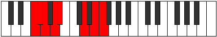

# Mode Thoptian

## Links

- [Documentation](index.md)
- [Scales Index](Scales.md)
- [Modes Index](Modes.md)
- [Chords Index](Chords.md)

## Parent Scale

[Epycrian](ScaleEpycrian.md)

## Number

[2615](https://ianring.com/musictheory/scales/2615)

## Perfection

- 4 Perfect notes
- 3 Perfect notes

## Interval Pattern

1, 1, 2, 1, 4, 2, 1

## Perfection Profile

[false false true true true true false]

## Permutations

| Tonic | Notes | Signature | Illustration | Audio |
|-------|-------|-----------|--------------|-------|
| [C](ModeCNaturalThoptian.md) | **C**, **Db**, Ebb, Fb, Gbb, A, **B**, **C** | C |  | [midi](https://github.com/edipermadi/music/blob/main/docs/ModeCNaturalThoptian.mid?raw=true) |
| [C#](ModeCSharpThoptian.md) | **C#**, **D**, Eb, F, Gb, A#, **B#**, **C#** | C |  | [midi](https://github.com/edipermadi/music/blob/main/docs/ModeCSharpThoptian.mid?raw=true) |
| [Db](ModeDFlatThoptian.md) | **Db**, **Ebb**, Fbb, Gbb, Abbb, Bb, **C**, **Db** | C |  | [midi](https://github.com/edipermadi/music/blob/main/docs/ModeDFlatThoptian.mid?raw=true) |
| [D](ModeDNaturalThoptian.md) | **D**, **Eb**, Fb, Gb, Abb, B, **C#**, **D** | C |  | [midi](https://github.com/edipermadi/music/blob/main/docs/ModeDNaturalThoptian.mid?raw=true) |
| [D#](ModeDSharpThoptian.md) | **D#**, **E**, F, G, Ab, B#, **C##**, **D#** | C |  | [midi](https://github.com/edipermadi/music/blob/main/docs/ModeDSharpThoptian.mid?raw=true) |
| [Eb](ModeEFlatThoptian.md) | **Eb**, **Fb**, Gbb, Abb, Bbbb, C, **D**, **Eb** | C |  | [midi](https://github.com/edipermadi/music/blob/main/docs/ModeEFlatThoptian.mid?raw=true) |
| [E](ModeENaturalThoptian.md) | **E**, **F**, Gb, Ab, Bbb, C#, **D#**, **E** | C |  | [midi](https://github.com/edipermadi/music/blob/main/docs/ModeENaturalThoptian.mid?raw=true) |
| [F](ModeFNaturalThoptian.md) | **F**, **Gb**, Abb, Bbb, Cbb, D, **E**, **F** | C |  | [midi](https://github.com/edipermadi/music/blob/main/docs/ModeFNaturalThoptian.mid?raw=true) |
| [F#](ModeFSharpThoptian.md) | **F#**, **G**, Ab, Bb, Cb, D#, **E#**, **F#** | C |  | [midi](https://github.com/edipermadi/music/blob/main/docs/ModeFSharpThoptian.mid?raw=true) |
| [Gb](ModeGFlatThoptian.md) | **Gb**, **Abb**, Bbbb, Cbb, Dbbb, Eb, **F**, **Gb** | C |  | [midi](https://github.com/edipermadi/music/blob/main/docs/ModeGFlatThoptian.mid?raw=true) |
| [G](ModeGNaturalThoptian.md) | **G**, **Ab**, Bbb, Cb, Dbb, E, **F#**, **G** | C |  | [midi](https://github.com/edipermadi/music/blob/main/docs/ModeGNaturalThoptian.mid?raw=true) |
| [G#](ModeGSharpThoptian.md) | **G#**, **A**, Bb, C, Db, E#, **F##**, **G#** | C |  | [midi](https://github.com/edipermadi/music/blob/main/docs/ModeGSharpThoptian.mid?raw=true) |
| [Ab](ModeAFlatThoptian.md) | **Ab**, **Bbb**, Cbb, Dbb, Ebbb, F, **G**, **Ab** | C |  | [midi](https://github.com/edipermadi/music/blob/main/docs/ModeAFlatThoptian.mid?raw=true) |
| [A](ModeANaturalThoptian.md) | **A**, **Bb**, Cb, Db, Ebb, F#, **G#**, **A** | C |  | [midi](https://github.com/edipermadi/music/blob/main/docs/ModeANaturalThoptian.mid?raw=true) |
| [A#](ModeASharpThoptian.md) | **A#**, **B**, C, D, Eb, F##, **G##**, **A#** | C |  | [midi](https://github.com/edipermadi/music/blob/main/docs/ModeASharpThoptian.mid?raw=true) |
| [Bb](ModeBFlatThoptian.md) | **Bb**, **Cb**, Dbb, Ebb, Fbb, G, **A**, **Bb** | C |  | [midi](https://github.com/edipermadi/music/blob/main/docs/ModeBFlatThoptian.mid?raw=true) |
| [B](ModeBNaturalThoptian.md) | **B**, **C**, Db, Eb, Fb, G#, **A#**, **B** | C |  | [midi](https://github.com/edipermadi/music/blob/main/docs/ModeBNaturalThoptian.mid?raw=true) |
