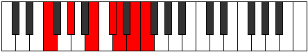

# Mode Thoptimic

## Links

- [Documentation](index.md)
- [Scales Index](Scales.md)
- [Modes Index](Modes.md)
- [Chords Index](Chords.md)

## Parent Scale

[Thoptimic](ScaleThoptimic.md)

## Number

[2889](https://ianring.com/musictheory/scales/2889)

## Perfection

- 2 Perfect notes
- 4 Perfect notes

## Perfection Profile

[false false false true false true]

## Permutations

| Tonic | Notes | Signature | Illustration | Audio |
|-------|-------|-----------|--------------|-------|
| [C](ModeCNaturalThoptimic.md) | **C**, **D#**, **E##**, F###, **G##**, A##, **C** | C |  | [midi](ModeCNaturalThoptimic.mid) [ogg](ModeCNaturalThoptimic.ogg) |
| [C#](ModeCSharpThoptimic.md) | **C#**, **D##**, **E###**, Cbbb, **Cbb**, Dbb, **C#** | C |  | [midi](ModeCSharpThoptimic.mid) [ogg](ModeCSharpThoptimic.ogg) |
| [Db](ModeDFlatThoptimic.md) | **Db**, **E**, **F##**, G##, **A#**, B#, **Db** | C |  | [midi](ModeDFlatThoptimic.mid) [ogg](ModeDFlatThoptimic.ogg) |
| [D](ModeDNaturalThoptimic.md) | **D**, **E#**, **F###**, G###, **A##**, B##, **D** | C |  | [midi](ModeDNaturalThoptimic.mid) [ogg](ModeDNaturalThoptimic.ogg) |
| [D#](ModeDSharpThoptimic.md) | **D#**, **E##**, **Cbbb**, Dbbb, **Dbb**, Ebb, **D#** | C |  | [midi](ModeDSharpThoptimic.mid) [ogg](ModeDSharpThoptimic.ogg) |
| [Eb](ModeEFlatThoptimic.md) | **Eb**, **F#**, **G##**, A##, **B#**, C##, **Eb** | C |  | [midi](ModeEFlatThoptimic.mid) [ogg](ModeEFlatThoptimic.ogg) |
| [E](ModeENaturalThoptimic.md) | **E**, **F##**, **G###**, A###, **B##**, C###, **E** | C |  | [midi](ModeENaturalThoptimic.mid) [ogg](ModeENaturalThoptimic.ogg) |
| [F](ModeFNaturalThoptimic.md) | **F**, **G#**, **A##**, B##, **C##**, D##, **F** | C |  | [midi](ModeFNaturalThoptimic.mid) [ogg](ModeFNaturalThoptimic.ogg) |
| [F#](ModeFSharpThoptimic.md) | **F#**, **G##**, **A###**, B###, **C###**, D###, **F#** | C |  | [midi](ModeFSharpThoptimic.mid) [ogg](ModeFSharpThoptimic.ogg) |
| [Gb](ModeGFlatThoptimic.md) | **Gb**, **A**, **B#**, C##, **D#**, E#, **Gb** | C |  | [midi](ModeGFlatThoptimic.mid) [ogg](ModeGFlatThoptimic.ogg) |
| [G](ModeGNaturalThoptimic.md) | **G**, **A#**, **B##**, C###, **D##**, E##, **G** | C |  | [midi](ModeGNaturalThoptimic.mid) [ogg](ModeGNaturalThoptimic.ogg) |
| [G#](ModeGSharpThoptimic.md) | **G#**, **A##**, **B###**, D##, **E#**, F##, **G#** | C |  | [midi](ModeGSharpThoptimic.mid) [ogg](ModeGSharpThoptimic.ogg) |
| [Ab](ModeAFlatThoptimic.md) | **Ab**, **B**, **C##**, D##, **E#**, F##, **Ab** | C |  | [midi](ModeAFlatThoptimic.mid) [ogg](ModeAFlatThoptimic.ogg) |
| [A](ModeANaturalThoptimic.md) | **A**, **B#**, **C###**, D###, **E##**, F###, **A** | C |  | [midi](ModeANaturalThoptimic.mid) [ogg](ModeANaturalThoptimic.ogg) |
| [A#](ModeASharpThoptimic.md) | **A#**, **B##**, **D##**, E##, **F##**, G##, **A#** | C |  | [midi](ModeASharpThoptimic.mid) [ogg](ModeASharpThoptimic.ogg) |
| [Bb](ModeBFlatThoptimic.md) | **Bb**, **C#**, **D##**, E##, **F##**, G##, **Bb** | C |  | [midi](ModeBFlatThoptimic.mid) [ogg](ModeBFlatThoptimic.ogg) |
| [B](ModeBNaturalThoptimic.md) | **B**, **C##**, **D###**, E###, **F###**, G###, **B** | C |  | [midi](ModeBNaturalThoptimic.mid) [ogg](ModeBNaturalThoptimic.ogg) |
