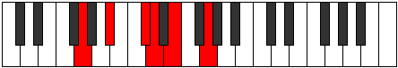

# Mode Thoptitonic

## Links

- [Documentation](README.md)
- [Scales Index](Scales.md)
- [Modes Index](Modes.md)
- [Chords Index](Chords.md)

## Parent Scale

[Thyritonic](ScaleThyritonic.md)

## Number

[713](https://ianring.com/musictheory/scales/713)

## Transposition

3, 3, 1, 2, 3

## Chord Pattern

## Perfection

- 1 Perfect notes
- 4 Perfect notes

## Perfection Profile

true, false, false, false, false

## Permutations

| Tonic | Notes | Signature | Illustration | Audio |
|-------|-------|-----------|--------------|-------|
| [C](ModeCNaturalThoptitonic.md) | C, **D#**, **F#**, **G**, **A**, C | C |  | [midi](https://github.com/edipermadi/music/blob/main/docs/ModeCNaturalThoptitonic.mid?raw=true) |
| [C#](ModeCSharpThoptitonic.md) | C#, **E**, **G**, **G#**, **A#**, C# | C |  | [midi](https://github.com/edipermadi/music/blob/main/docs/ModeCSharpThoptitonic.mid?raw=true) |
| [Db](ModeDFlatThoptitonic.md) | Db, **E**, **G**, **Ab**, **Bb**, Db | C |  | [midi](https://github.com/edipermadi/music/blob/main/docs/ModeDFlatThoptitonic.mid?raw=true) |
| [D](ModeDNaturalThoptitonic.md) | D, **F**, **G#**, **A**, **B**, D | C |  | [midi](https://github.com/edipermadi/music/blob/main/docs/ModeDNaturalThoptitonic.mid?raw=true) |
| [D#](ModeDSharpThoptitonic.md) | D#, **F#**, **A**, **A#**, **C**, D# | C |  | [midi](https://github.com/edipermadi/music/blob/main/docs/ModeDSharpThoptitonic.mid?raw=true) |
| [Eb](ModeEFlatThoptitonic.md) | Eb, **Gb**, **A**, **Bb**, **C**, Eb | C |  | [midi](https://github.com/edipermadi/music/blob/main/docs/ModeEFlatThoptitonic.mid?raw=true) |
| [E](ModeENaturalThoptitonic.md) | E, **G**, **A#**, **B**, **C#**, E | C |  | [midi](https://github.com/edipermadi/music/blob/main/docs/ModeENaturalThoptitonic.mid?raw=true) |
| [F](ModeFNaturalThoptitonic.md) | F, **G#**, **B**, **C**, **D**, F | C |  | [midi](https://github.com/edipermadi/music/blob/main/docs/ModeFNaturalThoptitonic.mid?raw=true) |
| [F#](ModeFSharpThoptitonic.md) | F#, **A**, **C**, **C#**, **D#**, F# | C |  | [midi](https://github.com/edipermadi/music/blob/main/docs/ModeFSharpThoptitonic.mid?raw=true) |
| [Gb](ModeGFlatThoptitonic.md) | Gb, **A**, **C**, **Db**, **Eb**, Gb | C |  | [midi](https://github.com/edipermadi/music/blob/main/docs/ModeGFlatThoptitonic.mid?raw=true) |
| [G](ModeGNaturalThoptitonic.md) | G, **A#**, **C#**, **D**, **E**, G | C |  | [midi](https://github.com/edipermadi/music/blob/main/docs/ModeGNaturalThoptitonic.mid?raw=true) |
| [G#](ModeGSharpThoptitonic.md) | G#, **B**, **D**, **D#**, **F**, G# | C |  | [midi](https://github.com/edipermadi/music/blob/main/docs/ModeGSharpThoptitonic.mid?raw=true) |
| [Ab](ModeAFlatThoptitonic.md) | Ab, **B**, **D**, **Eb**, **F**, Ab | C |  | [midi](https://github.com/edipermadi/music/blob/main/docs/ModeAFlatThoptitonic.mid?raw=true) |
| [A](ModeANaturalThoptitonic.md) | A, **C**, **D#**, **E**, **F#**, A | C |  | [midi](https://github.com/edipermadi/music/blob/main/docs/ModeANaturalThoptitonic.mid?raw=true) |
| [A#](ModeASharpThoptitonic.md) | A#, **C#**, **E**, **F**, **G**, A# | C |  | [midi](https://github.com/edipermadi/music/blob/main/docs/ModeASharpThoptitonic.mid?raw=true) |
| [Bb](ModeBFlatThoptitonic.md) | Bb, **Db**, **E**, **F**, **G**, Bb | C |  | [midi](https://github.com/edipermadi/music/blob/main/docs/ModeBFlatThoptitonic.mid?raw=true) |
| [B](ModeBNaturalThoptitonic.md) | B, **D**, **F**, **F#**, **G#**, B | C |  | [midi](https://github.com/edipermadi/music/blob/main/docs/ModeBNaturalThoptitonic.mid?raw=true) |
