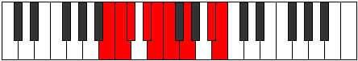

# Mode Thorcryllic

## Links

- [Documentation](README.md)
- [Scales Index](Scales.md)
- [Modes Index](Modes.md)
- [Chords Index](Chords.md)

## Parent Scale

[Zagyllic](ScaleZagyllic.md)

## Number

[2423](https://ianring.com/musictheory/scales/2423)

## Transposition

1, 1, 2, 1, 1, 2, 3, 1

## Chord Pattern

iii⁰, v, VIIb5, VIIb5

## Perfection

- 5 Perfect notes
- 3 Perfect notes

## Perfection Profile

[false true false true true true false true]

## Permutations

| Tonic | Notes | Signature | Illustration | Audio |
|-------|-------|-----------|--------------|-------|
| [C](ModeCNaturalThorcryllic.md) | **C**, C#, **D**, E, F, F#, **G#**, B, **C** | C |  | [midi](https://github.com/edipermadi/music/blob/main/docs/ModeCNaturalThorcryllic.mid?raw=true) |
| [C#](ModeCSharpThorcryllic.md) | **C#**, D, **D#**, F, F#, G, **A**, C, **C#** | C |  | [midi](https://github.com/edipermadi/music/blob/main/docs/ModeCSharpThorcryllic.mid?raw=true) |
| [Db](ModeDFlatThorcryllic.md) | **Db**, D, **Eb**, F, Gb, G, **A**, C, **Db** | C |  | [midi](https://github.com/edipermadi/music/blob/main/docs/ModeDFlatThorcryllic.mid?raw=true) |
| [D](ModeDNaturalThorcryllic.md) | **D**, D#, **E**, F#, G, G#, **A#**, C#, **D** | C |  | [midi](https://github.com/edipermadi/music/blob/main/docs/ModeDNaturalThorcryllic.mid?raw=true) |
| [D#](ModeDSharpThorcryllic.md) | **D#**, E, **F**, G, G#, A, **B**, D, **D#** | C |  | [midi](https://github.com/edipermadi/music/blob/main/docs/ModeDSharpThorcryllic.mid?raw=true) |
| [Eb](ModeEFlatThorcryllic.md) | **Eb**, E, **F**, G, Ab, A, **B**, D, **Eb** | C |  | [midi](https://github.com/edipermadi/music/blob/main/docs/ModeEFlatThorcryllic.mid?raw=true) |
| [E](ModeENaturalThorcryllic.md) | **E**, F, **F#**, G#, A, A#, **C**, D#, **E** | C |  | [midi](https://github.com/edipermadi/music/blob/main/docs/ModeENaturalThorcryllic.mid?raw=true) |
| [F](ModeFNaturalThorcryllic.md) | **F**, F#, **G**, A, A#, B, **C#**, E, **F** | C |  | [midi](https://github.com/edipermadi/music/blob/main/docs/ModeFNaturalThorcryllic.mid?raw=true) |
| [F#](ModeFSharpThorcryllic.md) | **F#**, G, **G#**, A#, B, C, **D**, F, **F#** | C |  | [midi](https://github.com/edipermadi/music/blob/main/docs/ModeFSharpThorcryllic.mid?raw=true) |
| [Gb](ModeGFlatThorcryllic.md) | **Gb**, G, **Ab**, Bb, B, C, **D**, F, **Gb** | C |  | [midi](https://github.com/edipermadi/music/blob/main/docs/ModeGFlatThorcryllic.mid?raw=true) |
| [G](ModeGNaturalThorcryllic.md) | **G**, G#, **A**, B, C, C#, **D#**, F#, **G** | C |  | [midi](https://github.com/edipermadi/music/blob/main/docs/ModeGNaturalThorcryllic.mid?raw=true) |
| [G#](ModeGSharpThorcryllic.md) | **G#**, A, **A#**, C, C#, D, **E**, G, **G#** | C |  | [midi](https://github.com/edipermadi/music/blob/main/docs/ModeGSharpThorcryllic.mid?raw=true) |
| [Ab](ModeAFlatThorcryllic.md) | **Ab**, A, **Bb**, C, Db, D, **E**, G, **Ab** | C |  | [midi](https://github.com/edipermadi/music/blob/main/docs/ModeAFlatThorcryllic.mid?raw=true) |
| [A](ModeANaturalThorcryllic.md) | **A**, A#, **B**, C#, D, D#, **F**, G#, **A** | C |  | [midi](https://github.com/edipermadi/music/blob/main/docs/ModeANaturalThorcryllic.mid?raw=true) |
| [A#](ModeASharpThorcryllic.md) | **A#**, B, **C**, D, D#, E, **F#**, A, **A#** | C |  | [midi](https://github.com/edipermadi/music/blob/main/docs/ModeASharpThorcryllic.mid?raw=true) |
| [Bb](ModeBFlatThorcryllic.md) | **Bb**, B, **C**, D, Eb, E, **Gb**, A, **Bb** | C |  | [midi](https://github.com/edipermadi/music/blob/main/docs/ModeBFlatThorcryllic.mid?raw=true) |
| [B](ModeBNaturalThorcryllic.md) | **B**, C, **C#**, D#, E, F, **G**, A#, **B** | C |  | [midi](https://github.com/edipermadi/music/blob/main/docs/ModeBNaturalThorcryllic.mid?raw=true) |
