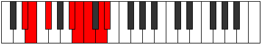

# Mode Thorian

## Links

- [Documentation](README.md)
- [Scales Index](Scales.md)
- [Modes Index](Modes.md)
- [Chords Index](Chords.md)

## Parent Scale

[Katacrian](ScaleKatacrian.md)

## Number

[2955](https://ianring.com/musictheory/scales/2955)

## Luminosity

7

## Transposition

1, 2, 4, 1, 1, 2, 1

## Chord Pattern

vi⁰

## Perfection

- 3 Perfect notes
- 4 Perfect notes

## Perfection Profile

true, true, false, false, true, false, false

## Permutations

| Tonic | Notes | Signature | Illustration | Audio |
|-------|-------|-----------|--------------|-------|
| [C](ModeCNaturalThorian.md) | C, Db, **Eb**, **F##**, G#, **A**, **B**, C | C |  | [midi](https://github.com/edipermadi/music/blob/main/docs/ModeCNaturalThorian.mid?raw=true) |
| [C#](ModeCSharpThorian.md) | C#, D, **E**, **F###**, G##, **A#**, **B#**, C# | C |  | [midi](https://github.com/edipermadi/music/blob/main/docs/ModeCSharpThorian.mid?raw=true) |
| [Db](ModeDFlatThorian.md) | Db, Ebb, **Fb**, **G#**, A, **Bb**, **C**, Db | C |  | [midi](https://github.com/edipermadi/music/blob/main/docs/ModeDFlatThorian.mid?raw=true) |
| [D](ModeDNaturalThorian.md) | D, Eb, **F**, **G##**, A#, **B**, **C#**, D | C |  | [midi](https://github.com/edipermadi/music/blob/main/docs/ModeDNaturalThorian.mid?raw=true) |
| [D#](ModeDSharpThorian.md) | D#, E, **F#**, **G###**, A##, **B#**, **C##**, D# | C |  | [midi](https://github.com/edipermadi/music/blob/main/docs/ModeDSharpThorian.mid?raw=true) |
| [Eb](ModeEFlatThorian.md) | Eb, Fb, **Gb**, **A#**, B, **C**, **D**, Eb | C |  | [midi](https://github.com/edipermadi/music/blob/main/docs/ModeEFlatThorian.mid?raw=true) |
| [E](ModeENaturalThorian.md) | E, F, **G**, **A##**, B#, **C#**, **D#**, E | C |  | [midi](https://github.com/edipermadi/music/blob/main/docs/ModeENaturalThorian.mid?raw=true) |
| [F](ModeFNaturalThorian.md) | F, Gb, **Ab**, **B#**, C#, **D**, **E**, F | C |  | [midi](https://github.com/edipermadi/music/blob/main/docs/ModeFNaturalThorian.mid?raw=true) |
| [F#](ModeFSharpThorian.md) | F#, G, **A**, **B##**, C##, **D#**, **E#**, F# | C |  | [midi](https://github.com/edipermadi/music/blob/main/docs/ModeFSharpThorian.mid?raw=true) |
| [Gb](ModeGFlatThorian.md) | Gb, Abb, **Bbb**, **C#**, D, **Eb**, **F**, Gb | C |  | [midi](https://github.com/edipermadi/music/blob/main/docs/ModeGFlatThorian.mid?raw=true) |
| [G](ModeGNaturalThorian.md) | G, Ab, **Bb**, **C##**, D#, **E**, **F#**, G | C |  | [midi](https://github.com/edipermadi/music/blob/main/docs/ModeGNaturalThorian.mid?raw=true) |
| [G#](ModeGSharpThorian.md) | G#, A, **B**, **C###**, D##, **E#**, **F##**, G# | C |  | [midi](https://github.com/edipermadi/music/blob/main/docs/ModeGSharpThorian.mid?raw=true) |
| [Ab](ModeAFlatThorian.md) | Ab, Bbb, **Cb**, **D#**, E, **F**, **G**, Ab | C |  | [midi](https://github.com/edipermadi/music/blob/main/docs/ModeAFlatThorian.mid?raw=true) |
| [A](ModeANaturalThorian.md) | A, Bb, **C**, **D##**, E#, **F#**, **G#**, A | C |  | [midi](https://github.com/edipermadi/music/blob/main/docs/ModeANaturalThorian.mid?raw=true) |
| [A#](ModeASharpThorian.md) | A#, B, **C#**, **D###**, E##, **F##**, **G##**, A# | C |  | [midi](https://github.com/edipermadi/music/blob/main/docs/ModeASharpThorian.mid?raw=true) |
| [Bb](ModeBFlatThorian.md) | Bb, Cb, **Db**, **E#**, F#, **G**, **A**, Bb | C |  | [midi](https://github.com/edipermadi/music/blob/main/docs/ModeBFlatThorian.mid?raw=true) |
| [B](ModeBNaturalThorian.md) | B, C, **D**, **E##**, F##, **G#**, **A#**, B | C |  | [midi](https://github.com/edipermadi/music/blob/main/docs/ModeBNaturalThorian.mid?raw=true) |
