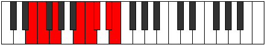
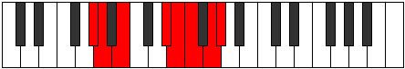

# Mode Thorian

## Links

- [Documentation](index.md)
- [Scales Index](Scales.md)
- [Modes Index](Modes.md)
- [Chords Index](Chords.md)

## Parent Scale

[Katacrian](ScaleKatacrian.md)

## Number

[2955](https://ianring.com/musictheory/scales/2955)

## Perfection

- 3 Perfect notes
- 4 Perfect notes

## Perfection Profile

[true true false false true false false]

## Permutations

| Tonic | Notes | Signature | Illustration | Audio |
|-------|-------|-----------|--------------|-------|
| [C](ModeCNaturalThorian.md) | C, Db, **Eb**, **F##**, G#, **A**, **B**, C | C |  | [midi](ModeCNaturalThorian.mid) [ogg](ModeCNaturalThorian.ogg) |
| [C#](ModeCSharpThorian.md) | C#, D, **E**, **F###**, G##, **A#**, **B#**, C# | C |  | [midi](ModeCSharpThorian.mid) [ogg](ModeCSharpThorian.ogg) |
| [Db](ModeDFlatThorian.md) | Db, Ebb, **Fb**, **G#**, A, **Bb**, **C**, Db | C |  | [midi](ModeDFlatThorian.mid) [ogg](ModeDFlatThorian.ogg) |
| [D](ModeDNaturalThorian.md) | D, Eb, **F**, **G##**, A#, **B**, **C#**, D | C |  | [midi](ModeDNaturalThorian.mid) [ogg](ModeDNaturalThorian.ogg) |
| [D#](ModeDSharpThorian.md) | D#, E, **F#**, **G###**, A##, **B#**, **C##**, D# | C |  | [midi](ModeDSharpThorian.mid) [ogg](ModeDSharpThorian.ogg) |
| [Eb](ModeEFlatThorian.md) | Eb, Fb, **Gb**, **A#**, B, **C**, **D**, Eb | C |  | [midi](ModeEFlatThorian.mid) [ogg](ModeEFlatThorian.ogg) |
| [E](ModeENaturalThorian.md) | E, F, **G**, **A##**, B#, **C#**, **D#**, E | C |  | [midi](ModeENaturalThorian.mid) [ogg](ModeENaturalThorian.ogg) |
| [F](ModeFNaturalThorian.md) | F, Gb, **Ab**, **B#**, C#, **D**, **E**, F | C |  | [midi](ModeFNaturalThorian.mid) [ogg](ModeFNaturalThorian.ogg) |
| [F#](ModeFSharpThorian.md) | F#, G, **A**, **B##**, C##, **D#**, **E#**, F# | C |  | [midi](ModeFSharpThorian.mid) [ogg](ModeFSharpThorian.ogg) |
| [Gb](ModeGFlatThorian.md) | Gb, Abb, **Bbb**, **C#**, D, **Eb**, **F**, Gb | C |  | [midi](ModeGFlatThorian.mid) [ogg](ModeGFlatThorian.ogg) |
| [G](ModeGNaturalThorian.md) | G, Ab, **Bb**, **C##**, D#, **E**, **F#**, G | C |  | [midi](ModeGNaturalThorian.mid) [ogg](ModeGNaturalThorian.ogg) |
| [G#](ModeGSharpThorian.md) | G#, A, **B**, **C###**, D##, **E#**, **F##**, G# | C |  | [midi](ModeGSharpThorian.mid) [ogg](ModeGSharpThorian.ogg) |
| [Ab](ModeAFlatThorian.md) | Ab, Bbb, **Cb**, **D#**, E, **F**, **G**, Ab | C |  | [midi](ModeAFlatThorian.mid) [ogg](ModeAFlatThorian.ogg) |
| [A](ModeANaturalThorian.md) | A, Bb, **C**, **D##**, E#, **F#**, **G#**, A | C |  | [midi](ModeANaturalThorian.mid) [ogg](ModeANaturalThorian.ogg) |
| [A#](ModeASharpThorian.md) | A#, B, **C#**, **D###**, E##, **F##**, **G##**, A# | C |  | [midi](ModeASharpThorian.mid) [ogg](ModeASharpThorian.ogg) |
| [Bb](ModeBFlatThorian.md) | Bb, Cb, **Db**, **E#**, F#, **G**, **A**, Bb | C |  | [midi](ModeBFlatThorian.mid) [ogg](ModeBFlatThorian.ogg) |
| [B](ModeBNaturalThorian.md) | B, C, **D**, **E##**, F##, **G#**, **A#**, B | C |  | [midi](ModeBNaturalThorian.mid) [ogg](ModeBNaturalThorian.ogg) |
