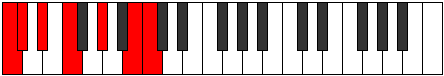
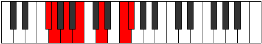
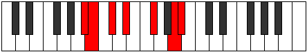

# Mode Thothimic

## Links

- [Documentation](index.md)
- [Scales Index](Scales.md)
- [Modes Index](Modes.md)
- [Chords Index](Chords.md)

## Parent Scale

[Zagimic](ScaleZagimic.md)

## Number

[2347](https://ianring.com/musictheory/scales/2347)

## Perfection

- 3 Perfect notes
- 3 Perfect notes

## Perfection Profile

[false true false true true false]

## Permutations

| Tonic | Notes | Signature | Illustration | Audio |
|-------|-------|-----------|--------------|-------|
| [C](ModeCNaturalThothimic.md) | **C**, Db, **Eb**, F, G#, **A##**, **C** | C |  | [midi](ModeCNaturalThothimic.mid) [ogg](ModeCNaturalThothimic.ogg) |
| [C#](ModeCSharpThothimic.md) | **C#**, D, **E**, F#, G##, **A###**, **C#** | C |  | [midi](ModeCSharpThothimic.mid) [ogg](ModeCSharpThothimic.ogg) |
| [Db](ModeDFlatThothimic.md) | **Db**, Ebb, **Fb**, Gb, A, **B#**, **Db** | C |  | [midi](ModeDFlatThothimic.mid) [ogg](ModeDFlatThothimic.ogg) |
| [D](ModeDNaturalThothimic.md) | **D**, Eb, **F**, G, A#, **B##**, **D** | C |  | [midi](ModeDNaturalThothimic.mid) [ogg](ModeDNaturalThothimic.ogg) |
| [D#](ModeDSharpThothimic.md) | **D#**, E, **F#**, G#, A##, **B###**, **D#** | C |  | [midi](ModeDSharpThothimic.mid) [ogg](ModeDSharpThothimic.ogg) |
| [Eb](ModeEFlatThothimic.md) | **Eb**, Fb, **Gb**, Ab, B, **C##**, **Eb** | C |  | [midi](ModeEFlatThothimic.mid) [ogg](ModeEFlatThothimic.ogg) |
| [E](ModeENaturalThothimic.md) | **E**, F, **G**, A, B#, **C###**, **E** | C |  | [midi](ModeENaturalThothimic.mid) [ogg](ModeENaturalThothimic.ogg) |
| [F](ModeFNaturalThothimic.md) | **F**, Gb, **Ab**, Bb, C#, **D##**, **F** | C |  | [midi](ModeFNaturalThothimic.mid) [ogg](ModeFNaturalThothimic.ogg) |
| [F#](ModeFSharpThothimic.md) | **F#**, G, **A**, B, C##, **D###**, **F#** | C |  | [midi](ModeFSharpThothimic.mid) [ogg](ModeFSharpThothimic.ogg) |
| [Gb](ModeGFlatThothimic.md) | **Gb**, Abb, **Bbb**, Cb, D, **E#**, **Gb** | C |  | [midi](ModeGFlatThothimic.mid) [ogg](ModeGFlatThothimic.ogg) |
| [G](ModeGNaturalThothimic.md) | **G**, Ab, **Bb**, C, D#, **E##**, **G** | C |  | [midi](ModeGNaturalThothimic.mid) [ogg](ModeGNaturalThothimic.ogg) |
| [G#](ModeGSharpThothimic.md) | **G#**, A, **B**, C#, D##, **E###**, **G#** | C |  | [midi](ModeGSharpThothimic.mid) [ogg](ModeGSharpThothimic.ogg) |
| [Ab](ModeAFlatThothimic.md) | **Ab**, Bbb, **Cb**, Db, E, **F##**, **Ab** | C |  | [midi](ModeAFlatThothimic.mid) [ogg](ModeAFlatThothimic.ogg) |
| [A](ModeANaturalThothimic.md) | **A**, Bb, **C**, D, E#, **F###**, **A** | C |  | [midi](ModeANaturalThothimic.mid) [ogg](ModeANaturalThothimic.ogg) |
| [A#](ModeASharpThothimic.md) | **A#**, B, **C#**, D#, E##, **Cbbb**, **A#** | C |  | [midi](ModeASharpThothimic.mid) [ogg](ModeASharpThothimic.ogg) |
| [Bb](ModeBFlatThothimic.md) | **Bb**, Cb, **Db**, Eb, F#, **G##**, **Bb** | C |  | [midi](ModeBFlatThothimic.mid) [ogg](ModeBFlatThothimic.ogg) |
| [B](ModeBNaturalThothimic.md) | **B**, C, **D**, E, F##, **G###**, **B** | C |  | [midi](ModeBNaturalThothimic.mid) [ogg](ModeBNaturalThothimic.ogg) |
