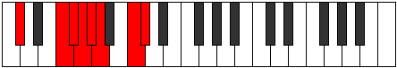

# Mode Thycrian

## Links

- [Documentation](README.md)
- [Scales Index](Scales.md)
- [Modes Index](Modes.md)
- [Chords Index](Chords.md)

## Parent Scale

[Thycrian](ScaleThycrian.md)

## Number

[2545](https://ianring.com/musictheory/scales/2545)

## Transposition

4, 1, 1, 1, 1, 3, 1

## Chord Pattern

iii⁰b3, iv⁰b3

## Perfection

- 4 Perfect notes
- 3 Perfect notes

## Perfection Profile

[true true true false false false true]

## Permutations

| Tonic | Notes | Signature | Illustration | Audio |
|-------|-------|-----------|--------------|-------|
| [C](ModeCNaturalThycrian.md) | C, D##, E#, **F#**, **G**, **Ab**, B, C | C |  | [midi](https://github.com/edipermadi/music/blob/main/docs/ModeCNaturalThycrian.mid?raw=true) |
| [C#](ModeCSharpThycrian.md) | C#, D###, E##, **F##**, **G#**, **A**, B#, C# | C |  | [midi](https://github.com/edipermadi/music/blob/main/docs/ModeCSharpThycrian.mid?raw=true) |
| [Db](ModeDFlatThycrian.md) | Db, E#, F#, **G**, **Ab**, **Bbb**, C, Db | C |  | [midi](https://github.com/edipermadi/music/blob/main/docs/ModeDFlatThycrian.mid?raw=true) |
| [D](ModeDNaturalThycrian.md) | D, E##, F##, **G#**, **A**, **Bb**, C#, D | C |  | [midi](https://github.com/edipermadi/music/blob/main/docs/ModeDNaturalThycrian.mid?raw=true) |
| [D#](ModeDSharpThycrian.md) | D#, E###, F###, **G##**, **A#**, **B**, C##, D# | C |  | [midi](https://github.com/edipermadi/music/blob/main/docs/ModeDSharpThycrian.mid?raw=true) |
| [Eb](ModeEFlatThycrian.md) | Eb, F##, G#, **A**, **Bb**, **Cb**, D, Eb | C |  | [midi](https://github.com/edipermadi/music/blob/main/docs/ModeEFlatThycrian.mid?raw=true) |
| [E](ModeENaturalThycrian.md) | E, F###, G##, **A#**, **B**, **C**, D#, E | C |  | [midi](https://github.com/edipermadi/music/blob/main/docs/ModeENaturalThycrian.mid?raw=true) |
| [F](ModeFNaturalThycrian.md) | F, G##, A#, **B**, **C**, **Db**, E, F | C |  | [midi](https://github.com/edipermadi/music/blob/main/docs/ModeFNaturalThycrian.mid?raw=true) |
| [F#](ModeFSharpThycrian.md) | F#, G###, A##, **B#**, **C#**, **D**, E#, F# | C |  | [midi](https://github.com/edipermadi/music/blob/main/docs/ModeFSharpThycrian.mid?raw=true) |
| [Gb](ModeGFlatThycrian.md) | Gb, A#, B, **C**, **Db**, **Ebb**, F, Gb | C |  | [midi](https://github.com/edipermadi/music/blob/main/docs/ModeGFlatThycrian.mid?raw=true) |
| [G](ModeGNaturalThycrian.md) | G, A##, B#, **C#**, **D**, **Eb**, F#, G | C |  | [midi](https://github.com/edipermadi/music/blob/main/docs/ModeGNaturalThycrian.mid?raw=true) |
| [G#](ModeGSharpThycrian.md) | G#, A###, B##, **C##**, **D#**, **E**, F##, G# | C |  | [midi](https://github.com/edipermadi/music/blob/main/docs/ModeGSharpThycrian.mid?raw=true) |
| [Ab](ModeAFlatThycrian.md) | Ab, B#, C#, **D**, **Eb**, **Fb**, G, Ab | C |  | [midi](https://github.com/edipermadi/music/blob/main/docs/ModeAFlatThycrian.mid?raw=true) |
| [A](ModeANaturalThycrian.md) | A, B##, C##, **D#**, **E**, **F**, G#, A | C |  | [midi](https://github.com/edipermadi/music/blob/main/docs/ModeANaturalThycrian.mid?raw=true) |
| [A#](ModeASharpThycrian.md) | A#, B###, C###, **D##**, **E#**, **F#**, G##, A# | C |  | [midi](https://github.com/edipermadi/music/blob/main/docs/ModeASharpThycrian.mid?raw=true) |
| [Bb](ModeBFlatThycrian.md) | Bb, C##, D#, **E**, **F**, **Gb**, A, Bb | C |  | [midi](https://github.com/edipermadi/music/blob/main/docs/ModeBFlatThycrian.mid?raw=true) |
| [B](ModeBNaturalThycrian.md) | B, C###, D##, **E#**, **F#**, **G**, A#, B | C |  | [midi](https://github.com/edipermadi/music/blob/main/docs/ModeBNaturalThycrian.mid?raw=true) |
