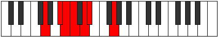

# Mode Thycrimic

## Links

- [Documentation](index.md)
- [Scales Index](Scales.md)
- [Modes Index](Modes.md)
- [Chords Index](Chords.md)

## Parent Scale

[Bygimic](ScaleBygimic.md)

## Number

[441](https://ianring.com/musictheory/scales/441)

## Interval Pattern

3, 1, 1, 2, 1, 4

## Chord Pattern

I

## Perfection

- 3 Perfect notes
- 3 Perfect notes

## Perfection Profile

[true false false true false true]

## Permutations

| Tonic | Notes | Signature | Illustration | Audio |
|-------|-------|-----------|--------------|-------|
| [C](ModeCNaturalThycrimic.md) | C, **D#**, **E**, F, **G**, Ab, C | C |  | [midi](https://github.com/edipermadi/music/blob/main/docs/ModeCNaturalThycrimic.mid?raw=true) |
| [C#](ModeCSharpThycrimic.md) | C#, **D##**, **E#**, F#, **G#**, A, C# | C |  | [midi](https://github.com/edipermadi/music/blob/main/docs/ModeCSharpThycrimic.mid?raw=true) |
| [Db](ModeDFlatThycrimic.md) | Db, **E**, **F**, Gb, **Ab**, Bbb, Db | C |  | [midi](https://github.com/edipermadi/music/blob/main/docs/ModeDFlatThycrimic.mid?raw=true) |
| [D](ModeDNaturalThycrimic.md) | D, **E#**, **F#**, G, **A**, Bb, D | C |  | [midi](https://github.com/edipermadi/music/blob/main/docs/ModeDNaturalThycrimic.mid?raw=true) |
| [D#](ModeDSharpThycrimic.md) | D#, **E##**, **F##**, G#, **A#**, B, D# | C |  | [midi](https://github.com/edipermadi/music/blob/main/docs/ModeDSharpThycrimic.mid?raw=true) |
| [Eb](ModeEFlatThycrimic.md) | Eb, **F#**, **G**, Ab, **Bb**, Cb, Eb | C |  | [midi](https://github.com/edipermadi/music/blob/main/docs/ModeEFlatThycrimic.mid?raw=true) |
| [E](ModeENaturalThycrimic.md) | E, **F##**, **G#**, A, **B**, C, E | C |  | [midi](https://github.com/edipermadi/music/blob/main/docs/ModeENaturalThycrimic.mid?raw=true) |
| [F](ModeFNaturalThycrimic.md) | F, **G#**, **A**, Bb, **C**, Db, F | C |  | [midi](https://github.com/edipermadi/music/blob/main/docs/ModeFNaturalThycrimic.mid?raw=true) |
| [F#](ModeFSharpThycrimic.md) | F#, **G##**, **A#**, B, **C#**, D, F# | C |  | [midi](https://github.com/edipermadi/music/blob/main/docs/ModeFSharpThycrimic.mid?raw=true) |
| [Gb](ModeGFlatThycrimic.md) | Gb, **A**, **Bb**, Cb, **Db**, Ebb, Gb | C |  | [midi](https://github.com/edipermadi/music/blob/main/docs/ModeGFlatThycrimic.mid?raw=true) |
| [G](ModeGNaturalThycrimic.md) | G, **A#**, **B**, C, **D**, Eb, G | C |  | [midi](https://github.com/edipermadi/music/blob/main/docs/ModeGNaturalThycrimic.mid?raw=true) |
| [G#](ModeGSharpThycrimic.md) | G#, **A##**, **B#**, C#, **D#**, E, G# | C |  | [midi](https://github.com/edipermadi/music/blob/main/docs/ModeGSharpThycrimic.mid?raw=true) |
| [Ab](ModeAFlatThycrimic.md) | Ab, **B**, **C**, Db, **Eb**, Fb, Ab | C |  | [midi](https://github.com/edipermadi/music/blob/main/docs/ModeAFlatThycrimic.mid?raw=true) |
| [A](ModeANaturalThycrimic.md) | A, **B#**, **C#**, D, **E**, F, A | C |  | [midi](https://github.com/edipermadi/music/blob/main/docs/ModeANaturalThycrimic.mid?raw=true) |
| [A#](ModeASharpThycrimic.md) | A#, **B##**, **C##**, D#, **E#**, F#, A# | C |  | [midi](https://github.com/edipermadi/music/blob/main/docs/ModeASharpThycrimic.mid?raw=true) |
| [Bb](ModeBFlatThycrimic.md) | Bb, **C#**, **D**, Eb, **F**, Gb, Bb | C |  | [midi](https://github.com/edipermadi/music/blob/main/docs/ModeBFlatThycrimic.mid?raw=true) |
| [B](ModeBNaturalThycrimic.md) | B, **C##**, **D#**, E, **F#**, G, B | C |  | [midi](https://github.com/edipermadi/music/blob/main/docs/ModeBNaturalThycrimic.mid?raw=true) |
