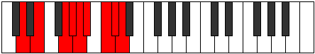

# Mode Thycryllic

## Links

- [Documentation](README.md)
- [Scales Index](Scales.md)
- [Modes Index](Modes.md)
- [Chords Index](Chords.md)

## Parent Scale

[Zagyllic](ScaleZagyllic.md)

## Number

[3557](https://ianring.com/musictheory/scales/3557)

## Transposition

2, 3, 1, 1, 1, 2, 1, 1

## Chord Pattern

IIb5, vi⁰, viii

## Perfection

- 5 Perfect notes
- 3 Perfect notes

## Perfection Profile

true, false, true, false, true, false, true, true

## Permutations

| Tonic | Notes | Signature | Illustration | Audio |
|-------|-------|-----------|--------------|-------|
| [C](ModeCNaturalThycryllic.md) | C, **D**, F, **F#**, G, **G#**, A#, B, C | C |  | [midi](https://github.com/edipermadi/music/blob/main/docs/ModeCNaturalThycryllic.mid?raw=true) |
| [C#](ModeCSharpThycryllic.md) | C#, **D#**, F#, **G**, G#, **A**, B, C, C# | C |  | [midi](https://github.com/edipermadi/music/blob/main/docs/ModeCSharpThycryllic.mid?raw=true) |
| [Db](ModeDFlatThycryllic.md) | Db, **Eb**, Gb, **G**, Ab, **A**, B, C, Db | C |  | [midi](https://github.com/edipermadi/music/blob/main/docs/ModeDFlatThycryllic.mid?raw=true) |
| [D](ModeDNaturalThycryllic.md) | D, **E**, G, **G#**, A, **A#**, C, C#, D | C |  | [midi](https://github.com/edipermadi/music/blob/main/docs/ModeDNaturalThycryllic.mid?raw=true) |
| [D#](ModeDSharpThycryllic.md) | D#, **F**, G#, **A**, A#, **B**, C#, D, D# | C |  | [midi](https://github.com/edipermadi/music/blob/main/docs/ModeDSharpThycryllic.mid?raw=true) |
| [Eb](ModeEFlatThycryllic.md) | Eb, **F**, Ab, **A**, Bb, **B**, Db, D, Eb | C |  | [midi](https://github.com/edipermadi/music/blob/main/docs/ModeEFlatThycryllic.mid?raw=true) |
| [E](ModeENaturalThycryllic.md) | E, **F#**, A, **A#**, B, **C**, D, D#, E | C |  | [midi](https://github.com/edipermadi/music/blob/main/docs/ModeENaturalThycryllic.mid?raw=true) |
| [F](ModeFNaturalThycryllic.md) | F, **G**, A#, **B**, C, **C#**, D#, E, F | C |  | [midi](https://github.com/edipermadi/music/blob/main/docs/ModeFNaturalThycryllic.mid?raw=true) |
| [F#](ModeFSharpThycryllic.md) | F#, **G#**, B, **C**, C#, **D**, E, F, F# | C |  | [midi](https://github.com/edipermadi/music/blob/main/docs/ModeFSharpThycryllic.mid?raw=true) |
| [Gb](ModeGFlatThycryllic.md) | Gb, **Ab**, B, **C**, Db, **D**, E, F, Gb | C |  | [midi](https://github.com/edipermadi/music/blob/main/docs/ModeGFlatThycryllic.mid?raw=true) |
| [G](ModeGNaturalThycryllic.md) | G, **A**, C, **C#**, D, **D#**, F, F#, G | C |  | [midi](https://github.com/edipermadi/music/blob/main/docs/ModeGNaturalThycryllic.mid?raw=true) |
| [G#](ModeGSharpThycryllic.md) | G#, **A#**, C#, **D**, D#, **E**, F#, G, G# | C |  | [midi](https://github.com/edipermadi/music/blob/main/docs/ModeGSharpThycryllic.mid?raw=true) |
| [Ab](ModeAFlatThycryllic.md) | Ab, **Bb**, Db, **D**, Eb, **E**, Gb, G, Ab | C |  | [midi](https://github.com/edipermadi/music/blob/main/docs/ModeAFlatThycryllic.mid?raw=true) |
| [A](ModeANaturalThycryllic.md) | A, **B**, D, **D#**, E, **F**, G, G#, A | C |  | [midi](https://github.com/edipermadi/music/blob/main/docs/ModeANaturalThycryllic.mid?raw=true) |
| [A#](ModeASharpThycryllic.md) | A#, **C**, D#, **E**, F, **F#**, G#, A, A# | C |  | [midi](https://github.com/edipermadi/music/blob/main/docs/ModeASharpThycryllic.mid?raw=true) |
| [Bb](ModeBFlatThycryllic.md) | Bb, **C**, Eb, **E**, F, **Gb**, Ab, A, Bb | C |  | [midi](https://github.com/edipermadi/music/blob/main/docs/ModeBFlatThycryllic.mid?raw=true) |
| [B](ModeBNaturalThycryllic.md) | B, **C#**, E, **F**, F#, **G**, A, A#, B | C |  | [midi](https://github.com/edipermadi/music/blob/main/docs/ModeBNaturalThycryllic.mid?raw=true) |
