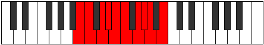

# Mode Thydygic

## Links

- [Documentation](README.md)
- [Scales Index](Scales.md)
- [Modes Index](Modes.md)
- [Chords Index](Chords.md)

## Parent Scale

[Aeolorygic](ScaleAeolorygic.md)

## Number

[1915](https://ianring.com/musictheory/scales/1915)

## Transposition

1, 2, 1, 1, 1, 2, 1, 1, 2

## Chord Pattern

vi⁰, vi⁰, viii⁰, ix⁰, ix⁰

## Perfection

- 7 Perfect notes
- 2 Perfect notes

## Perfection Profile

[false true true false true true true true true]

## Permutations

| Tonic | Notes | Signature | Illustration | Audio |
|-------|-------|-----------|--------------|-------|
| [C](ModeCNaturalThydygic.md) | **C**, C#, D#, **E**, F, F#, G#, A, A#, **C** | C |  | [midi](https://github.com/edipermadi/music/blob/main/docs/ModeCNaturalThydygic.mid?raw=true) |
| [C#](ModeCSharpThydygic.md) | **C#**, D, E, **F**, F#, G, A, A#, B, **C#** | C |  | [midi](https://github.com/edipermadi/music/blob/main/docs/ModeCSharpThydygic.mid?raw=true) |
| [Db](ModeDFlatThydygic.md) | **Db**, D, E, **F**, Gb, G, A, Bb, B, **Db** | C |  | [midi](https://github.com/edipermadi/music/blob/main/docs/ModeDFlatThydygic.mid?raw=true) |
| [D](ModeDNaturalThydygic.md) | **D**, D#, F, **F#**, G, G#, A#, B, C, **D** | C |  | [midi](https://github.com/edipermadi/music/blob/main/docs/ModeDNaturalThydygic.mid?raw=true) |
| [D#](ModeDSharpThydygic.md) | **D#**, E, F#, **G**, G#, A, B, C, C#, **D#** | C |  | [midi](https://github.com/edipermadi/music/blob/main/docs/ModeDSharpThydygic.mid?raw=true) |
| [Eb](ModeEFlatThydygic.md) | **Eb**, E, Gb, **G**, Ab, A, B, C, Db, **Eb** | C |  | [midi](https://github.com/edipermadi/music/blob/main/docs/ModeEFlatThydygic.mid?raw=true) |
| [E](ModeENaturalThydygic.md) | **E**, F, G, **G#**, A, A#, C, C#, D, **E** | C |  | [midi](https://github.com/edipermadi/music/blob/main/docs/ModeENaturalThydygic.mid?raw=true) |
| [F](ModeFNaturalThydygic.md) | **F**, F#, G#, **A**, A#, B, C#, D, D#, **F** | C |  | [midi](https://github.com/edipermadi/music/blob/main/docs/ModeFNaturalThydygic.mid?raw=true) |
| [F#](ModeFSharpThydygic.md) | **F#**, G, A, **A#**, B, C, D, D#, E, **F#** | C |  | [midi](https://github.com/edipermadi/music/blob/main/docs/ModeFSharpThydygic.mid?raw=true) |
| [Gb](ModeGFlatThydygic.md) | **Gb**, G, A, **Bb**, B, C, D, Eb, E, **Gb** | C |  | [midi](https://github.com/edipermadi/music/blob/main/docs/ModeGFlatThydygic.mid?raw=true) |
| [G](ModeGNaturalThydygic.md) | **G**, G#, A#, **B**, C, C#, D#, E, F, **G** | C |  | [midi](https://github.com/edipermadi/music/blob/main/docs/ModeGNaturalThydygic.mid?raw=true) |
| [G#](ModeGSharpThydygic.md) | **G#**, A, B, **C**, C#, D, E, F, F#, **G#** | C |  | [midi](https://github.com/edipermadi/music/blob/main/docs/ModeGSharpThydygic.mid?raw=true) |
| [Ab](ModeAFlatThydygic.md) | **Ab**, A, B, **C**, Db, D, E, F, Gb, **Ab** | C |  | [midi](https://github.com/edipermadi/music/blob/main/docs/ModeAFlatThydygic.mid?raw=true) |
| [A](ModeANaturalThydygic.md) | **A**, A#, C, **C#**, D, D#, F, F#, G, **A** | C |  | [midi](https://github.com/edipermadi/music/blob/main/docs/ModeANaturalThydygic.mid?raw=true) |
| [A#](ModeASharpThydygic.md) | **A#**, B, C#, **D**, D#, E, F#, G, G#, **A#** | C |  | [midi](https://github.com/edipermadi/music/blob/main/docs/ModeASharpThydygic.mid?raw=true) |
| [Bb](ModeBFlatThydygic.md) | **Bb**, B, Db, **D**, Eb, E, Gb, G, Ab, **Bb** | C |  | [midi](https://github.com/edipermadi/music/blob/main/docs/ModeBFlatThydygic.mid?raw=true) |
| [B](ModeBNaturalThydygic.md) | **B**, C, D, **D#**, E, F, G, G#, A, **B** | C |  | [midi](https://github.com/edipermadi/music/blob/main/docs/ModeBNaturalThydygic.mid?raw=true) |
